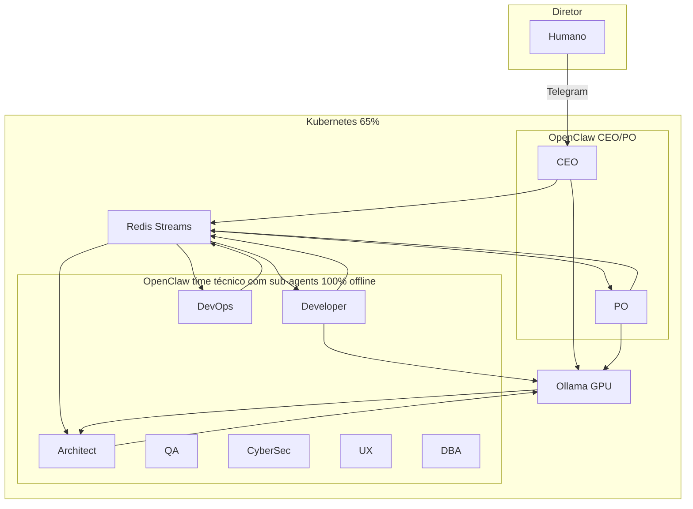

# Plano de Fases — Desenvolvimento ClawDevs

## 1. Resumo da análise da documentação

### docs/ (documentação principal)

- **Visão e objetivo:** ClawDevs = enxame de **9 agentes de IA** (CEO, PO, DevOps, Architect, Developer, QA, CyberSec, UX, DBA) + Governance Proposer, orquestrados em **Kubernetes** (Minikube), estado em **Redis**, inferência via **provedores integrados OpenClaw** (Ollama local e cloud, OpenRouter, Qwen OAuth, Moonshot AI, OpenAI, Hugging Face Inference), interface **OpenClaw** (Telegram/voz). Tudo roda **dentro do cluster**; limite **65% do hardware**. Objetivo: **qualquer um pode ter seu ClawDevs** na própria máquina, 24/7.
- **Prioridades não negociáveis:** (1) Cibersegurança (Zero Trust, OWASP, CISO), (2) Custo baixíssimo, (3) Performance segura e altíssima.
- **Provedores de inferência:** Apenas tecnologias integradas OpenClaw: Ollama (local e cloud), OpenRouter, Qwen (OAuth), Moonshot AI, OpenAI, Hugging Face (Inference). Ver [07-configuracao-e-prompts.md](docs/07-configuracao-e-prompts.md).
- **Documentos-chave:** [00-objetivo-e-maquina-referencia.md](docs/00-objetivo-e-maquina-referencia.md), [01-visao-e-proposta.md](docs/01-visao-e-proposta.md), [02-agentes.md](docs/02-agentes.md), [03-arquitetura.md](docs/03-arquitetura.md), [04-infraestrutura.md](docs/04-infraestrutura.md), [05-seguranca-e-etica.md](docs/05-seguranca-e-etica.md), [06-operacoes.md](docs/06-operacoes.md), [07-configuracao-e-prompts.md](docs/07-configuracao-e-prompts.md), [37-deploy-fase0-telegram-ceo-ollama.md](docs/37-deploy-fase0-telegram-ceo-ollama.md), [openclaw-sub-agents-architecture.md](docs/openclaw-sub-agents-architecture.md). Índice completo em [docs/README.md](docs/README.md).

### docs/issues/ (backlog de implementação)

- **59 issues** organizadas em **11 fases** (0 → 11), do “zero ao avançado”.
- **Fase 0 (Fundação):** issues 001–009, **124**, **125** — máquina de referência, setup, Minikube/Redis/Ollama 65%, ResourceQuota/LimitRange, Redis Streams, GPU Lock + validação pré-GPU e batching, consumer groups, Docker multi-stage, transcrição m4a, **contingência cluster acéfalo**, **pipeline explícito e slot único de revisão**.
- **Fases seguintes:** 1 = Agentes (010–019), 2 = Segurança (020–029, 126, 128), 3 = Operações (030–039, 127), 4 = Configuração, 5 = Self-improvement/memória, 6 = Habilidades transversais, 7 = Ferramentas, 8 = Skills/ambiente, 9 = Integrações, 10 = Frontend/UX, 11 = Avançado (War Room, Chaos Engineering, balanceamento dinâmico).
- Referência: [docs/issues/README.md](docs/issues/README.md) (tabela de fases e índice por arquivo).

### Estado atual do repositório

- **Makefile:** `make prepare` (Docker, kubectl, Minikube GPU), `make up` (namespace, Redis, Ollama, OpenClaw com workspace CEO, secrets opcionais), `make down` (estaca zero), `make verify` (scripts em docs/scripts), `make openclaw-image` (build da imagem gateway).
- **k8s:** namespace, [k8s/redis/deployment.yaml](k8s/redis/deployment.yaml), [k8s/ollama/deployment.yaml](k8s/ollama/deployment.yaml), [k8s/openclaw/](k8s/openclaw/) (configmap, workspace-ceo-configmap, deployment, Dockerfile, entrypoint, secret.example). **Ausente:** ResourceQuota/LimitRange, Redis Streams como uso efetivo, GPU Lock script, consumer groups, job “Revisão pós-Dev”.
- **Scripts:** `docs/scripts/verify-machine.sh`, `verify-gpu-cluster.sh`; `scripts/ollama-ensure-cloud-auth.sh`, `run-openclaw-telegram-ollama.sh`. **Não existe** `setup.sh` monolítico conforme [docs/issues/002-setup-um-clique.md](docs/issues/002-setup-um-clique.md) (doc 09 referencia scripts/setup.sh).
- **Conclusão:** A “Fase 0 mínima” (CEO via Telegram + Ollama no K8s) está **parcialmente implementada** (doc 37 + Makefile). Para “iniciar desenvolvimento ClawDevs” no sentido do backlog, o foco é **completar e consolidar a Fase 0** (issues 001–009, 124, 125) e em seguida Fase 1.

---

## 2. Arquitetura de alto nível (referência)

- **OpenClaw usa Ollama (GPU):** O gateway OpenClaw (CEO e PO) consome o **Ollama GPU** no cluster para inferência local — em Fase 0 o CEO responde via Ollama; nuvem (OpenRouter, OpenAI, Ollama cloud, Qwen, Moonshot AI, Hugging Face) é opcional conforme config OpenClaw.
- **Time técnico = OpenClaw com sub-agents (100% offline):** O time técnico (Developer, Architect, QA, CyberSec, UX, DBA, DevOps) roda em um **OpenClaw com sub-agents** ([Sub-Agents](https://docs.openclaw.ai/tools/subagents)): agentes são acionados via `sessions_spawn`, executam em sessões isoladas e anunciam o resultado de volta ao requester (CEO/PO ou orquestrador). Esse OpenClaw do time técnico fica **100% offline** — sem egress para internet; apenas Redis, Ollama (GPU) e rede interna do cluster. Isolamento em **duas camadas**: NetworkPolicy (K8s) + **Multi-Agent Sandbox & Tools** ([Multi-Agent Sandbox & Tools](https://docs.openclaw.ai/tools/multi-agent-sandbox-tools)) — sandbox `mode: "all"`, `scope: "agent"` e restrição de tools por agente (deny `browser`, `gateway`; allow apenas read, write, apply_patch, exec, sessions).
- **Event-driven:** Redis Streams como barramento; estado em chaves (ex.: `project:v1:issue:42`); GPU Lock + slot único de revisão (issue 125).
- **Resiliência:** Contingência cluster acéfalo (124): heartbeat Redis, branch efêmera de recuperação, LanceDB, retomada automática sem comando humano.

### Restrição: time técnico 100% offline da internet

- **Regra:** O **OpenClaw do time técnico** (com sub-agents: Developer, Architect, QA, CyberSec, UX, DBA, DevOps) opera **100% offline da internet**. Apenas o OpenClaw CEO/PO pode acessar rede externa (Telegram, APIs nuvem) e o Ollama no cluster.
- **Implementação (duas camadas):**
  - **Camada 1 — Kubernetes:** NetworkPolicy com **egress bloqueado** para o(s) pod(s) do OpenClaw técnico; tráfego apenas cluster-interno (Redis, Ollama). O OpenClaw CEO/PO mantém egress para Ollama e para internet. Manifestos em `k8s/` (ex.: `k8s/networkpolicy-time-tecnico-offline.yaml`).
  - **Camada 2 — OpenClaw Multi-Agent Sandbox & Tools** ([Multi-Agent Sandbox & Tools](https://docs.openclaw.ai/tools/multi-agent-sandbox-tools)): config `agents.list[]` com sandbox e tool policy por perfil. **CEO/PO:** `sandbox: { mode: "off" }` (ou `non-main`), tools conforme necessidade (messaging, sessões). **Time técnico:** `sandbox: { mode: "all", scope: "agent" }` (um container por agente) e `tools.deny` para `browser`, `gateway` e demais que impliquem rede/acesso externo; `tools.allow` apenas o necessário (ex.: `read`, `write`, `apply_patch`, `exec`, sessões). Auth por agente (`agentDir` próprio) — sem compartilhar credenciais entre CEO/PO e time técnico.
- **Efeito:** Defesa em profundidade: mesmo com falha de rede, isolamento e menor privilégio continuam no gateway. Reduz superfície de ataque, evita exfiltração; modelos e código vêm do Ollama local e do estado/Redis; atualizações e código de terceiros entram por processo controlado (ex.: pipeline de quarentena com aprovação, Fase 2). Documentar em [04-infraestrutura.md](docs/04-infraestrutura.md) e [14-seguranca-runtime-agentes.md](docs/14-seguranca-runtime-agentes.md).

---

## 3. Fases de desenvolvimento (ordem sugerida)

| Fase     | Escopo              | Issues principais | Objetivo                                                                                                                                                                                                    |
| -------- | ------------------- | ----------------- | ----------------------------------------------------------------------------------------------------------------------------------------------------------------------------------------------------------- |
| **0**    | Fundação            | 001–009, 124, 125 | Máquina referência, setup/automation, Minikube 65%, Redis, Ollama, ResourceQuota, Redis Streams, GPU Lock, consumer groups, Docker multi-stage, transcrição m4a, contingência acéfalo, pipeline slot único. |
| **1**    | Agentes             | 010–019           | Definição canônica dos 9 agentes, SOUL, pods CEO/PO (nuvem) e técnicos, código de conduta, fluxo E2E exemplo (2FA), autonomia nível 4.                                                                      |
| **2**    | Segurança           | 020–029, 126, 128 | Zero Trust, quarentena, sandbox, OWASP, CISO, token bucket/degradação CEO, SAST/entropia.                                                                                                                   |
| **3**    | Operações           | 030–039, 127      | Primeiros socorros GPU, prevenção riscos, disjuntor draft_rejected, five strikes, orçamento degradação.                                                                                                     |
| **4–11** | Config até Avançado | 040–129           | Config/FinOps, memória/self-improvement, habilidades, ferramentas, skills, integrações, frontend, War Room/Chaos.                                                                                           |

---

## 4. Início do desenvolvimento: Fase 0 (detalhada)

A **primeira fase de desenvolvimento** deve ser a **Fase 0 — Fundação**, para ter base estável antes de múltiplos agentes e fluxos.

### 4.1 Itens já cobertos (parcialmente)

- **001** — Máquina de referência: doc [00-objetivo-e-maquina-referencia.md](docs/00-objetivo-e-maquina-referencia.md) e scripts `docs/scripts/verify-machine.sh` / `verify-machine.md`.
- **003** — Minikube + Redis + Ollama: Makefile (`prepare` + `up`), [k8s/ollama/deployment.yaml](k8s/ollama/deployment.yaml), [k8s/redis/deployment.yaml](k8s/redis/deployment.yaml). Falta: documentar tabela 65% e modelos recomendados no repo (já em 04-infra).
- **008** — Docker multi-stage: [k8s/openclaw/Dockerfile](k8s/openclaw/Dockerfile) existe; validar se atende “imagens enxutas”.
- **Deploy Fase 0 (doc 37):** CEO Telegram + Ollama no cluster aplicado via `make up`; secret Telegram e workspace CEO (SOUL) aplicados.

### 4.2 Itens a implementar na Fase 0 (prioridade sugerida)

1. **Time técnico 100% offline (OpenClaw sub-agents + Multi-Agent Sandbox & Tools)**
  - Duas camadas: (1) **NetworkPolicy** (egress bloqueado para pod OpenClaw técnico); (2) **OpenClaw Multi-Agent Sandbox & Tools** ([doc](https://docs.openclaw.ai/tools/multi-agent-sandbox-tools)) — CEO/PO `sandbox: { mode: "off" }`, time técnico `sandbox: { mode: "all", scope: "agent" }` e `tools.deny` (browser, gateway). Documentar em docs/04 e docs/14; aplicar k8s (ex.: `k8s/networkpolicy-time-tecnico-offline.yaml`) e config OpenClaw `agents.list[]`.
2. **002 — Setup “um clique”**
  - Criar `scripts/setup.sh` (ou integrar ao Makefile) conforme [docs/09-setup-e-scripts.md](docs/09-setup-e-scripts.md) e [docs/issues/002-setup-um-clique.md](docs/issues/002-setup-um-clique.md): não root, SO (Pop!_OS), coleta chaves dos provedores OpenClaw (conforme lista canônica) e Telegram, dependências, Minikube 65%, Redis, Ollama, transcrição (`~/enxame/transcription/`, `m4a_to_md.py`), config OpenClaw, aliases e testes. Manter `make prepare` e `make up` como alternativa enxuta.
3. **004 — ResourceQuota e LimitRange**
  - Adicionar manifestos em `k8s/` (ex.: `k8s/limits.yaml` ou em namespace) conforme [04-infraestrutura.md](docs/04-infraestrutura.md); aplicar no `make up`.
4. **005 — Redis Streams e estado global**
  - Documentar e, se necessário, configurar streams/chaves no Redis (ex.: `cmd:strategy`, `task:backlog`); orquestrador ou sidecar que publique/consuma (pode ser stub inicial para Fase 1).
5. **006 — GPU Lock + validação pré-GPU e batching**
  - Script de GPU Lock (Redis SETNX + TTL dinâmico), hard timeout no deployment; referência [docs/scripts/gpu_lock.md](docs/scripts/gpu_lock.md). Validação pré-GPU em CPU (SLM) e batching de PRs podem ser especificação inicial para o orquestrador (Fase 1).
6. **007 — Consumer groups e fila de prioridade**
  - Configurar consumer groups no Redis Streams e ordem de consumo; alinhar com issue 125 (slot único).
7. **009 — Transcrição m4a → md**
  - Garantir `scripts/m4a_to_md.py` (ou equivalente) e integração no setup/OpenClaw conforme doc 09.
8. **124 — Contingência cluster acéfalo**
  - Heartbeat no Redis (timeout configurável), acionar DevOps local: branch efêmera de recuperação, persistência fila em LanceDB, pausa consumo GPU; health check a cada 5 min; retomada automática (3 ciclos estáveis, checkout limpo, Architect para conflitos); notificação assíncrona ao Diretor. Especificação em [06-operacoes.md](docs/06-operacoes.md) e [docs/issues/124-contingencia-cluster-acefalo.md](docs/issues/124-contingencia-cluster-acefalo.md).
9. **125 — Pipeline explícito e slot único de revisão**
  - Um consumidor/job “Revisão pós-Dev” por evento `code:ready`; adquire GPU Lock uma vez, executa Architect → QA → CyberSec → DBA em sequência; hard timeout documentado. Ref. [docs/estrategia-uso-hardware-gpu-cpu.md](docs/estrategia-uso-hardware-gpu-cpu.md) e [docs/issues/125-pipeline-explicito-slot-unico-revisao.md](docs/issues/125-pipeline-explicito-slot-unico-revisao.md).

### 4.3 Ordem prática recomendada para Fase 0

1. **Time técnico 100% offline (sub-agents + Multi-Agent Sandbox & Tools)** — NetworkPolicy + config OpenClaw (sandbox all/agent, tools deny); documentação em 04-infra e 14-runtime e k8s.
2. **004** (ResourceQuota/LimitRange) — rápido, reduz risco de estouro no cluster.
3. **002** (setup.sh) — replicabilidade “um clique” para qualquer máquina equivalente.
4. **005** (Redis Streams/estado) — base para eventos e para 006/007/125.
5. **006** (GPU Lock script + timeout) — evita OOM e lock órfão.
6. **007** (consumer groups) + **125** (slot único revisão) — desenho do pipeline de revisão.
7. **009** (transcrição) — fechar requisito de voz no setup.
8. **124** (contingência acéfalo) — resiliência sem comando humano.

---

## 5. Próximos passos após Fase 0

- **Fase 1:** Implementar SOUL e pods para todos os agentes (010–019), fluxo evento-driven mínimo (CEO → PO → backlog) e exemplo E2E (016).  
- **Fase 2:** Zero Trust, quarentena, token bucket/degradação CEO, OWASP/CISO (020–029, 126, 128).  
- Manter alinhamento com [docs/README.md](docs/README.md), [docs/issues/README.md](docs/issues/README.md) e revisões pós-crítica (README principal) em todas as decisões de arquitetura e segurança.

---

## 6. Referências rápidas

- **Objetivo e máquina:** [docs/00-objetivo-e-maquina-referencia.md](docs/00-objetivo-e-maquina-referencia.md)  
- **Índice da doc:** [docs/README.md](docs/README.md)  
- **Backlog e fases:** [docs/issues/README.md](docs/issues/README.md)  
- **Deploy Fase 0 atual:** [docs/37-deploy-fase0-telegram-ceo-ollama.md](docs/37-deploy-fase0-telegram-ceo-ollama.md)  
- **Arquitetura OpenClaw + K8s:** [docs/openclaw-sub-agents-architecture.md](docs/openclaw-sub-agents-architecture.md)  
- **Auto-evolução:** [docs/36-auto-evolucao-clawdevs.md](docs/36-auto-evolucao-clawdevs.md) (início/parada só pelo Diretor via Telegram)

