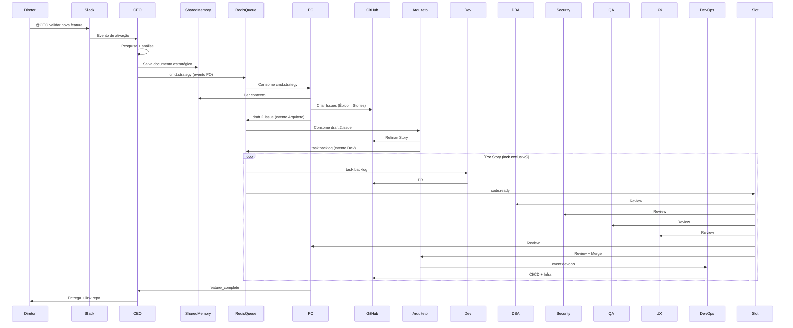

# Refatoração ClawDevs conforme fluxo de sequência e state diagram

## Situação atual (resumo)

- **Já existe:** Redis (streams + chaves `project:v1:issue:`*), gateway-redis-adapter (`POST /publish`), GPU Lock, consumidor Developer (`task:backlog`), slot único Revisão pós-Dev (Architect → QA → CyberSec → DBA; **UX e PO não estão no slot**), consumer Slack (`orchestrator:events`), disjuntor `draft_rejected`, OpenClaw/Ollama/Redis no k8s.
- **Não existe neste repo:** consumidor de `cmd:strategy` (PO), consumidor de `draft.2.issue` (Arquiteto), escrita explícita do “documento estratégico” na Memoria, estado por issue (Backlog/Ready/InProgress/…), lock **por story** (hoje só GPU lock), revisão com **todas as 6 aprovações + merge pelo Arquiteto**, fluxo DevOps (deploy/CI-CD) acionado por evento, auditorias sequenciais (QA/DBA/Security/UX), evento “feature concluída” (PO→CEO→Diretor).

Referência de lacunas: [docs/analise-codigo-vs-docs-fluxo.md](docs/analise-codigo-vs-docs-fluxo.md).

---

## 1. Memoria compartilhada (SharedMemory)

- **Contrato:** CEO grava o documento estratégico em Redis para o PO e demais agentes lerem.
- **Implementação:**
  - Nova chave Redis: `project:v1:strategy_doc` (ou `project:v1:strategy:{project_id}` se multi-projeto) com TTL opcional.
  - Gateway-redis-adapter: novo endpoint `POST /write-strategy` (ou extensão de `/publish` com tipo) que faz `SET project:v1:strategy_doc <body>`; chamado pelo OpenClaw após resposta do CEO (ferramenta/ação no gateway externo) ou por script de teste.
  - Documentar em [docs/38-redis-streams-estado-global.md](docs/38-redis-streams-estado-global.md) (convenção de chaves e quem lê/escreve).

---

## 2. Máquina de estados (state diagram)

- **Estados por issue:** `Backlog` → `Refinamento` → `Ready` → `InProgress` → `InReview` → `Approved` → `Merged` → `Deployed` → `Monitoring` → `Done` (ou volta a `Backlog`).
- **Implementação:**
  - Chave por issue: `project:v1:issue:{id}:state` com valores acima.
  - Transições: cada agente/script que muda o ciclo de vida da issue atualiza essa chave (e opcionalmente labels no GitHub).
  - Módulo compartilhado (ex.: `scripts/issue_state.py`) com funções `set_issue_state(r, issue_id, state)`, `get_issue_state(r, issue_id)` e constantes dos estados; usado por PO worker, architect draft consumer, developer worker, slot de revisão, merge step, DevOps e auditorias.
  - Documentar no mesmo doc 38 e em um novo `docs/agents-devs/state-machine-issues.md` com o diagrama e quem faz cada transição.

---

## 3. CEO → Memoria + evento para PO

- **Fluxo desejado:** CEO termina análise → grava documento em Memoria → publica evento para PO → encerra.
- **Implementação:**
  - Garantir que o adapter tenha forma de escrever estratégia (item 1) e já expõe `POST /publish` para `stream: "cmd:strategy"`.
  - No repositório: documentar o contrato (payload de `cmd:strategy` com `directive`, `strategy_doc_id` ou corpo, `source=ceo`) e que o OpenClaw (ou ferramenta) deve: 1) chamar `POST /write-strategy` (ou equivalente) com o documento; 2) chamar `POST /publish` com `stream: "cmd:strategy"` e dados mínimos. Não é obrigatório alterar código do OpenClaw aqui; apenas contrato e, se necessário, um script de teste que simule os dois passos.

---

## 4. PO worker (consumidor de `cmd:strategy`)

- **Responsabilidade:** Acordar com evento no Redis; ler contexto estratégico da Memoria; validar acesso ao repo (gh); quebrar em Épico → Features → Stories → Tasks; criar Issues no GitHub; publicar evento para Arquiteto; atualizar estados (Backlog/Refinamento).
- **Implementação:**
  - Novo script: `scripts/po_worker.py` que faz `XREADGROUP` em `cmd:strategy` (consumer group `clawdevs`), lê `project:v1:strategy_doc` (ou chave indicada no payload), chama `gh repo view` / API para validar repo, usa LLM (Ollama) ou regras fixas para gerar épicos/features/stories/tasks e criar issues via `gh issue create`; grava especificação em `project:v1:issue:{id}` e estado `Refinamento` ou `Backlog`; publica em `draft.2.issue` (ou stream dedicado para Arquiteto) com `issue_id`; no final publica “evento → Arquiteto” (mesmo stream ou outro já existente).
  - Deployment k8s para o PO worker (consumidor), com env REDIS, GITHUB_TOKEN, KEY_PREFIX, stream names (ConfigMap redis-streams). Opcional: GPU Lock se usar Ollama pesado; caso contrário pode usar modelo leve ou só regras.
  - Atualizar [k8s/redis/streams-configmap.yaml](k8s/redis/streams-configmap.yaml) e [scripts/redis-streams-init.sh](scripts/redis-streams-init.sh) se surgir novo stream; manter compatibilidade com `draft.2.issue` para acordar Arquiteto.

---

## 5. Arquiteto consumidor de rascunho (Refinamento → Ready)

- **Responsabilidade:** Consumir evento do PO (rascunho/refinamento); refinar tecnicamente cada Story; aprovar ou rejeitar (já existe `draft_rejected`); ao aprovar, definir arquitetura e marcar como Ready; publicar evento para Dev.
- **Implementação:**
  - Novo script: `scripts/architect_draft_consumer.py` que faz `XREADGROUP` em `draft.2.issue`, lê `project:v1:issue:{id}`, valida/refina com Ollama (perfil Arquiteto); se rejeitar, publica em `draft_rejected` e mantém estado Refinamento; se aprovar, atualiza estado para `Ready`, opcionalmente grava decisões em `project:v1:issue:{id}:arch` e publica em `task:backlog` (evento para Dev). Reutilizar lógica do disjuntor para 3 rejeições consecutivas.
  - Deployment k8s para este consumidor (env Redis, Ollama, KEY_PREFIX); usar GPU Lock se chamar Ollama.
  - Atualizar doc 38 com quem consome `draft.2.issue` e quem publica em `task:backlog` após refinamento.

---

## 6. Lock exclusivo por Story (Ready → InProgress)

- **Requisito:** “Para cada Story (com lock exclusivo)”; “Dev adquire lock exclusivo” no state diagram.
- **Implementação:**
  - Lock por issue (story): chave `project:v1:issue:{id}:dev_lock` com SETNX + TTL (ex.: 1h). Developer worker, ao consumir mensagem de `task:backlog`, só processa se conseguir adquirir esse lock; caso contrário devolve a mensagem (ou não faz XACK e deixa para outro consumer) ou tenta a próxima mensagem. Assim apenas um Dev trabalha numa story por vez.
  - Ajustar [scripts/developer_worker.py](scripts/developer_worker.py): antes de processar, chamar `set_issue_state(r, issue_id, "InProgress")` e adquirir `issue:{id}:dev_lock`; ao terminar (ou falha), liberar lock e, se PR aberto, setar `InReview`.
  - Manter GPU Lock para uso do Ollama; o lock por story é adicional (coordena qual story está em desenvolvimento).

---

## 7. Revisão com 6 papéis + aprovação total + merge pelo Arquiteto

- **Requisito:** DBA, Security, QA, UX, PO, Arquiteto fazem review; Dev implementa ajustes até todos aprovarem; Arquiteto faz merge final.
- **Implementação:**
  - Estender [scripts/slot_revisao_pos_dev.py](scripts/slot_revisao_pos_dev.py) para executar em sequência as 6 etapas: Architect, QA, CyberSec (Security), DBA, UX, PO (regra de negócio). Cada etapa retorna aprovado/rejeitado; persistir em chaves `project:v1:issue:{id}:review:{role}` (ex.: approved/rejected).
  - Regra: só quando todos os 6 estiverem “approved” → considerar estado `Approved` e disparar passo de merge. Se qualquer um rejeitar → manter `InReview`, publicar evento ou comentar no PR para o Dev (ex.: `orchestration_phase3.emit_event` ou webhook) e não fazer merge.
  - Novo passo “merge”: script ou função (executada apenas quando estado = Approved) que chama `gh pr merge` (somente Arquiteto pode fazer merge, conforme [docs/02-agentes.md](docs/02-agentes.md)). Pode ser um job separado que consome stream `event:merge` ou parte do slot que emite evento e um “merge runner” consome. Após merge bem-sucedido: `set_issue_state(r, issue_id, "Merged")`.
  - Integração com GitHub: usar `gh pr review` / comentários para registrar parecer de cada papel; opcionalmente usar GitHub Checks ou labels (review-architect, review-qa, …) para refletir aprovações.
  - Documentar em [docs/39-consumer-groups-pipeline-revisao.md](docs/39-consumer-groups-pipeline-revisao.md) e no novo doc da máquina de estados.

---

## 8. DevOps: estratégia de deploy, CI/CD, provisionamento

- **Requisito:** Arquiteto repassa para DevOps; DevOps define estratégia de deploy, configura pipeline CI/CD no GitHub, provisiona (Terraform/Cloud).
- **Implementação:**
  - Novo stream (opcional) ou uso de `orchestrator:events`: evento `event:devops` ou payload em stream existente com `issue_id`, `branch`, `repo`, `merged_at`. DevOps consumer (novo script `scripts/devops_worker.py` ou CronJob): consome quando há PR merged; lê estado Merged; configura pipeline (ex.: GitHub Actions via `gh` ou API) e documenta provisionamento (Terraform/Cloud). Atualizar estado para `Deployed` quando pipeline estiver configurado e, se aplicável, quando deploy for concluído.
  - Deployment k8s para DevOps worker com acesso a GitHub e, se necessário, credenciais de cloud (Secret). Manter tudo dentro do k8s.

---

## 9. Auditorias periódicas (QA, DBA, Security, UX)

- **Requisito:** Fila sequencial; auditorias agendadas; cada uma pode criar Issue no GitHub se encontrar bug/melhoria.
- **Implementação:**
  - Stream único `audit:queue` (ou reutilizar um stream de eventos) e um consumidor sequencial que executa, em ordem, “auditoria QA”, “auditoria DBA”, “auditoria Security”, “auditoria UX”. Cada passo pode ser um script que analisa código/repo (ou chama Ollama) e, se encontrar problema, usa `gh issue create`. Agendar via CronJob que publica mensagem em `audit:queue` (ex.: diário).
  - ConfigMap e CronJob em [k8s/orchestrator/](k8s/orchestrator/) (ex.: `cronjob-audit-queue.yaml`) e script `scripts/audit_runner.py` que consome `audit:queue` e chama subscripts ou funções por tipo (QA, DBA, Security, UX). Após auditorias, atualizar estado para `Monitoring` ou criar issues e manter Monitoring até não haver pendências → `Done`.

---

## 10. Feature concluída: PO → CEO → Diretor

- **Requisito:** PO notifica CEO quando feature está concluída; CEO notifica Diretor (entrega final + link repositório).
- **Implementação:**
  - Quando estado da issue (ou épico) passar para `Done` ou `Deployed`, PO (ou script de fechamento) publica evento em stream `event:feature_complete` (ou `orchestrator:events` com tipo `feature_complete`) com `issue_id`, `repo`, `summary`, `link`.
  - Consumer existente de `orchestrator:events` para Slack pode tratar `feature_complete` e postar mensagem no canal do Diretor; ou novo consumer que chama OpenClaw/CEO para gerar mensagem e depois posta no Slack. Documentar que a mensagem final ao Diretor deve incluir link do repositório e resumo (conforme diagrama).

---

## 11. Ajustes de configuração e docs

- **Redis streams:** Adicionar, se criados, `event:devops`, `audit:queue`, `event:feature_complete` (ou reutilizar `orchestrator:events`) em [k8s/redis/streams-configmap.yaml](k8s/redis/streams-configmap.yaml) e em [scripts/redis-streams-init.sh](scripts/redis-streams-init.sh) / [k8s/redis/job-init-streams.yaml](k8s/redis/job-init-streams.yaml).
- **OpenClaw / Slack:** Manter entrada pelo Diretor via Slack (e Telegram); documentar que o “Evento de ativação” do CEO vem da mensagem no canal; fluxo de resposta do CEO (documento + decisão) e chamadas ao adapter (Memoria + cmd:strategy) em [docs/agents-devs/interacao-agentes-mensageria.md](docs/agents-devs/interacao-agentes-mensageria.md) e, se possível, em exemplo de configuração do OpenClaw.
- **K8s:** Garantir que todos os novos workers (PO, Architect draft, DevOps, audit runner) tenham deployment/job no namespace `ai-agents`, com Redis, GitHub secret (quando necessário), Ollama URL e GPU Lock quando usarem modelo pesado. Revisar [k8s/development-team/](k8s/development-team/) e [k8s/orchestrator/](k8s/orchestrator/).

---

## Diagrama de fluxo (resumo)

---

## Ordem sugerida de implementação

1. Memoria (chave estratégia + endpoint adapter) e módulo de estado (`issue_state.py` + doc).
2. PO worker (consumidor cmd:strategy, escrita Memoria, criação issues, publicação draft.2.issue).
3. Architect draft consumer (draft.2.issue → Ready, task:backlog).
4. Lock por story + ajustes no developer_worker (InProgress, InReview).
5. Extensão do slot de revisão (6 papéis, Approved, passo de merge).
6. DevOps worker (event:devops, CI/CD, Deployed).
7. Auditorias (audit:queue + CronJob + runner).
8. Feature complete (evento PO→CEO→Diretor + Slack).
9. Ajustes finais de streams, ConfigMaps, deployments e documentação.

Todos os componentes permanecem dentro do k8s (openclaw, ollama-gpu, redis, GitHub via secret, Slack via consumer e OpenClaw).