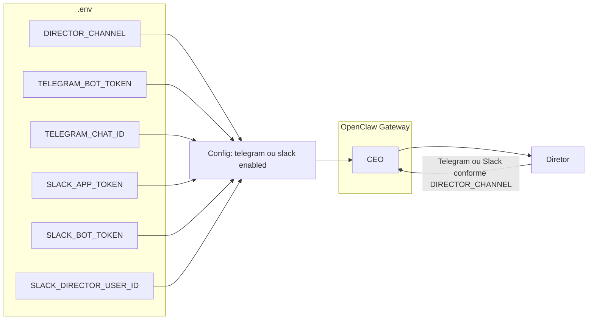

# Plano: Integração Slack (todos os agentes) + Telegram (só CEO)

## Regras de canal e workspace

- **Telegram:** somente o **agente CEO** pode conversar com o Diretor. Canal exclusivo CEO ↔ Diretor (comportamento atual).
- **Slack:** **todos os agentes** (CEO, PO, DevOps, Architect, Developer, QA, CyberSec, UX, DBA) podem conversar com o Diretor/time no workspace [clawdevsai](https://clawdevsai.slack.com).
- **Workspace único:** todos os agentes devem compartilhar o **mesmo workspace** (ex.: `/workspace` no K8s, `config/openclaw/workspace-ceo` no local). Reforçar na config e na documentação: `agents.defaults.workspace` e cada `agents.list[].workspace` iguais.

## Política rigorosa de plataformas de comunicação

- **CEO:** único agente autorizado a usar **qualquer** plataforma além do Slack (ex.: Telegram para o Diretor). Pode usar Telegram e Slack.
- **Demais agentes (PO, DevOps, Architect, Developer, QA, CyberSec, UX, DBA):** **não é permitido** acessar outra plataforma de comunicação que não seja o **Slack**. Eles **somente** podem conversar via Slack.
- **Implementação:** na configuração do OpenClaw, o canal Telegram deve estar restrito ao agente CEO (roteamento/allowlist por agente). Os outros canais (ex.: Telegram, WhatsApp, Discord, CLI público, etc.) não devem ser expostos aos subagentes; apenas o canal Slack deve estar disponível para a lista completa de agentes. Documentar e validar na config que nenhum agente não-CEO receba mensagens ou tenha permissão de envio em canais que não sejam Slack.

## Discussões entre agentes no Slack — LLM obrigatório

- **Regra:** quando os agentes **discutirem uma solução entre si no Slack**, é **obrigatório** usar **Ollama com LLM local em GPU** (não usar modelos em nuvem para essas conversas).
- **Implementação:** na config do OpenClaw, para o canal Slack (ou para sessões/conversas de discussão entre agentes no Slack), definir o provedor de modelo como **Ollama** (baseUrl apontando para o serviço Ollama no cluster, ex.: `http://ollama-service.ai-agents.svc.cluster.local:11434/v1`). Garantir que `agents.list[]` dos agentes que participam no Slack usem `model` do provedor `ollama` (ex.: `ollama/glm-5:cloud`, `ollama/ministral-3:3b`, etc.) e que o gateway não roteie conversas do Slack para provedores em nuvem quando for discussão entre agentes. Documentar na doc e na config: "Slack (discussão entre agentes): Ollama local GPU obrigatório."

## Contexto atual

- **Fluxo:** Diretor comunica com o **CEO** via **Telegram**; CEO é o único agente nesse canal ([config/openclaw/openclaw.local.json5](config/openclaw/openclaw.local.json5), [k8s/management-team/openclaw/configmap.yaml](k8s/management-team/openclaw/configmap.yaml)).
- **Workspace:** no ConfigMap K8s todos os agentes já usam `"workspace": "/workspace"`; no local só o CEO está definido. Ao adicionar Slack (todos os agentes), garantir que a config local use o **mesmo** workspace para todos.
- **Credenciais:** [.env](.env) usa `TELEGRAM_BOT_TOKEN` e `TELEGRAM_CHAT_ID`; em K8s o Secret e o [entrypoint](k8s/management-team/openclaw/entrypoint.sh) injetam o chat ID.

Objetivo: manter Telegram (só CEO) e **adicionar** Slack (todos os agentes), configurável via .env com tokens Slack (Socket Mode), e reforçar workspace único em toda a config e docs.

---

## 1. Variáveis de ambiente (.env e .env.example)

**Telegram (inalterado):**

- `TELEGRAM_BOT_TOKEN`, `TELEGRAM_CHAT_ID` — canal exclusivo CEO ↔ Diretor.

**Slack (novo):**

- `SLACK_APP_TOKEN=xapp-...` — App Token com `connections:write` (Socket Mode). Ver [docs OpenClaw Slack](https://docs.openclaw.ai/channels/slack).
- `SLACK_BOT_TOKEN=xoxb-...` — Bot Token (após instalar o app no workspace clawdevsai).
- `SLACK_ENABLED=true` (opcional) — se `false` ou vazio, não habilita o canal Slack.
- `SLACK_DIRECTOR_USER_ID` (opcional) — ID do Diretor no Slack para `allowFrom` em DMs. Se omitido, usar `dmPolicy: "pairing"` e aprovar com `openclaw pairing approve slack <CODE>`.

**Arquivos:**

- **[.env](.env):** adicionar comentários/placeholders para `SLACK_ENABLED`, `SLACK_APP_TOKEN`, `SLACK_BOT_TOKEN`, `SLACK_DIRECTOR_USER_ID`.
- **Criar `.env.example`** (commitar): listar todas as variáveis (Telegram, Slack, Ollama) com descrição e valores de exemplo.

---

## 2. Configuração OpenClaw (Slack + workspace único)

**Regra de canais (alinhada à política rigorosa):**

- **Telegram:** `enabled: true`; roteado **apenas para o CEO**. Nenhum outro agente pode receber ou enviar por Telegram (garantir na config do gateway).
- **Slack:** `enabled: true` quando `SLACK_APP_TOKEN` e `SLACK_BOT_TOKEN` estiverem definidos (e opcionalmente `SLACK_ENABLED=true`). No Slack, **todos os agentes** podem participar. Para os agentes não-CEO, o Slack é a **única** plataforma de comunicação permitida.
- **Outras plataformas:** não expor outros canais (WhatsApp, Discord, etc.) aos subagentes; apenas CEO pode usar canais adicionais (ex.: Telegram).

**Workspace único (reforço):**

- **Config local ([config/openclaw/openclaw.local.json5](config/openclaw/openclaw.local.json5)):** definir `agents.defaults.workspace` e, quando houver lista de agentes, garantir que todos usem o **mesmo** `workspace` (ex.: `"config/openclaw/workspace-ceo"`).
- **ConfigMap K8s:** já usa `"workspace": "/workspace"` para todos. Adicionar comentário: "Todos os agentes compartilham o mesmo workspace /workspace."

**Config local — bloco Slack:**

- Incluir `channels.slack` com: `enabled: true` quando tokens Slack estiverem no .env; `mode: "socket"`; tokens via env; `dmPolicy: "allowlist"` e `allowFrom: [SLACK_DIRECTOR_USER_ID]` se definido, senão `dmPolicy: "pairing"`. **Não** restringir Slack a um único agente: permitir que todos os agentes possam ser invocados no Slack.

**Modelo obrigatório para discussões no Slack (Ollama local GPU):**

- Para conversas/discussões entre agentes no Slack: garantir que o provedor de modelo seja **Ollama** (local, GPU). Em `models.providers.ollama` apontar `baseUrl` para o Ollama do cluster (ou port-forward). Em `agents.list[]` dos agentes que usam Slack, usar apenas modelos `ollama/*` (ex.: `ollama/glm-5:cloud`, `ollama/ministral-3:3b`). Não rotear sessões do canal Slack para provedores em nuvem (OpenRouter, OpenAI, etc.) quando for discussão entre agentes; documentar essa regra na config (comentário) e na doc.

---

## 3. Script de run local (Telegram + Slack opcional)

**[scripts/run-openclaw-telegram-ollama.sh](scripts/run-openclaw-telegram-ollama.sh):**

- Manter Telegram sempre habilitado (CEO): exigir `TELEGRAM_BOT_TOKEN`; opcional `TELEGRAM_CHAT_ID` (pairing se ausente).
- Se `SLACK_APP_TOKEN` e `SLACK_BOT_TOKEN` estiverem definidos (e `SLACK_ENABLED` não for `false`): gerar config com `channels.slack.enabled: true`, `allowFrom` com `SLACK_DIRECTOR_USER_ID` se existir; exportar variáveis Slack.
- Garantir que a config gerada use **um único workspace** para todos os agentes (defaults + list).
- Port-forward Ollama e `exec npx openclaw@latest gateway`.

---

## 4. Kubernetes: ConfigMap, Secret, entrypoint e deployment

**ConfigMap ([k8s/management-team/openclaw/configmap.yaml](k8s/management-team/openclaw/configmap.yaml)):**

- Incluir `channels.slack` no JSON: `"enabled": true` quando env `SLACK_APP_TOKEN`/`SLACK_BOT_TOKEN` estiverem presentes; `"mode": "socket"`; `"allowFrom": ["__SLACK_DIRECTOR_USER_ID__"]` ou `[]` (entrypoint substitui).
- Reforçar em comentário: "Telegram: só CEO. Slack: todos os agentes. Todos compartilham o mesmo workspace /workspace."

**Secret:**

- Estender o secret existente ou criar `openclaw-slack` com: `SLACK_APP_TOKEN`, `SLACK_BOT_TOKEN`, `SLACK_DIRECTOR_USER_ID` (opcional). Documentar na doc de deploy.

**Entrypoint ([k8s/management-team/openclaw/entrypoint.sh](k8s/management-team/openclaw/entrypoint.sh)):**

- Manter injeção de `TELEGRAM_CHAT_ID` (Telegram sempre ativo para CEO).
- Se `SLACK_APP_TOKEN` e `SLACK_BOT_TOKEN` estiverem definidos: substituir `__SLACK_DIRECTOR_USER_ID__` na config e deixar `channels.slack.enabled: true`; caso contrário, `channels.slack.enabled: false`.

**Deployment ([k8s/management-team/openclaw/deployment.yaml](k8s/management-team/openclaw/deployment.yaml)):**

- Adicionar env (valueFrom secretKeyRef, optional): `SLACK_APP_TOKEN`, `SLACK_BOT_TOKEN`, `SLACK_DIRECTOR_USER_ID`.

---

## 5. Digest e alertas (enviar ao Diretor via Slack quando aplicável)

**[scripts/digest_daily.py](scripts/digest_daily.py):** hoje envia para Telegram se `TELEGRAM_BOT_TOKEN` e `TELEGRAM_CHAT_ID` estão definidos.

- Manter envio para **Telegram** (Diretor) quando `TELEGRAM_BOT_TOKEN` e `TELEGRAM_CHAT_ID` estiverem definidos (canal do CEO).
- Opcional: se Slack estiver configurado, enviar também para canal Slack ou DM do Diretor via `SLACK_BOT_TOKEN` e `SLACK_DIRECTOR_USER_ID`.
- Docs (05, 40): indicar que notificação ao Diretor usa Telegram (CEO); Slack pode ser usado para digest/alertas do time se configurado.

Outros pontos que mencionam “notificação ao Diretor” (ex.: [docs/05-seguranca-e-etica.md](docs/05-seguranca-e-etica.md), [docs/40-contingencia-cluster-acefalo.md](docs/40-contingencia-cluster-acefalo.md)): atualizar a documentação para indicar que o destino pode ser Telegram **ou** Slack conforme `DIRECTOR_CHANNEL`.

---

## 6. Setup interativo (scripts/setup.sh)

**[scripts/setup.sh](scripts/setup.sh):**

- Manter coleta de Telegram (obrigatório para CEO).
- Perguntar se deseja habilitar Slack; se sim, pedir tokens. Reforçar na mensagem final: Telegram = só CEO; Slack = todos os agentes; mesmo workspace.
- Remover: Perguntar o canal do Diretor: “Canal do CEO com o Diretor: 1) Telegram  2) Slack”.
- Se Telegram: fluxo atual (token + chat ID).
- Se Slack: pedir `SLACK_APP_TOKEN`, `SLACK_BOT_TOKEN` e opcionalmente `SLACK_DIRECTOR_USER_ID`; gravar em `.env` e no Secret K8s (incluir chaves Slack no secret gerado em [scripts/setup.sh](scripts/setup.sh) ~linhas 125–139).
- Gerar `config.yaml` (ou o config usado pelo setup) com o bloco do canal escolhido e referência à doc [Slack OpenClaw](https://docs.openclaw.ai/channels/slack).

---

## 7. Documentação interna (docs e README)

- **Doc novo ou seção em [docs/37-deploy-fase0-telegram-ceo-ollama.md](docs/37-deploy-fase0-telegram-ceo-ollama.md):** “Canal Diretor: Telegram ou Slack”:
  - Criar app no [Slack API](https://api.slack.com/apps) para o workspace clawdevsai.
  - Habilitar **Socket Mode**; criar **App Token** (`xapp-...`) com `connections:write`; instalar app e obter **Bot Token** (`xoxb-...`).
  - Subscrever eventos de bot: `app_mention`, `message.im`, `message.channels`, etc. (conforme [docs OpenClaw Slack](https://docs.openclaw.ai/channels/slack)).
  - Definir no `.env`: `DIRECTOR_CHANNEL=slack`, `SLACK_APP_TOKEN`, `SLACK_BOT_TOKEN`, e opcionalmente `SLACK_DIRECTOR_USER_ID` (como obter o user ID no Slack).
- **[config/openclaw/README.md](config/openclaw/README.md):** mencionar opção Slack e variável `DIRECTOR_CHANNEL`; link para a doc OpenClaw Slack.
- **Regra “único com acesso ao Slack”:** deixar explícito na doc e na descrição do agente CEO (configmap/description): o **único agente com acesso ao canal externo (Telegram ou Slack)** é o **CEO**; esse canal é exclusivamente para comunicação CEO ↔ Diretor.

---

## 8. Resumo de arquivos a alterar/criar

| Item                                                    | Ação                                                                                                                   |
| ------------------------------------------------------- | ---------------------------------------------------------------------------------------------------------------------- |
| `.env`                                                  | Adicionar comentários/placeholders: `DIRECTOR_CHANNEL`, `SLACK_APP_TOKEN`, `SLACK_BOT_TOKEN`, `SLACK_DIRECTOR_USER_ID` |
| `.env.example`                                          | Criar com todas as variáveis (Telegram, Slack, Ollama, etc.) e descrição                                               |
| `config/openclaw/openclaw.local.json5`                  | Adicionar `channels.slack` (enabled false, mode socket, dmPolicy/allowFrom)                                            |
| `scripts/run-openclaw-telegram-ollama.sh`               | Generalizar: ler `DIRECTOR_CHANNEL`, validar tokens do canal escolhido, gerar config telegram ou slack                 |
| `k8s/management-team/openclaw/configmap.yaml`           | Incluir `channels.slack` com placeholders                                                                              |
| `k8s/management-team/openclaw/entrypoint.sh`            | Injetar `DIRECTOR_CHANNEL`, `SLACK`_*, ativar um canal e desativar o outro                                             |
| `k8s/management-team/openclaw/deployment.yaml`          | Env `DIRECTOR_CHANNEL`, `SLACK_APP_TOKEN`, `SLACK_BOT_TOKEN`, `SLACK_DIRECTOR_USER_ID` (Secret)                        |
| Secret K8s (exemplo/doc)                                | Documentar/criar exemplo com chaves Slack                                                                              |
| `scripts/digest_daily.py`                               | Se `DIRECTOR_CHANNEL=slack`, enviar digest via Slack API (DM ao Diretor)                                               |
| `scripts/setup.sh`                                      | Perguntar canal (Telegram/Slack) e coletar credenciais Slack; gravar .env e Secret                                     |
| `docs/37-deploy-fase0-telegram-ceo-ollama.md` (ou novo) | Seção Slack: criar app, Socket Mode, tokens, variáveis                                                                 |
| `config/openclaw/README.md`                             | Opção Slack e `DIRECTOR_CHANNEL`                                                                                       |
| Docs (05, 40, etc.)                                     | “Notificação ao Diretor” pode ser Telegram ou Slack conforme config                                                    |

---

## Fluxo final (resumo)

- **Telegram:** apenas o CEO conversa com o Diretor. **Slack:** todos os agentes podem conversar; mesmo workspace compartilhado. **Política rigorosa:** agentes não-CEO não podem acessar outra plataforma além do Slack. **Discussões no Slack:** quando agentes discutirem soluções entre si no Slack, usar **obrigatoriamente** Ollama (LLM local com GPU).

---

## O que ainda falta para todos os agentes conversarem no Slack

| Item | Status | Ação |
|------|--------|------|
| **Config local (`openclaw.local.json5`) — lista de agentes** | Pendente | Hoje só tem `ceo` em `agents.list`. Para todos conversarem no Slack no run local, incluir a lista completa: CEO, PO, DevOps, Architect, Developer, QA, CyberSec, UX, DBA — todos com o **mesmo workspace** (ex.: `config/openclaw/workspace-ceo`). |
| **Menor LLM local só para conversa no Slack** | Pendente | Escolher um modelo pequeno (menos VRAM, mais rápido) para uso **apenas** em conversas no Slack. Opções: **Phi-3 mini** (~3.8B), **Qwen2.5:3b**, **Ministral-3:3b** ou **SmolLM** (3B). Definir em `agents.defaults.model` e em cada `agents.list[].model` na config local quando o objetivo for só Slack; documentar em `config/openclaw/README.md` e em `docs/42-slack-tokens-setup.md`. |
| **K8s** | Feito | ConfigMap já tem lista completa e `channels.slack`; entrypoint e deployment com env Slack. |
| **Script run local** | Feito | `run-openclaw-telegram-ollama.sh` habilita Slack quando tokens no .env. |
| **Docs tokens e criação do app** | Feito | `docs/42-slack-tokens-setup.md` com tokens, manifest, Manage members (DIRECTOR_USER_ID). |

