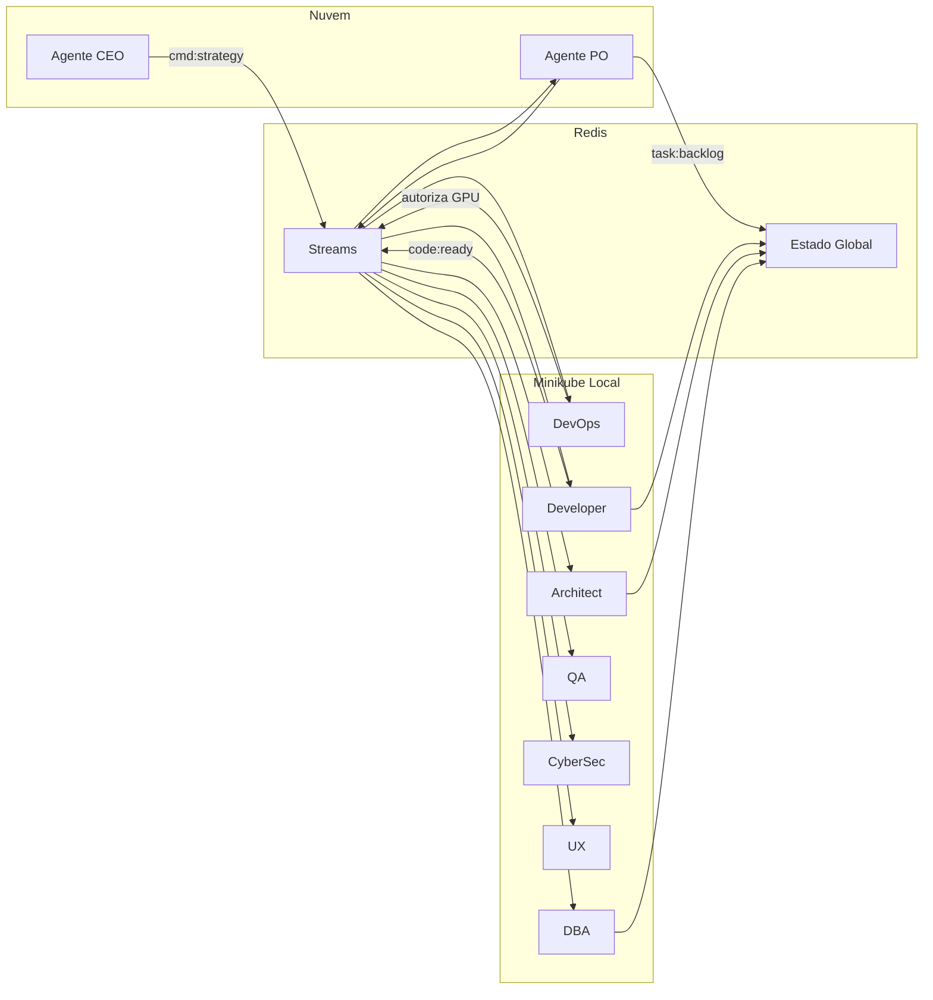

# Arquitetura: Redis Streams e fluxo de eventos

A orquestração do **ClawDevs** usa **arquitetura orientada a eventos com estado centralizado (Redis Streams)**. Os agentes não se chamam diretamente; ficam em *idle* e são acordados por eventos, reduzindo uso de CPU/GPU e evitando OOM.

## Por que Redis Streams

1. **Performance:** Agentes não fazem *polling*; consomem zero CPU/GPU em *idle* até o Redis disparar o gatilho.
2. **Custo (VRAM):** Com Redis gerenciando a fila, apenas um agente técnico por vez usa a GPU. Quando o Developer termina, o Redis notifica o Architect e o modelo do Developer pode ser descarregado.
3. **Custo (tokens):** O estado centralizado evita que o Agente CEO reenvie o contexto inteiro para o PO a cada interação; o contexto fica no Redis.

## Estado da verdade (The Global State)

Em vez de passar JSONs grandes entre pods, transmite-se apenas um **ID de transação**. Convenção de streams e chaves: [38-redis-streams-estado-global.md](38-redis-streams-estado-global.md).

- O Agente PO grava a especificação técnica completa em uma chave no Redis (ex.: `project:v1:issue:42`).
- O Agente Developer recebe a instrução: *"Leia a chave `issue:42` e trabalhe"*. O tráfego de rede interna do Minikube permanece mínimo.

## Estágio de borda (antes do stream)

Os eventos ou payloads que alimentam o stream passam por um **estágio de borda** antes de serem consumidos pelos agentes. (1) **Truncamento por tokens:** um script (ex.: na entrada do Redis Stream) aplica limite de tokens (ex.: 4000) com truncamento bruto mantendo cabeçalho e causa raiz. (2) **Pre-flight para nuvem:** para payloads com mais de três interações destinados à nuvem (CEO, PO), o orquestrador aplica **pre-flight obrigatório** com sumarização em modelo local (CLI Summarize ou equivalente): o histórico bruto é substituído por resumo executivo denso antes do envio ao Gateway; só então o Gateway envia ao provedor. Isso evita corte no meio de JSON e reduz custo na causa raiz. (3) **Gateway:** limite rígido de max tokens por request no perfil do agente (config JSON/YAML) aplicado antes da requisição chegar ao provedor. Assim, nenhum agente recebe carga que estoure a VRAM e o FinOps é controlado por regras na infraestrutura, não por ação reativa de agente. (4) **Roteamento CEO/PO (local vs nuvem):** eventos destinados ao CEO ou ao PO podem ser **rotulados** (ex.: `task_type: small` vs `task_type: requires_cloud`) ou classificados por regras/SLM em CPU; o Gateway ou orquestrador encaminha para **Ollama local** (tarefa pequena) ou para o **provedor em nuvem** (validação complexa, raciocínio profundo, criatividade, investigação na internet). CEO e PO têm assim **duplo destino**: local por padrão, nuvem sob demanda. Ver [07-configuracao-e-prompts.md](07-configuracao-e-prompts.md) (Roteamento CEO/PO e Pipeline) e [04-infraestrutura.md](04-infraestrutura.md). (5) **Token bucket para eventos de estratégia:** contador no orquestrador (ex.: Redis) limita o número de eventos com **tag de estratégia** (ex.: canal `cmd:strategy`) por janela (ex.: 5 por hora); além do limite, o Gateway intercepta (enfileirar ou descartar com erro). **Degradação por eficiência:** se a razão ideias CEO vs tarefas aprovadas pelo PO cair abaixo do limiar, o orquestrador bloqueia temporariamente a nuvem para o CEO e força roteamento para modelo local em CPU (ex.: Phi-3). Ver [07-configuracao-e-prompts.md](07-configuracao-e-prompts.md). O **TTL do Redis** também é usado para expirar mensagens antigas do working buffer (expiração automática, sem depender do DevOps); ver [07-configuracao-e-prompts.md](07-configuracao-e-prompts.md) e [28-memoria-longo-prazo-elite.md](28-memoria-longo-prazo-elite.md).

## Stream de eventos (The Action)

O Redis Streams mantém uma linha do tempo imutável de eventos. Exemplo de fluxo:

1. **Evento 1:** CEO publica no canal `cmd:strategy`.
2. **Evento 2:** O PO, em *idle*, recebe o sinal, consome a API (nuvem), gera o backlog e publica no canal `task:backlog`.
3. **Ciclo de rascunho (validação técnica):** Antes de a tarefa ir para "pronto para desenvolvimento", o PO publica um **rascunho** no stream (ex.: evento `draft.2.issue`). O Architect consome o rascunho, avalia **viabilidade técnica** contra a arquitetura atual. Se for tecnicamente impossível, o Architect retorna **draft_rejected** e o PO reescreve a tarefa; só então a tarefa é publicada na fila de desenvolvimento. Isso evita deadlock por tarefas impossíveis e mitiga o risco de **alucinação de escopo** (RAG falha ou doc desatualizada → PO cria tarefas impossíveis na base atual; ver [02-agentes.md](02-agentes.md)) e mantém governança. **Disjuntor:** Se a **mesma épico** for rejeitada **3 vezes consecutivas**, o orquestrador **congela** a tarefa e aciona **RAG health check** determinístico (datas de indexação vs main, estrutura de pastas); após autocura e atualização da memória do orquestrador, a épico é descongelada e o PO recebe a rejeição com **contexto saneado**. Ver [06-operacoes.md](06-operacoes.md) (Disjuntor de draft_rejected). **Desempate Developer–Architect:** Em impasses no código (ex.: PR rejeitado por padrão de design), o **Agente CEO atua como juiz de desempate** — avalia estritamente pelo **impacto no valor de negócio** antes de acionar o Diretor. Se a recusa do Architect tiver **tag de vulnerabilidade crítica (cybersec)**, o CEO **não** pode forçar o merge; o impasse escala para o Diretor. **Orçamento de degradação:** se mais de 10–15% das tarefas do sprint caírem em 5º strike (abandono) ou aprovação por omissão **cosmética**, o DevOps dispara alerta crítico e **pausa a esteira** (freio de mão) até recalibragem; detalhes em [06-operacoes.md](06-operacoes.md). Aprovação por omissão aplica-se **apenas** a impasses cosméticos (diff só CSS/UI/markdown); impasses de código lógico/backend seguem a lógica de 5 strikes (fila de bloqueados). **Dependências:** pacotes novos podem passar por **pipeline de quarentena automatizada** (sandbox sob demanda, varredura + testes) e **zonas de confiança de autores** (pacotes assinados por publicadores da matriz instaláveis sem aprovação direta); ver [05-seguranca-e-etica.md](05-seguranca-e-etica.md).
4. **Evento 4:** O Agente DevOps (vigia) vê tarefa nova; verifica se a GPU está com menos de 50% de uso; se estiver, autoriza o Agente Developer a carregar o modelo local (Ollama) e começar a codar.

## Estágio pré-GPU (validação em CPU) e batching de PRs

Antes de solicitar o lock de GPU, o orquestrador submete o artefato (ex.: diff ou código) a um **SLM em CPU** (ex.: Phi-3 Mini, FI-Tree) para checagens determinísticas: **sintaxe**, **lint** e **aderência básica a SOLID**. Só após passar essa malha fina no processador principal a tarefa entra na fila que compete pelo lock; o Architect consome GPU apenas para análises lógicas que exigem complexidade. Isso reduz tempo ocioso na fila e evita gastar VRAM com revisões que ferramentas em CPU resolvem.

**Batching de PRs:** Em vez de o Architect carregar o modelo na VRAM para cada micro-alteração do Developer, o orquestrador pode **acumular** pequenas alterações (micro-PRs) e o Architect realiza **revisão em lote** com janela de contexto maior de uma só vez. O sistema paga a latência do barramento (carregamento do modelo) uma vez, otimizando o custo de VRAM e reduzindo contenção no lock. Ver [06-operacoes.md](06-operacoes.md) e [07-configuracao-e-prompts.md](07-configuracao-e-prompts.md).

## Fila de prioridade e lock de GPU (fundação — Phase 0)

**Risco:** Com Pub/Sub simples, ao evento `code:ready` os agentes Architect, QA, CyberSec, UX e DBA podem acordar todos ao mesmo tempo e tentar carregar cinco modelos na VRAM, causando OOM e travamento.

**Estratégia de uso de hardware:** O projeto adota **pipeline explícito ou slot único de revisão** — não múltiplos agentes disputando o mesmo evento para GPU. Um único consumidor por etapa ou um job consolidado "Revisão pós-Dev" adquire o lock uma vez e executa as etapas (Architect, QA, CyberSec, DBA) em sequência interna. Ver [estrategia-uso-hardware-gpu-cpu.md](estrategia-uso-hardware-gpu-cpu.md).

**Mitigação (fundação obrigatória):** Fila de prioridade com **lock de GPU** e **TTL dinâmico** desde o dia 1. Usar **Consumer Groups** no Redis Streams: um grupo `gpu-consumers` em que apenas um agente por vez obtém o "token da GPU"; o próximo só recebe quando o anterior liberar. Implementação: script de GPU Lock (Redis `SETNX`) com **TTL calculado dinamicamente** com base no payload do evento no Redis — por exemplo, se a contagem de linhas do payload (ex.: diff do PR) for maior que 500, TTL = 120 s; caso contrário, TTL = 60 s. **Hard timeout no orquestrador:** o Kubernetes deve encerrar o pod que usa GPU após tempo máximo (ex.: 120 s) de uso contínuo, sem depender de o agente liberar o lock — evita cluster em coma se o processo morrer por OOM ou travamento. Ver [scripts/gpu_lock.md](scripts/gpu_lock.md), [04-infraestrutura.md](04-infraestrutura.md) e [09-setup-e-scripts.md](09-setup-e-scripts.md).

**Node selectors (fundação):** Configurar **node selectors** no Minikube (ex.: em `limits.yaml` ou manifests dos pods) para que os agentes **administrativos** (DevOps, UX) usem **exclusivamente** o modelo leve (ex.: Phi-3 Mini) rodando em **CPU**. A VRAM da RTX fica reservada desde o dia 1 para Developer, Architect e QA. Isso reduz o funil na GPU e blindagem contra a própria fila.

**Evolução adicional (Phase 11):** PriorityClasses para evict gracioso em pico térmico; ver [issues/122-balanceamento-dinamico-gpu-cpu.md](issues/122-balanceamento-dinamico-gpu-cpu.md) e [06-operacoes.md](06-operacoes.md).

**Roteamento hierárquico (nuvem → GPU → CPU):** Para evitar deadlock quando a nuvem (ex.: FreeRide) atinge rate limit e a GPU local está ocupada pelo GPU Lock, a config do OpenClaw deve unificar fallbacks: nuvem → GPU local → **modelo local leve em CPU** (ex.: Phi-3 Mini) como última via. Quando não for viável forçar CPU, **pausar a fila** (ex.: Sessions-Spawn) e **persistir o estado da conversa no LanceDB**; ao liberar o GPU Lock, o Redis sinaliza e o orquestrador recupera o estado do LanceDB para o agente continuar. **CEO e PO:** destino duplo — Ollama local para tarefas pequenas; nuvem sob demanda para validação complexa, pensar, criatividade e investigação na internet (ver estágio de borda acima e [07-configuracao-e-prompts.md](07-configuracao-e-prompts.md)). Ver [22-modelos-gratuitos-openrouter-freeride.md](22-modelos-gratuitos-openrouter-freeride.md) e [28-memoria-longo-prazo-elite.md](28-memoria-longo-prazo-elite.md).

## Fluxo de dados (diagrama)

## Comparativo de eficiência

| Característica | Chamada direta (API) | Redis Streams |
|----------------|----------------------|--------------|
| Uso de CPU | Alto (espera ocupada) | Mínimo (reativo) |
| Risco de OOM (GPU) | Alto (caótico) | Baixo (controlado por fila) |
| Latência | Média | Baixa (memória) |
| Resiliência | Se um pod cai, o dado pode se perder | Se o pod cai, a tarefa volta para a fila |

## Blackboard e resiliência

Comunicação via **Event Bus (Redis ou RabbitMQ)** no padrão "quadro negro": o Agente CEO escreve a tarefa no Redis; o PO assina e escreve o backlog; o Developer pega a tarefa quando o pod estiver livre. Se um agente cair, a tarefa permanece na fila; quando o Kubernetes reiniciar o pod, o agente retoma de onde parou. **Regra de ouro:** toda tarefa **interrompida** (por qualquer motivo — FinOps, timeout, pausa térmica, falha de arbitragem, etc.) é **devolvida ao backlog do Product Owner**; a issue **nunca** é descartada nem se perde.

**Checkpoint transacional (pausa térmica):** Atrelado ao Redis Streams: aos **80°C** (gatilho pré-crítico), o DevOps **injeta evento de prioridade máxima** no Redis ordenando **commit do estado atual em branch efêmera de recuperação** (ex.: `recovery-failsafe-YYYYMMDD-HHMMSS`) — isolando o estado antes do Q-Suite térmico (82°C) derrubar a execução. Na retomada: checkout limpo; se houver divergência no índice ou conflitos, o Architect (tarefa prioridade zero) resolve na branch de recuperação antes de reentregar a tarefa. Ver [06-operacoes.md](06-operacoes.md) e [04-infraestrutura.md](04-infraestrutura.md).

**Contingência cluster acéfalo (queda de internet):** Se CEO e PO estão na nuvem e a conectividade cai, o fluxo estratégico para mas a execução local pode continuar cegamente. O orquestrador monitora o Redis; se **nenhum comando com tag de estratégia do CEO** for recebido em **time-out configurável** (ex.: 5 min), o **DevOps local** é acionado: executa **commit do estado atual em branch efêmera de recuperação** (ex.: `recovery-failsafe-<timestamp>`), persiste a fila no LanceDB e **pausa** o consumo da fila de GPU. **Retomada automática:** durante a pausa o orquestrador executa **health check contínuo** (ping em endpoints a cada 5 min, sem tokens); quando a conectividade estiver estável por **3 ciclos consecutivos** (evitar flapping), o orquestrador **acorda automaticamente** o DevOps e dispara o script de retomada (checkout limpo; se divergência ou conflitos, Architect prioridade zero resolve na branch de recuperação; restaura fila e retoma consumo). **Nenhuma intervenção humana** para destravar; o Diretor recebe apenas **notificação assíncrona** (Telegram/Slack ou digest). Detalhes em [06-operacoes.md](06-operacoes.md) (seção *Contingência: cluster acéfalo*).

**Semântica idempotente no stream:** Os payloads no Redis Streams devem ser tratados como **transações idempotentes**. O consumidor **não** envia ACK até o trabalho estar **100% concluído em disco**. Se o pod for pausado abruptamente (ex.: aos 82°C), a mensagem não recebe ACK e permanece pendente na fila; na retomada, o Redis reentrega a tarefa e o agente retoma do ponto exato. Ver [06-operacoes.md](06-operacoes.md).

## Orquestração de eventos (evitar ghost commits)

Não usar *polling* (ficar perguntando se está pronto). Usar **webhooks** locais: o Agente Architect só acorda quando o Git dispara um sinal de `post-commit`, evitando revisão sobre código ainda não sincronizado no volume compartilhado (erros "File Not Found").

## Merge de conhecimento (curadoria centralizada)

Para evitar que o autoaprendizado de nove agentes em paralelo gere **conflitos** (learnings contraditórios) e **corrupção do arquivo de identidade central** (SOUL.md, AGENTS.md, TOOLS.md), a promoção de `.learnings/` para esses arquivos **não** é feita de forma orgânica por cada agente. O orquestrador trata a promoção como **processo formal de merge request**:

- **CronJob em sessão isolada:** Em janela dedicada (ex.: execução noturna ou em slot isolado), um **agente curador** (Architect ou CyberSec) é acionado em **sessão totalmente isolada** das filas do Redis do dia a dia. Sua única função nessa sessão é ler os aprendizados acumulados ainda não processados, **resolver contradições** com base no contexto arquitetural e produzir um **único artefato consolidado** (JSON ou Markdown), que é então injetado de forma segura nos arquivos globais. Assim a curadoria é centralizada sem paralisar as filas de desenvolvimento. Ver [10-self-improvement-agentes.md](10-self-improvement-agentes.md) (Promoção para memória do workspace, protocolo de consenso e curadoria).

**Governance Proposer (10º agente):** A evolução de **rules, soul, skills, task e outras configs** dos agentes segue fluxo distinto: um **repositório Git dedicado** no GitHub contém a fonte canônica; o agente **Governance Proposer** lê esse repo periodicamente (cron), busca melhorias na internet (ex. ClawHub) e **gera PR** para o **Diretor** aprovar. Validação humana do PR é **obrigatória** (nenhum merge automático). Após o Diretor aprovar e fazer merge na main, **o próprio agente** aplica as modificações localmente (pull e sincronização com o workspace). Ver [35-governance-proposer.md](35-governance-proposer.md).
