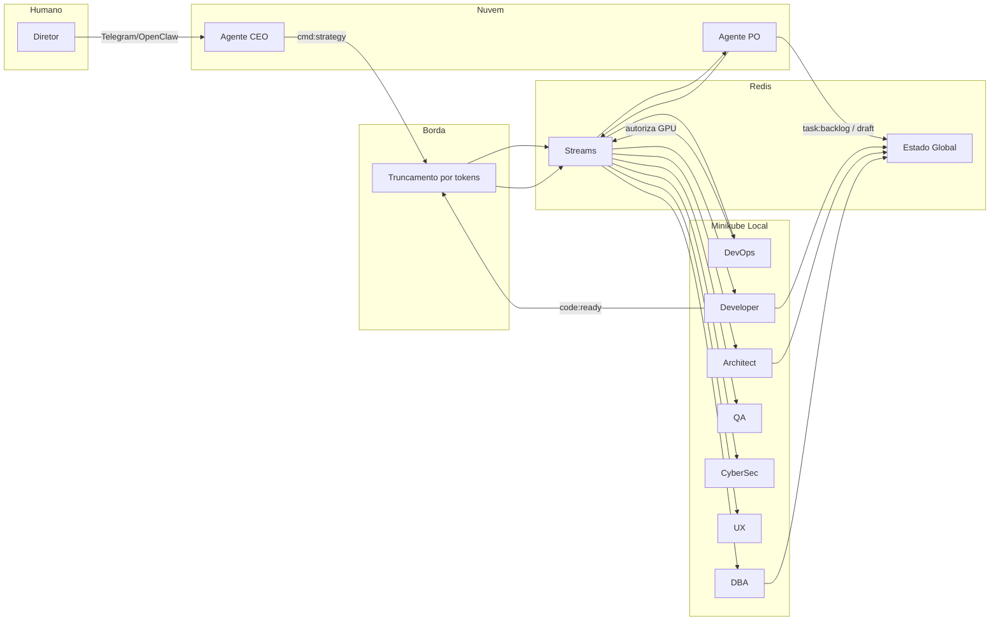
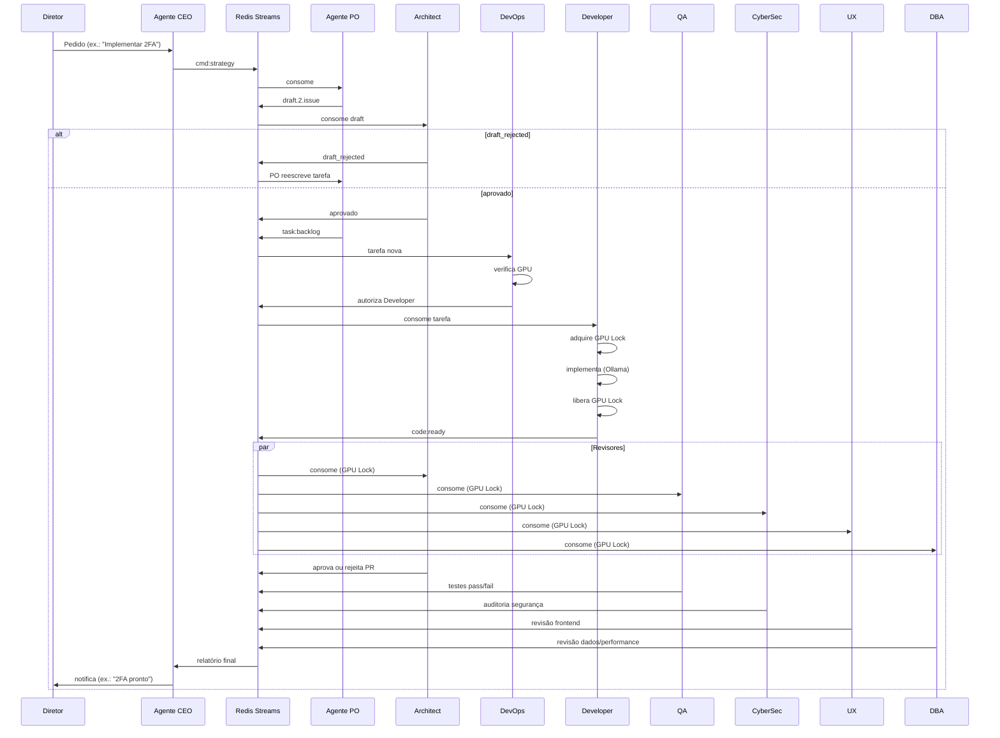
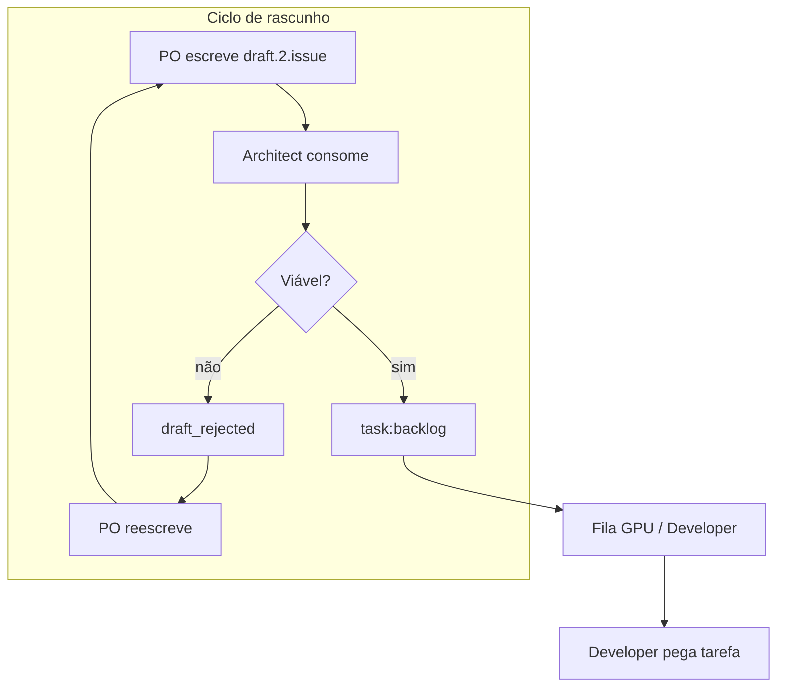
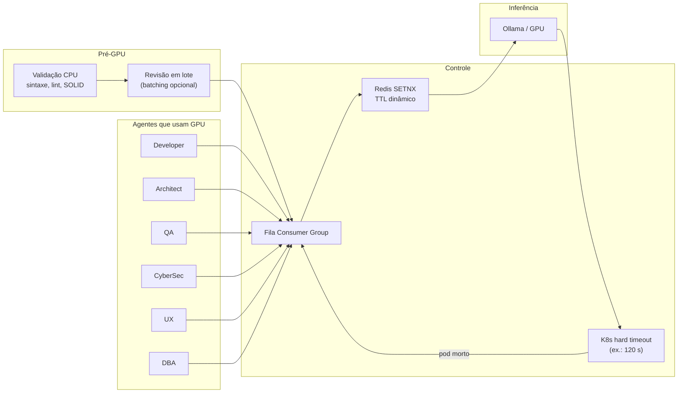
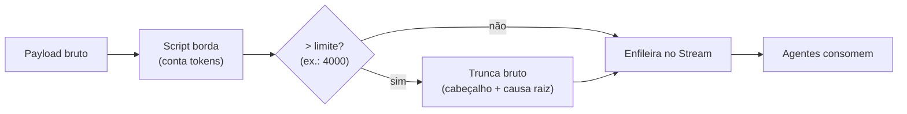
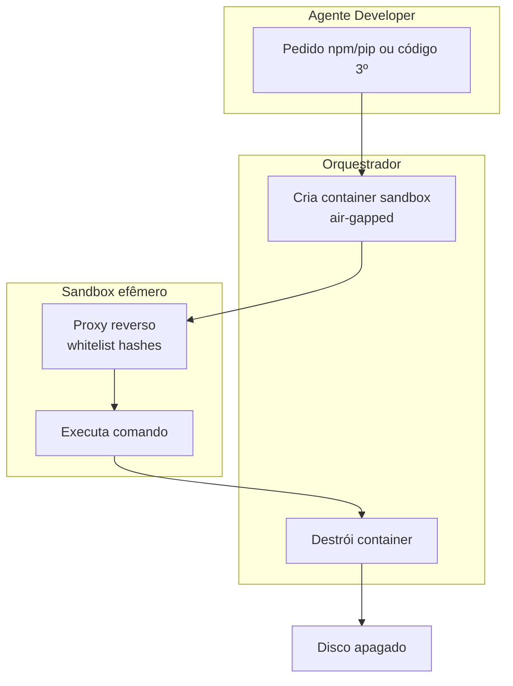
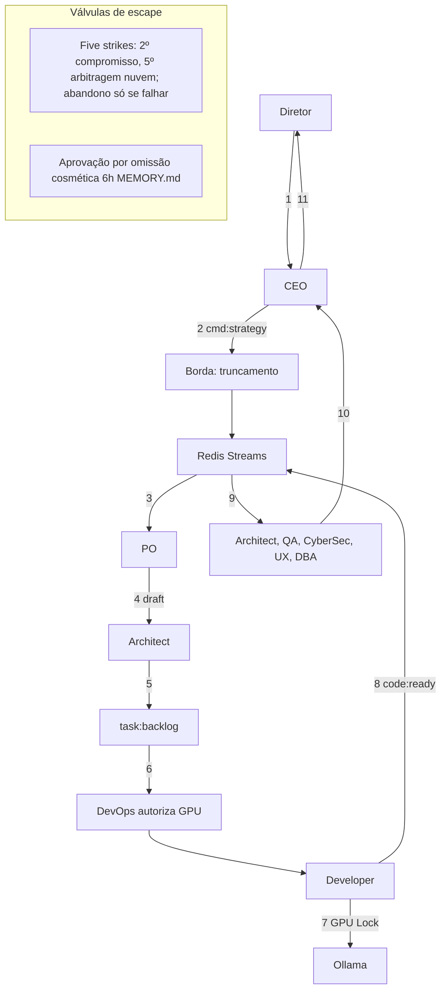

# Fluxo completo do enxame (Mermaid)

Este documento consolida os fluxos do time de desenvolvimento autônomo em diagramas **Mermaid**, para visualização da arquitetura, da sequência de eventos e das válvulas de proteção e governança. Referência: [03-arquitetura.md](03-arquitetura.md), [06-operacoes.md](06-operacoes.md), [08-exemplo-de-fluxo.md](08-exemplo-de-fluxo.md).

---

## 1. Visão de componentes e fluxo de dados

---

## 2. Sequência do fluxo de valor (estratégia → entrega)

---

## 3. Ciclo de rascunho (PO → Architect) e fila de desenvolvimento

---

## 4. Validação pré-GPU (CPU), batching e GPU Lock

Antes de disputar o lock, o artefato passa por **validação em CPU** (sintaxe, lint, SOLID via SLM). O Architect pode realizar **revisão em lote (batching)** de micro-PRs com uma janela de contexto única. Em seguida, a fila e o GPU Lock controlam o acesso à GPU.

---

## 5. Truncamento na borda (disjuntor não-LLM)

---

## 6. Governança: Five Strikes (fallback contextual) e aprovação por omissão (apenas cosmético)

```mermaid
flowchart TB
  subgraph fiveStrikes [Five Strikes e fallback]
    Conflito[Developer x Architect no mesmo PR]
    Conta[Orquestrador conta iterações]
    S2["2º strike?"]
    Compromisso["Prompt compromisso: Architect gera código aprovável"]
    S5["5º strike?"]
    Escala["Empacota contexto, roteia arbitragem nuvem"]
    Abandon["PR bloqueado, só se escalação falhar"]
    Proxima[Developer próxima tarefa]
    Conflito --> Conta
    Conta --> S2
    S2 -->|sim| Compromisso
    Compromisso --> S5
    S5 -->|sim| Escala
    Escala --> Abandon
    Abandon --> Proxima
    S2 -->|não| Conflito
    S5 -->|não| Conflito
  end

  subgraph aprovOmissao [Aprovação por omissão apenas cosmético]
    CEO_alerta["CEO envia alerta"]
    Tipo["Tipo do diff determinístico"]
    Cosmetic["Somente CSS, UI isolada ou markdown"]
    Logic["Código lógico ou backend"]
    Timer["Timer ex.: 6 h"]
    Diretor_responde["Diretor responde?"]
    CEO_aprova["CEO aprova por omissão"]
    MEMORY["Registra em MEMORY.md"]
    FilaBloq["Issue volta ao backlog do PO; PO + Architect analisam histórico e solução; tarefa retorna ao desenvolvimento"]
    CEO_alerta --> Tipo
    Tipo --> Cosmetic
    Tipo --> Logic
    Cosmetic --> Timer
    Timer --> Diretor_responde
    Diretor_responde -->|não| CEO_aprova
    CEO_aprova --> MEMORY
    Diretor_responde -->|sim| FimNorm[Fluxo normal]
    Logic --> FilaBloq
  end
```

---

## 7. Execução segura do Developer (sandbox air-gap)

---

## 8. Fluxo completo resumido (uma página)

---

## Referências

- [01-visao-e-proposta.md](01-visao-e-proposta.md) — Autonomia nível 4, matriz de escalonamento
- [02-agentes.md](02-agentes.md) — Definição dos nove agentes
- [03-arquitetura.md](03-arquitetura.md) — Redis Streams, estado global, estágio de borda
- [04-infraestrutura.md](04-infraestrutura.md) — GPU Lock, hard timeout, truncamento na borda
- [05-seguranca-e-etica.md](05-seguranca-e-etica.md) — Sandbox air-gap, proxy, análise estática
- [06-operacoes.md](06-operacoes.md) — Five strikes, aprovação por omissão cosmética, prevenção
- [07-configuracao-e-prompts.md](07-configuracao-e-prompts.md) — Pipeline de truncamento
- [08-exemplo-de-fluxo.md](08-exemplo-de-fluxo.md) — Exemplo 2FA
