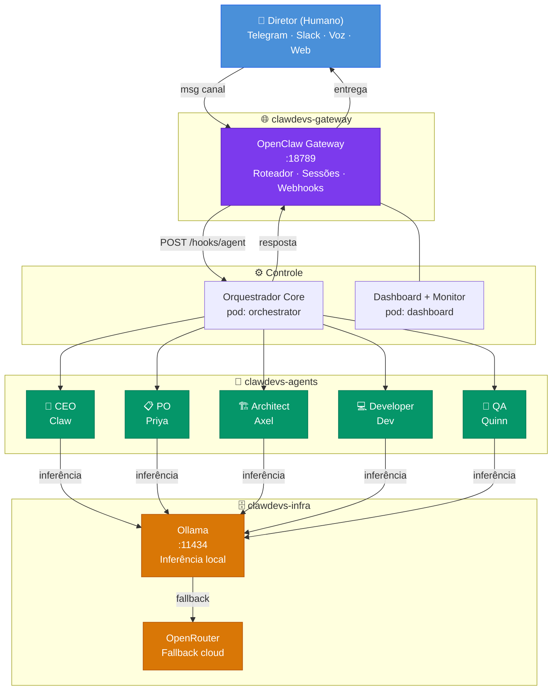
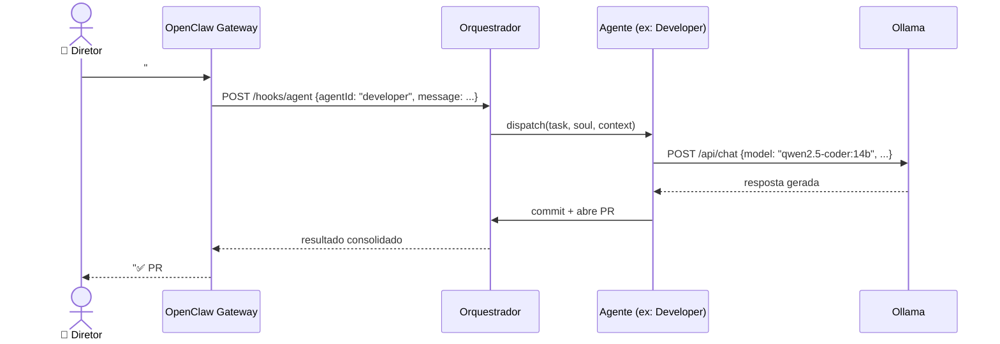
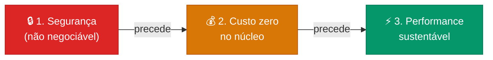
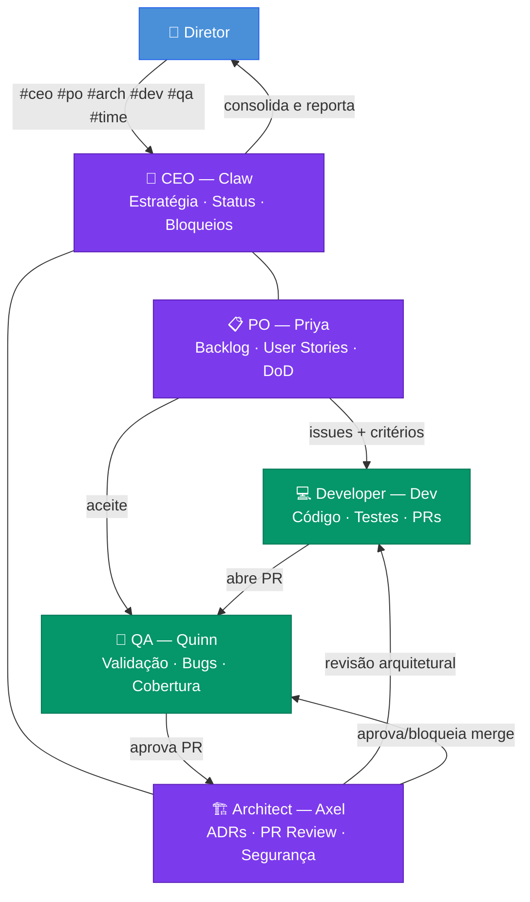
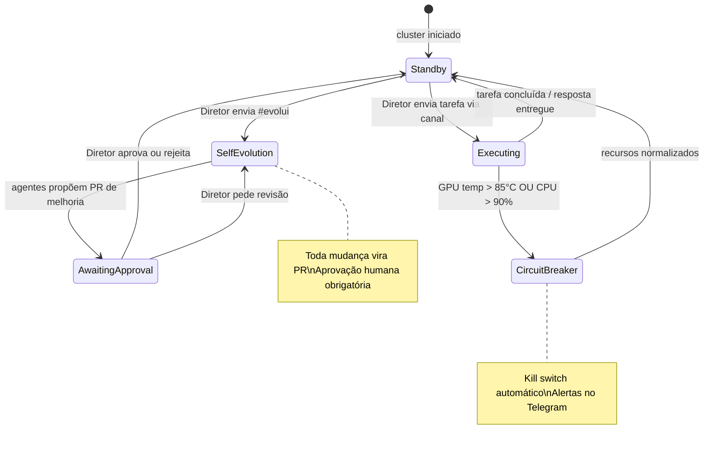

# 01 — Visão do Projeto
> **Objetivo:** Estabelecer a visão macro da arquitetura, os princípios inegociáveis do produto e os modos de operação do sistema.
> **Público-alvo:** Produto (PO, Stakeholders)
> **Ação Esperada:** Entender o propósito do ecossistema e validar se o direcionamento técnico apoia as metas de negócio.

**v2.0 | 06 de março de 2026**

---

## Índice resumido

Para navegação completa acesse o [README principal](./README.md).

---

## Arquitetura Macro

---

## Fluxo de uma tarefa (ponta a ponta)

---

## Princípios de design

**Toda decisão técnica e de produto** deve ser avaliada nesta ordem de prioridade: segurança → custo → performance. Nunca invertida, independente de pressão de prazo.

---

## Time de agentes (v1.0)

---

## Modos de operação

---

*Próximo Documento:* [02 — Backlog e MVP →](./02-produto-backlog-mvp.md)
