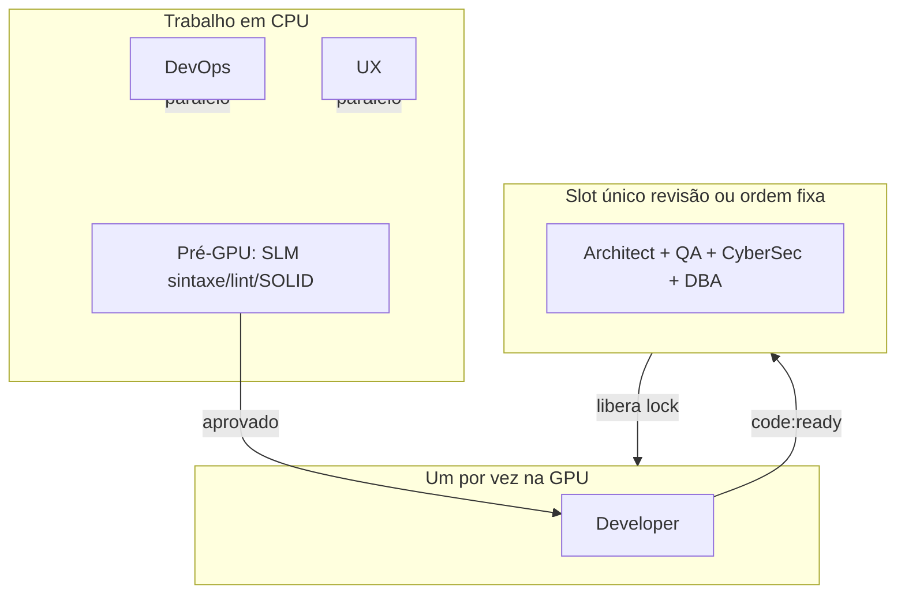

# Estratégia de uso de hardware: maximizar GPU e CPU

Estratégia de uso de hardware do **ClawDevs**. Objetivo: **maximizar a utilização de GPU e CPU** dentro do **limite do cluster Kubernetes de 65% do hardware** (o cluster não deve exceder esse teto). Evitar desperdício e revisar o modelo em que vários agentes "acordam" ao mesmo tempo disputando o GPU Lock. Esta estratégia complementa a fundação (GPU Lock, node selectors, estágio pré-GPU, batching de PRs) documentada em [03-arquitetura.md](03-arquitetura.md), [04-infraestrutura.md](04-infraestrutura.md) e [06-operacoes.md](06-operacoes.md).

---

## Princípios

1. **Limite do Kubernetes:** O cluster consome no máximo **65% do hardware**; a estratégia de GPU/CPU opera dentro desse teto (Minikube + ResourceQuota).
2. **GPU:** Nunca mais de um agente (ou um slot consolidado) usando a GPU ao mesmo tempo; implementado via GPU Lock + pipeline explícito ou slot único de revisão.
3. **CPU:** Múltiplos agentes podem trabalhar em CPU ao mesmo tempo (DevOps, UX, estágio pré-GPU), dentro dos limites do namespace (ResourceQuota/LimitRange), sem disputar a GPU.
4. **Ordem explícita:** Em vez de N agentes subscrevendo o mesmo evento e disputando o lock, o orquestrador garante **um consumidor GPU por etapa** ou um **slot único de revisão** — não múltiplos agentes disputando o mesmo evento para GPU.

---

## Escolha da estratégia: pipeline explícito e slot único de revisão

**Opção adotada: híbrido.**

- **Fase de desenvolvimento:** O Developer é o único consumidor designado do evento "tarefa pronta para desenvolvimento"; adquire o GPU Lock, codifica, publica `code:ready` e libera o lock.
- **Fase de revisão pós-Dev:** Em vez de Architect, QA, CyberSec, UX e DBA acordarem todos ao evento `code:ready` e disputarem o lock, adota-se **slot único de revisão**:
  - Um único **job/pod "Revisão pós-Dev"** (ou consumidor dedicado no Redis Stream) é acionado por `code:ready`.
  - Esse slot adquire o **GPU Lock uma vez**, carrega **um** modelo (ex.: Llama 3 8B) e executa **em sequência interna** (sem liberar o lock) as etapas: Architect, QA, CyberSec, DBA (e opcionalmente UX se couber no mesmo modelo), gerando todos os pareceres em uma janela.
  - Ao final, libera o lock.
- **Efeito:** Uma carga de modelo na VRAM por ciclo de revisão, máximo uso contínuo da GPU no slot, sem múltiplos pods acordando para disputar o lock.

Alternativa válida para evolução futura: **ordem fixa por evento** — o orquestrador publica em sequência `code:ready` → só Architect consome → ao terminar, publica `architect_done` → só QA consome, etc. Assim só um agente acorda por vez para a GPU. A implementação atual prioriza o slot único para a fase de revisão.

---

## Maximizar utilização da GPU

- **OLLAMA_KEEP_ALIVE:** Configurar de forma que, dentro do mesmo slot ou da mesma sequência de agentes que usam o mesmo modelo, o Ollama não descarregue o modelo entre chamadas (ex.: janela de 5–10 min). Ver [04-infraestrutura.md](04-infraestrutura.md).
- **Agrupamento por modelo:** Ordenar a fila de trabalho para que agentes que usam o mesmo modelo (ex.: Architect, QA, CyberSec, DBA com Llama 3 8B) rodem em sequência sem trocar modelo; o slot único de revisão implementa isso naturalmente.
- **Batching de PRs (obrigatório):** O orquestrador acumula pequenas alterações e o Architect (ou o slot de revisão) realiza revisão em lote com janela de contexto única; reduz chamadas à GPU e contenção no lock. Ver [03-arquitetura.md](03-arquitetura.md) e [06-operacoes.md](06-operacoes.md).
- **Hard timeout no Kubernetes:** Manter (ex.: 120 s por uso contínuo de um agente; para slot único de revisão, o timeout deve cobrir a duração total do slot, ex.: 300 s se necessário), documentado no deployment. Evita lock órfão. Ver [04-infraestrutura.md](04-infraestrutura.md) e [06-operacoes.md](06-operacoes.md).

---

## Maximizar utilização da CPU

- **Pré-GPU obrigatório:** Todo artefato passa por **validação em CPU** (SLM: sintaxe, lint, aderência básica a SOLID) antes de entrar na fila do GPU Lock; reduz trabalho desperdiçado na GPU. Ver [03-arquitetura.md](03-arquitetura.md).
- **DevOps e UX sempre em CPU:** Node selectors garantem que DevOps e UX usem apenas Phi-3 Mini em CPU; nenhum uso de GPU por esses agentes. Ver [04-infraestrutura.md](04-infraestrutura.md) e [issues/006-gpu-lock-script.md](issues/006-gpu-lock-script.md).
- **Expandir trabalho em CPU:** Onde for seguro e com qualidade aceitável, deslocar mais tarefas para CPU (ex.: análises de log, revisões "leves" ou checklist determinístico) usando SLM em CPU, deixando a GPU para Developer e para o bloco de revisão pesada. Alinhar com [issues/122-balanceamento-dinamico-gpu-cpu.md](issues/122-balanceamento-dinamico-gpu-cpu.md).
- **Paralelismo CPU vs GPU:** Quando a GPU estiver ocupada (ex.: Developer codando), tarefas que rodam só em CPU (DevOps, UX, pré-validações) podem continuar ativas, sem disputar o lock; "um agente na GPU" não bloqueia trabalho útil em CPU.

---

## Concorrência e ordem de execução

- **Regra clara:** "Mais de um agente ao mesmo tempo" é revisado assim:
  - **GPU:** Nunca mais de um agente (ou um slot consolidado) usando a GPU ao mesmo tempo; GPU Lock + pipeline explícito ou slot único.
  - **CPU:** Múltiplos agentes podem trabalhar em CPU ao mesmo tempo (DevOps, UX, estágio pré-GPU), dentro dos limites do namespace.
- **Consumer Groups / Redis:** A implementação (issue 007 e evoluções) deve refletir esta estratégia: um consumer group com **ordem fixa** (um consumidor designado por tipo de evento) ou um único consumer para o stream de "revisão" que dispara o slot consolidado. Ver [issues/007-consumer-groups-fila-prioridade.md](issues/007-consumer-groups-fila-prioridade.md).

---

## Diagrama conceitual

---

## Referências

- [03-arquitetura.md](03-arquitetura.md) — Fila de prioridade, GPU Lock, estágio pré-GPU, batching
- [04-infraestrutura.md](04-infraestrutura.md) — Hub & Spoke, OLLAMA_KEEP_ALIVE, ResourceQuota, node selectors
- [06-operacoes.md](06-operacoes.md) — Prevenção, hard timeout, recuperação
- [scripts/gpu_lock.md](scripts/gpu_lock.md) — Script de GPU Lock
- [issues/006-gpu-lock-script.md](issues/006-gpu-lock-script.md) — GPU Lock e TTL dinâmico
- [issues/007-consumer-groups-fila-prioridade.md](issues/007-consumer-groups-fila-prioridade.md) — Consumer Groups
- [issues/122-balanceamento-dinamico-gpu-cpu.md](issues/122-balanceamento-dinamico-gpu-cpu.md) — Balanceamento dinâmico GPU/CPU
