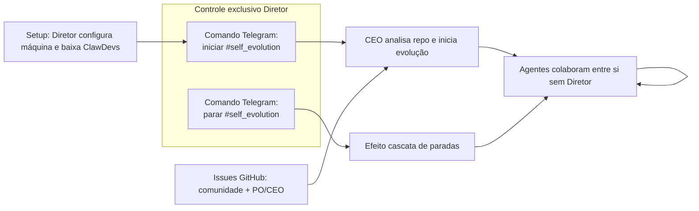

# Auto-evolução do ClawDevs — Tarefa #self_evolution

O **ClawDevs** pode ser usado para melhorar a si mesmo: o repositório alvo da evolução é o próprio projeto ClawDevs. Os agentes discutem entre si e implementam melhorias **sem intervenção do Diretor** durante a execução (sem validação nem aprovação de PR ou tarefa), seguindo **todas as diretrizes e políticas de segurança** da documentação. A diferença em relação ao fluxo normal é a ausência de gate humano no ciclo de evolução — **exceto** o comando para **iniciar** e o comando para **parar** a tarefa #self_evolution, que são exclusivos do Diretor via Telegram.

---

## Regra de controle

> **A tarefa #self_evolution só pode ser iniciada ou finalizada por comando do Diretor via Telegram** (ou interface OpenClaw usada pelo Diretor). Nenhum agente pode dar início nem encerrar a #self_evolution por conta própria. Esse é o único controle humano obrigatório sobre o modo de auto-evolução.

---

## Premissas

- Os agentes discutem e implementam **entre si**, sem validação nem aprovação do Diretor durante a execução.
- As **políticas de segurança** (Zero Trust, [05-seguranca-e-etica.md](05-seguranca-e-etica.md), [14-seguranca-runtime-agentes.md](14-seguranca-runtime-agentes.md), OWASP, etc.) **não são relaxadas** no modo #self_evolution.
- Diferença em relação ao fluxo normal: **nenhuma intervenção do Diretor** (sem aprovação de PR, sem validação de tarefa, sem gate humano no ciclo de evolução) — **exceto** o comando para **iniciar** e o comando para **parar** a #self_evolution, que são exclusivos do Diretor via Telegram.

---

## Fluxo em 6 passos

### 1. Setup

O Diretor configura a máquina e baixa o projeto ClawDevs (clone/setup conforme [00-objetivo-e-maquina-referencia.md](00-objetivo-e-maquina-referencia.md) e [09-setup-e-scripts.md](09-setup-e-scripts.md)).

### 2. Início (somente Diretor via Telegram)

A #self_evolution **só começa** quando o Diretor envia o comando via **Telegram** (ex.: *"CEO iniciar tarefa #self_evolution"*). Nenhum agente pode iniciar esse modo por conta própria.

### 3. Evolução autônoma

O CEO analisa o repositório ClawDevs e inicia a evolução autônoma segundo **todas as diretrizes** definidas na documentação (arquitetura, segurança, self-improvement, habilidades proativas, etc.). Os agentes (CEO, PO, Architect, Developer, QA, CyberSec, UX, DBA, DevOps) colaboram entre si sem pedir aprovação ao Diretor.

### 4. Sem intervenção

Não há validação do Diretor nem aprovação explícita para mudanças durante a #self_evolution; o ciclo é fechado entre os agentes.

### 5. Parada (somente Diretor via Telegram)

A #self_evolution **só termina** quando o Diretor solicita a parada via **Telegram**. Esse comando dispara um **efeito cascata de paradas**: encerramento ordenado das atividades em andamento, sem exigir nenhuma ação adicional do Diretor (nada é "pedido" ao Diretor na parada). O estado em progresso pode ser persistido/recuperável conforme [06-operacoes.md](06-operacoes.md). Nenhum agente pode encerrar a #self_evolution por conta própria.

### 6. Fontes de trabalho

Além da análise autônoma do CEO sobre o repositório ClawDevs:

- A **comunidade** pode criar **novas issues no GitHub**; o ClawDevs implementa essas issues.
- O ClawDevs também implementa **issues criadas pelo PO** e **traduzidas/priorizadas pelo CEO** no fluxo normal.

Ou seja: issues da comunidade + issues do PO/CEO alimentam o backlog da #self_evolution.

---

## Diagrama do fluxo

Início e parada da #self_evolution são **exclusivos do Diretor via Telegram**; nenhum agente pode iniciar nem encerrar esse modo.

---

## Referências

- [01-visao-e-proposta.md](01-visao-e-proposta.md) — Objetivo e modo de auto-evolução
- [05-seguranca-e-etica.md](05-seguranca-e-etica.md) — Políticas de segurança (Zero Trust, etc.)
- [06-operacoes.md](06-operacoes.md) — Operações, contingência, persistência de estado
- [10-self-improvement-agentes.md](10-self-improvement-agentes.md) — Self-improvement e learnings
- [14-seguranca-runtime-agentes.md](14-seguranca-runtime-agentes.md) — Validação em runtime
- [soul/CEO.md](soul/CEO.md) — Identidade do agente CEO
- [00-objetivo-e-maquina-referencia.md](00-objetivo-e-maquina-referencia.md) — Escopo (qualquer projeto, qualquer linguagem)
- [README.md](README.md) — Índice e visão geral do ClawDevs

---

## Terminologia

| Termo | Significado |
|------|-------------|
| **#self_evolution** | Identificador da tarefa de auto-evolução do ClawDevs. |
| **Auto-evolução** | Modo de operação em que o repositório alvo é o próprio ClawDevs e os agentes evoluem o projeto entre si. |
| **Diretor** | Humano que configura o ambiente e é o **único** que pode **iniciar ou finalizar** a #self_evolution via Telegram; não intervém durante a execução, mas detém o monopólio do start/stop. |
