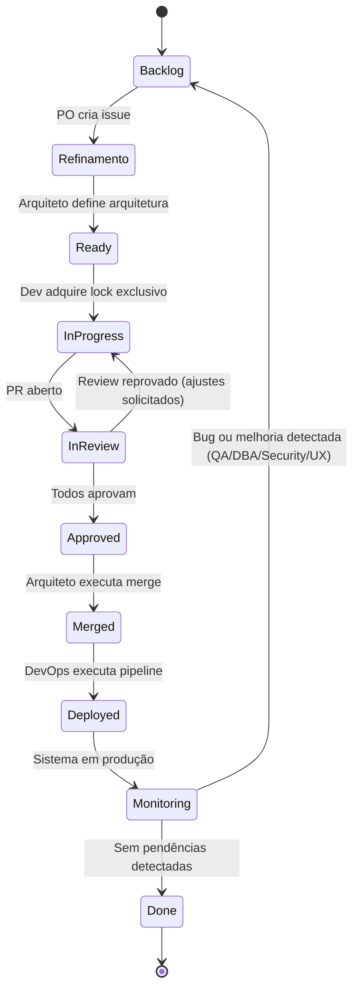

# Máquina de estados — Issues (state diagram)

Cada issue segue o ciclo de vida abaixo. O estado é armazenado em Redis em `project:v1:issue:{id}:state`. Módulo compartilhado: [scripts/issue_state.py](../../scripts/issue_state.py).

Ref: fluxo de sequência (Diretor → CEO → PO → Arquiteto → Dev → revisão → merge → DevOps) e [38-redis-streams-estado-global.md](../38-redis-streams-estado-global.md).

---

## Diagrama de estados

---

## Transições e responsáveis

| Estado       | Quem define / transição |
|-------------|--------------------------|
| **Backlog** | PO (após criar issues a partir da estratégia). |
| **Refinamento** | PO (issue criada, aguardando validação técnica no draft). |
| **Ready**   | Arquiteto (após aprovar draft em `draft.2.issue`; publica em `task:backlog`). |
| **InProgress** | Developer (ao consumir de `task:backlog` e adquirir lock `project:v1:issue:{id}:dev_lock`). |
| **InReview** | Developer (ao abrir PR e publicar em `code:ready`). Slot de revisão processa. |
| **Approved** | Slot Revisão pós-Dev (quando todos os 6 papéis aprovam: Architect, QA, CyberSec, DBA, UX, PO). |
| **Merged**  | Passo de merge (Arquiteto executa `gh pr merge`). |
| **Deployed** | DevOps (após configurar pipeline CI/CD e deploy). |
| **Monitoring** | DevOps ou runner (sistema em produção). |
| **Done**    | Runner de auditorias ou PO (sem pendências). |
| **Backlog** (retorno) | QA/DBA/Security/UX (auditoria cria nova issue para bug/melhoria). |

---

## Uso do módulo issue_state

- `set_issue_state(r, issue_id, state)` / `transition(r, issue_id, new_state)` — definir estado.
- `get_issue_state(r, issue_id)` — ler estado atual.
- Constantes: `STATE_BACKLOG`, `STATE_REFINAMENTO`, `STATE_READY`, `STATE_IN_PROGRESS`, `STATE_IN_REVIEW`, `STATE_APPROVED`, `STATE_MERGED`, `STATE_DEPLOYED`, `STATE_MONITORING`, `STATE_DONE`.

Todos os scripts que alteram o ciclo de vida da issue (PO worker, architect draft consumer, developer worker, slot de revisão, merge step, DevOps, audit runner) devem atualizar essa chave.
