# 03 — Interface do Diretor (Dashboard)
> **Objetivo:** Definir a especificação da torre de controle (UI) onde o humano supervisiona os agentes em tempo real.
> **Público-alvo:** PO (spec), Devs (implementação)
> **Ação Esperada:** PO guiar o Backlog da UI por aqui; Devs utilizarem como wireframe/spec para o frontend.

**v2.0 | Atualizado em: 06 de março de 2026**

---

## Visão Geral do Painel

O Dashboard é a **torre de controle do sistema de agentes**. Permite que o Diretor acompanhe em tempo real:

- **Qual agente** está ativo e o que está executando
- **Em qual etapa do fluxo** de desenvolvimento a tarefa se encontra
- **Status** de cada tarefa (pendente · em execução · concluído · erro · bloqueado)
- **Tempo** de execução e estimativa de conclusão
- **Dependências** entre tarefas e bloqueios
- **Comunicação A2A** — delegações e atualizações entre agentes
- **Intervenção Manual** — Injeção de tarefas diretamente pelo Diretor

---

## Separação das Áreas da Interface

A interface do Diretor divide-se em duas áreas principais:

1. **Dashboard de Monitoramento** — visão em tempo real do estado dos agentes, comunicação A2A, custo, alertas e intervenção manual (incluindo adicionar tarefa manual).
2. **Painel de Acompanhamento de Issues** — acompanhamento das tarefas por tipo (Novas Features, Bugs e Hotfix, Refatoração), com cards e etapas de cada fluxo.

---

## 1. Dashboard de Monitoramento (Wireframe ASCII)

Visão operacional: status dos agentes, fluxo A2A, custo, alertas e botão para **adicionar tarefa manual**. O Diretor pode injetar uma nova tarefa diretamente nesta tela através do botão `[+ NOVA TAREFA MANUAL]`.

```text
┌─────────────────────────────────────────────────────────────────────────────────────────────┐
│  🤖 ClawDevs AI — Dashboard de Monitoramento              [🔴 LIVE]  06/03/2026  10:42:15  │
│─────────────────────────────────────────────────────────────────────────────────────────────│
│  ┌──────────────┐  ┌──────────────┐  ┌──────────────┐  ┌──────────────┐  ┌──────────────┐ │
│  │🟢 CLAW  CEO  │  │🟢 PRIYA  PO  │  │🟡 AXEL  ARCH │  │🟡 DEV  DEV  │  │🔴 QUINN  QA │ │
│  │ 1 tarefa     │  │ 2 tarefas    │  │ 1 tarefa     │  │ 1 tarefa     │  │ OFFLINE/OOM  │ │
│  │ ████████ 80% │  │ ██████░░ 60% │  │ ██████████   │  │ ██████████   │  │ ░░░░░░░░░░   │ │
│  └──────────────┘  └──────────────┘  └──────────────┘  └──────────────┘  └──────────────┘ │
│─────────────────────────────────────────────────────────────────────────────────────────────│
│  📋 FLUXO A2A EM TEMPO REAL                          │  💰 CUSTO · 🔔 ALERTAS              │
│  10:42:10 DEV → QUINN: review_pr(PR#61) [FEAT-088]  │  Ollama: $0.00 · OR: $3.42/$50      │
│  10:41:55 AXEL → DEV: arch_approved(FEAT-092)       │  🔴 Quinn offline (OOM) — OR ativo  │
│  10:41:30 CLAW → PRIYA: triage_ok(BUG-035)          │  🟡 Dev: task > 15min (normal)      │
│  10:40:12 PRIYA → CLAW: spec_done(FEAT-088)         │  ✅ PR #61 pronto para review       │
│                                                      │  [+ NOVA TAREFA MANUAL]             │
└─────────────────────────────────────────────────────────────────────────────────────────────┘
```

---

## 2. Painel de Acompanhamento de Issues (Wireframe ASCII)

Acompanhamento das tarefas por tipo de trabalho: Novas Features, Bugs e Hotfix, Refatoração. Cada card exibe progresso, etapa atual, agente responsável e histórico.

```text
┌─────────────────────────────────────────────────────────────────────────────────────────────┐
│  📋 Acompanhamento de Issues / Tarefas                                                    │
│─────────────────────────────────────────────────────────────────────────────────────────────│
│  ┌─────────────────────────────────┐  ┌──────────────────────────────┐  ┌─────────────────┐│
│  │  🆕 NOVAS FEATURES              │  │  🐛 BUGS E HOTFIX            │  │ 🔧 REFATORAÇÃO  ││
│  │  [3 ativas]  [2 pendentes]      │  │  [1 CRITICAL] [2 HIGH]       │  │ [2 em progresso]││
│  │─────────────────────────────────│  │──────────────────────────────│  │─────────────────││
│  │ FEAT-088 · Login Google         │  │ BUG-031 · SQL Injection       │  │ REFAC-012       ││
│  │ Priya → Design UX               │  │ 🔴 CRITICAL · Dev (hotfix)   │  │ Auth module     ││
│  │ ████████░░ 80%  ⏱ 12min        │  │ ████████░░ 75%  ⏱ 18min     │  │ ████░░░░░░ 40%  ││
│  │ → Code Review                   │  │ → QA Regressão               │  │ → Testes regr.  ││
│  │─────────────────────────────────│  │──────────────────────────────│  │─────────────────││
│  │ FEAT-092 · Notificações push    │  │ BUG-033 · Redis TTL          │  │ REFAC-014       ││
│  │ Axel → Spec técnica             │  │ 🟠 HIGH · Dev (análise)      │  │ Queue Service   ││
│  │ ███░░░░░░░ 30%  ⏱ 3min         │  │ ██░░░░░░░░ 20%  ⏱ 5min      │  │ ██░░░░░░░░ 20%  ││
│  │ → Desenvolvimento               │  │ → Root Cause                 │  │ → Implementação ││
│  │─────────────────────────────────│  │──────────────────────────────│  │─────────────────││
│  │ FEAT-095 · Dashboard métricas   │  │ BUG-035 · WebSocket timeout  │  │                 ││
│  │ ⏳ PENDENTE                     │  │ 🟡 MEDIUM · Claw (triage)    │  │                 ││
│  │ Aguardando FEAT-088             │  │ ░░░░░░░░░░ 0%                │  │                 ││
│  │ ─ Bloqueado                     │  │ → Triagem                    │  │                 ││
│  └─────────────────────────────────┘  └──────────────────────────────┘  └─────────────────┘│
└─────────────────────────────────────────────────────────────────────────────────────────────┘
```

---

## Fluxos Completos (Referência)

Os três fluxos abaixo descrevem o ciclo de vida ponta a ponta por tipo de trabalho. Os **Painéis de Tarefas** (seção seguinte) mapeiam as etapas exibidas nos cards do Painel de Acompanhamento de Issues.

### Fluxo completo — Desenvolvimento de um novo software (do zero)

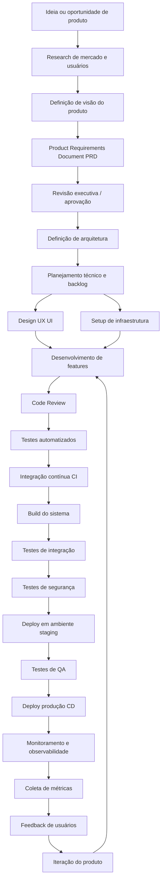

### Fluxo completo — Manutenção de software

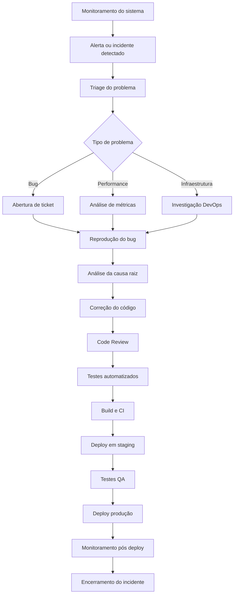

### Fluxo completo — Evolução de software (novas features)

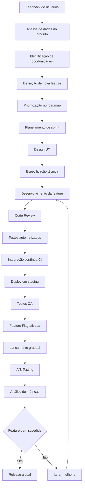

---

## Painéis de Tarefas (Etapas por tipo de fluxo)

Estes diagramas representam as **etapas exibidas nos painéis de acompanhamento de issues**, agrupadas por tipo de fluxo. Cada nó corresponde a uma etapa possível nos cards (Novas Features, Bugs, Refatoração) e no histórico de steps.

### Painel de tarefas — Desenvolvimento de um novo software (do zero)

```mermaid
flowchart LR
    subgraph Ideacao
        A1[Ideia do produto]
        A2[Pesquisa de mercado]
        A3[Definição da visão]
    end
    subgraph Planejamento
        B1[PRD - Documento de requisitos]
        B2[Definição da arquitetura]
        B3[Criação do backlog]
    end
    subgraph Design
        C1[UX Research]
        C2[Design de interface]
        C3[Prototipo]
    end
    subgraph Desenvolvimento
        D1[Setup do repositório]
        D2[Infraestrutura cloud]
        D3[Desenvolvimento de features]
    end
    subgraph Qualidade
        E1[Testes automatizados]
        E2[Testes integração]
        E3[QA manual]
    end
    subgraph Deploy
        F1[Build CI]
        F2[Deploy Staging]
        F3[Deploy Produção]
    end
    subgraph Monitoramento
        G1[Observabilidade]
        G2[Logs e métricas]
        G3[Feedback usuários]
    end
    A1 --> A2 --> A3
    A3 --> B1 --> B2 --> B3
    B3 --> C1 --> C2 --> C3
    C3 --> D1 --> D2 --> D3
    D3 --> E1 --> E2 --> E3
    E3 --> F1 --> F2 --> F3
    F3 --> G1 --> G2 --> G3
```

### Painel de tarefas — Manutenção de software

```mermaid
flowchart LR
    subgraph Monitoramento
        A1[Monitoramento sistema]
        A2[Alerta detectado]
        A3[Abertura de incidente]
    end
    subgraph Analise
        B1[Triage do problema]
        B2[Reprodução do bug]
        B3[Análise causa raiz]
    end
    subgraph Correção
        C1[Correção do código]
        C2[Code Review]
        C3[Testes automatizados]
    end
    subgraph Validacao
        D1[Build CI]
        D2[Deploy Staging]
        D3[Testes QA]
    end
    subgraph Resolucao
        E1[Deploy Produção]
        E2[Monitoramento pós deploy]
        E3[Encerramento incidente]
    end
    A1 --> A2 --> A3
    A3 --> B1 --> B2 --> B3
    B3 --> C1 --> C2 --> C3
    C3 --> D1 --> D2 --> D3
    D3 --> E1 --> E2 --> E3
```

### Painel de tarefas — Evolução de software (novas features)

```mermaid
flowchart LR
    subgraph Descoberta
        A1[Feedback usuários]
        A2[Análise de dados]
        A3[Identificação de oportunidade]
    end
    subgraph Produto
        B1[Definição da feature]
        B2[Priorização roadmap]
        B3[Planejamento sprint]
    end
    subgraph Design
        C1[UX Design]
        C2[Protótipo]
        C3[Validação]
    end
    subgraph Engenharia
        D1[Implementação]
        D2[Code Review]
        D3[Testes automatizados]
    end
    subgraph Release
        E1[Build CI]
        E2[Deploy Staging]
        E3[Testes QA]
    end
    subgraph Experimento
        F1[Feature Flag]
        F2[A/B Test]
        F3[Análise métricas]
    end
    subgraph Resultado
        G1[Release global]
        G2[Iteração melhoria]
    end
    A1 --> A2 --> A3
    A3 --> B1 --> B2 --> B3
    B3 --> C1 --> C2 --> C3
    C3 --> D1 --> D2 --> D3
    D3 --> E1 --> E2 --> E3
    E3 --> F1 --> F2 --> F3
    F3 --> G1
    F3 --> G2
```

---

## Painéis de Acompanhamento de Execução

Abaixo, detalhamos como cada painel gerencia o ciclo de vida das tarefas baseado em seus estados.

---

## Arquitetura do Sistema de Monitoramento

O frontend expõe duas áreas: **Dashboard de Monitoramento** (barra de agentes, feed A2A, custo/alertas, botão de tarefa manual) e **Painel de Acompanhamento de Issues** (painéis Novas Features, Bugs e Hotfix, Refatoração).

```mermaid
graph TD
    subgraph AGENTS["Pods de Agentes (clawdevs-agents)"]
        CEO_POD[Claw CEO :8001]
        PO_POD[Priya PO :8002]
        ARCH_POD[Axel Arch :8003]
        DEV_POD[Dev :8004]
        QA_POD[Quinn QA :8005]
    end

    subgraph STREAMS["Redis (clawdevs-infra)"]
        PUB_DASH[Pub/Sub: clawdevs.dashboard]
        STREAM_A2A[Stream: clawdevs.a2a]
        STREAM_EVENTS[Stream: clawdevs.events]
        STATE[Hash: task:{id}:state]
    end

    subgraph BACKEND["Dashboard Backend (:8080)"]
        WS[WebSocket Server /ws]
        AGG[Aggregator Service]
        API_REST[REST API /api/*]
        AUTH[JWT Auth — Diretor]
    end

    subgraph FRONTEND["Dashboard Frontend (:3000)"]
        PANEL_FEAT[Painel Novas Features]
        PANEL_BUG[Painel Bugs e Hotfix]
        PANEL_REFAC[Painel Refatoração]
        AGENT_BAR[Barra de Agentes]
        A2A_FEED[Feed A2A em tempo real]
        COST_WIDGET[Custo e Alertas]
    end

    CEO_POD & PO_POD & ARCH_POD & DEV_POD & QA_POD -->|PUBLISH task_events| PUB_DASH
    CEO_POD & PO_POD & ARCH_POD & DEV_POD & QA_POD -->|XADD a2a messages| STREAM_A2A
    CEO_POD & PO_POD & ARCH_POD & DEV_POD & QA_POD -->|HSET task state| STATE

    PUB_DASH --> AGG
    STREAM_A2A --> AGG
    STREAM_EVENTS --> AGG
    STATE --> AGG

    AGG --> WS
    WS -->|WebSocket push| PANEL_FEAT & PANEL_BUG & PANEL_REFAC & AGENT_BAR & A2A_FEED & COST_WIDGET

    AUTH --> WS & API_REST
```

---

## Painel 1 — Novas Features

### O que exibe

Rastreia o desenvolvimento de novas funcionalidades do início ao lançamento. Cada feature percorre um fluxo com etapas bem definidas.

```mermaid
flowchart LR
    E1["📋 Análise de produto"]
    E2["🎨 Design UX"]
    E3["📐 Spec técnica"]
    E4["🗓️ Sprint planning"]
    E5["👨‍💻 Desen- volvimento"]
    E6["🔎 Code Review"]
    E7["🧪 Testes auto"]
    E8["🔄 CI Build"]
    E9["✅ QA staging"]
    E10["🚩 Feature Flag"]
    E11["📊 Monitor pós-launch"]

    E1 --> E2 --> E3 --> E4 --> E5 --> E6 --> E7 --> E8 --> E9 --> E10 --> E11

    style E5 fill:#f59e0b,color:#000
    style E6 fill:#3b82f6,color:#fff
    style E9 fill:#8b5cf6,color:#fff
```

### Card de Feature (dados exibidos)

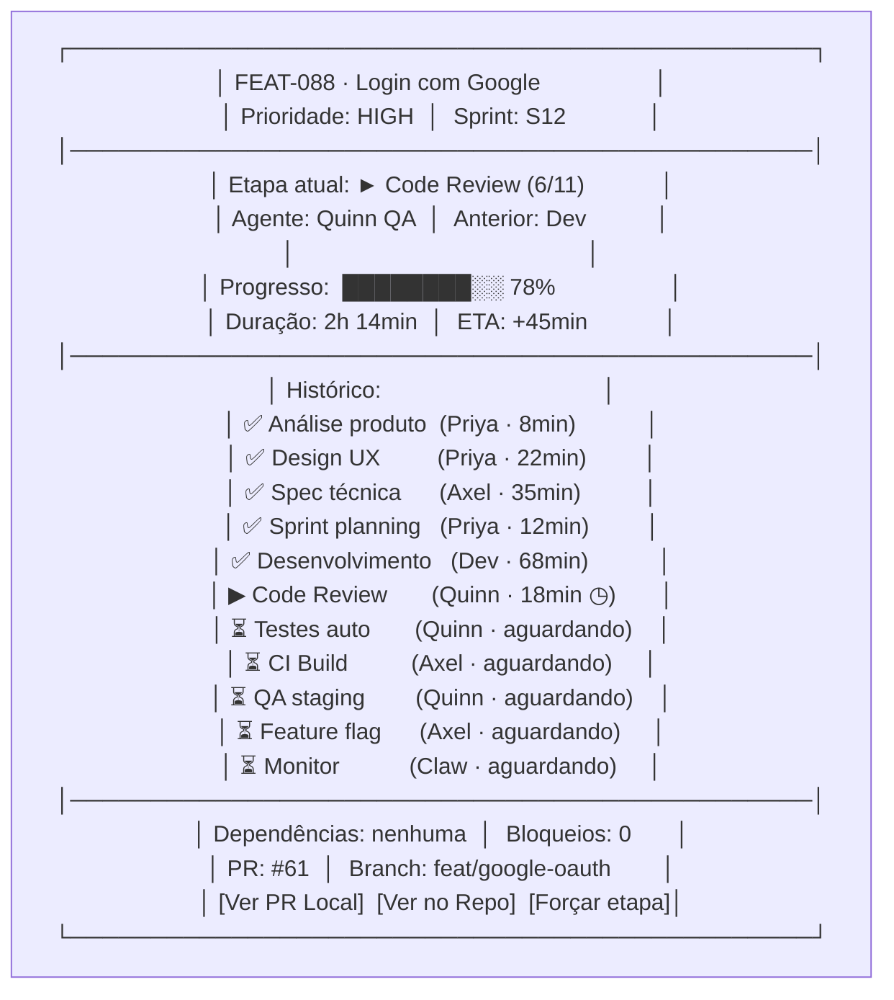

### Responsável por Etapa (Novas Features)

| Etapa | Agente | Input | Output | Duração típica |
|-------|--------|-------|--------|---------------|
| Análise de produto | Priya (PO) | Ideia / feedback | Issue + contexto | 5–15 min |
| Design UX | Priya (PO) | Issue | Spec UX no issue | 15–45 min |
| Spec técnica | Axel (Arch) | Spec UX | ADR + tech spec | 20–60 min |
| Sprint planning | Priya (PO) | Spec técnica | Subtasks + story points | 10–20 min |
| Desenvolvimento | Dev | Spec técnica + subtasks | Branch + commits + PR | 30–180 min |
| Code Review | Quinn (QA) + Axel (Arch) | PR diff | Aprovado / changes | 15–40 min |
| Testes automatizados | Quinn (QA) | Branch | Relatório de testes | 5–20 min |
| CI / Build | Axel (Arch) | Branch | Build OK / falhou | 3–10 min |
| QA staging | Quinn (QA) | Deploy staging | QA report | 20–60 min |
| Feature flag / deploy | Axel (Arch) | PR merged | Flag ativa em prod | 5–15 min |
| Monitoramento pós-launch | Claw (CEO) | Métricas | Relatório 24h | contínuo |

---

## Painel 2 — Bugs e Hotfix

### O que exibe

Rastreia incidentes, bugs e hotfixes. Prioridade máxima — SLA por severidade visível no painel.

```mermaid
flowchart LR
    B1["⚠️ Detecção (alerta/reporte)"]
    B2["🔍 Triagem (Claw CEO)"]
    B3["🔁 Repro- dução"]
    B4["🧩 Análise causa raiz"]
    B5["🔨 Correção (hotfix)"]
    B6["🔎 Code Review"]
    B7["🧪 Testes regressão"]
    B8["🔄 CI Build"]
    B9["🧩 Deploy staging"]
    B10["✅ QA validação"]
    B11["🚀 Deploy produção"]
    B12["📋 Post- mortem"]

    B1 --> B2 --> B3 --> B4 --> B5 --> B6 --> B7 --> B8 --> B9 --> B10 --> B11 --> B12

    style B1 fill:#ef4444,color:#fff
    style B2 fill:#f97316,color:#fff
    style B4 fill:#8b5cf6,color:#fff
    style B11 fill:#22c55e,color:#fff
```

### Card de Bug (dados exibidos)

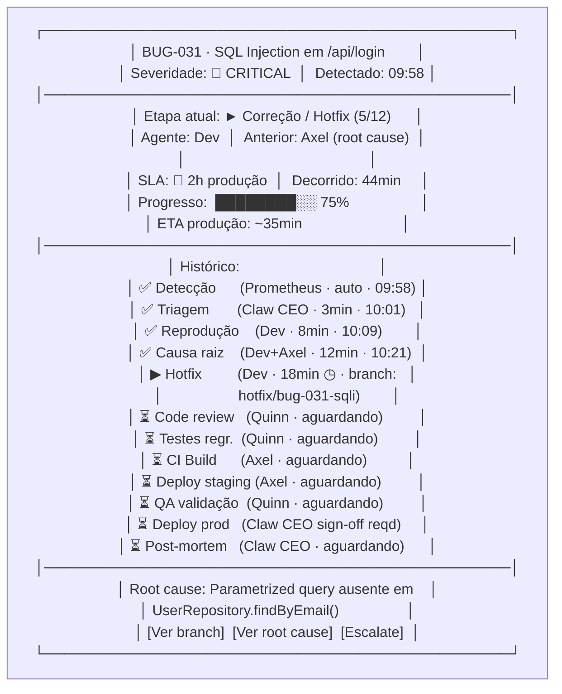

### SLA Visual por Severidade

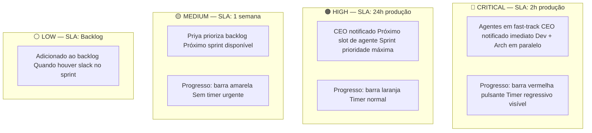

### Responsável por Etapa (Bugs e Hotfix)

| Etapa | Agente | Trigger | Output | SLA CRITICAL |
|-------|--------|---------|--------|-------------|
| Detecção | Prometheus / Diretor / Auto | Alerta ou report | Issue criado automaticamente | automático |
| Triagem | Claw (CEO) | Novo bug | Severidade + assignee | < 5 min |
| Reprodução | Dev | Triagem OK | Bug confirmado + branch hotfix | < 15 min |
| Análise causa raiz | Dev + Axel (Arch) | Reprodução OK | Root cause doc no issue | < 30 min |
| Correção | Dev | Root cause identificado | Branch + commits | < 30 min |
| Code Review | Quinn (QA) | PR aberto | Aprovado (fast-track) | < 10 min |
| Testes de regressão | Quinn (QA) | Review OK | Relatório regressão | < 10 min |
| CI / Build | Axel (Arch) | Testes OK | Build OK | < 5 min |
| Deploy staging | Axel (Arch) | Build OK | Ambiente validado | < 5 min |
| QA validação | Quinn (QA) | Staging pronto | QA aprovado | < 10 min |
| Deploy produção | Axel (Arch) + CEO | QA OK + sign-off CEO | Hotfix em produção | < 5 min |
| Post-mortem | Claw (CEO) | Deploy OK | Post-mortem + issue prevenção | < 2h |

---

## Painel 3 — Refatoração Preventiva

### O que exibe

Acompanha melhorias internas de código, redução de dívida técnica e manutenção de qualidade sem urgência de incidente.


### Card de Refatoração (dados exibidos)

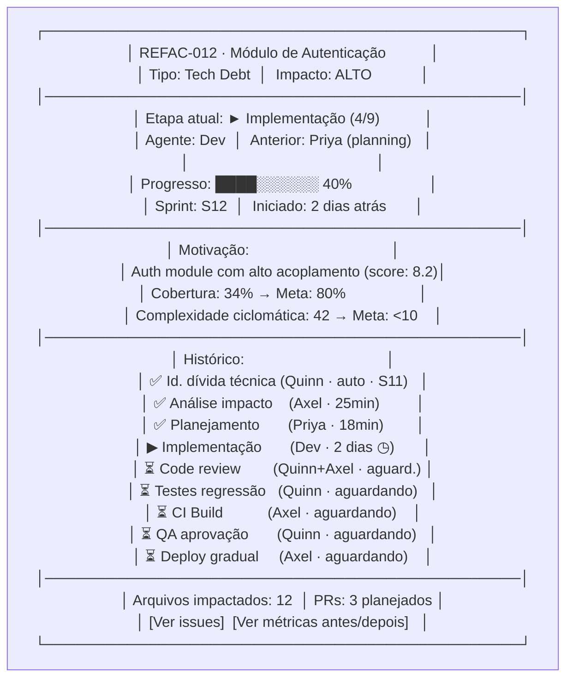

### Responsável por Etapa (Refatoração)

| Etapa | Agente | Critério de entrada | Output |
|-------|--------|--------------------|----|
| Identificação de dívida técnica | Quinn (QA) + Axel (Arch) | SonarQube / análise manual | Issue de refatoração criado |
| Análise de impacto | Axel (Arch) | Issue criado | Relatório de impacto + risco |
| Planejamento | Priya (PO) | Análise de impacto | Subtasks + sprint allocation |
| Implementação | Dev | Planejamento aprovado | Branch + commits incrementais |
| Code Review | Quinn (QA) + Axel (Arch) | PR aberto | Aprovado (foco em qualidade e regressão) |
| Testes de regressão | Quinn (QA) | Review OK | Cobertura antes/depois + regressão 0 |
| CI / Build | Axel (Arch) | Testes OK | Build verde |
| QA aprovação | Quinn (QA) | Build OK | Sign-off de qualidade |
| Deploy gradual | Axel (Arch) | QA aprovado | Deploy com monitoramento |

---

## Painel de Monitoramento de Tarefas em Tempo Real (Agente)

Este componente faz parte do **Dashboard de Monitoramento** e é o coração da visualização de progresso por agente. Ele mapeia as tarefas ativas contra os [Painéis de Tarefas de Workflow](file:///c:/Users/Administrator/Workspace/lukeware/clawdevs.ai/clawdevs/05-processo-fluxo-trabalho.md).

**Na tela de monitoramento de tarefas**, o Diretor pode **adicionar uma tarefa manual** a qualquer momento através do botão `[+ NOVA TAREFA MANUAL]` (ver seção "Injeção de Tarefa Manual" abaixo).

### Visualização por Agente
Cada agente possui um "sub-painel" que detalha:
1. **Tarefa Atual**: ID e Título.
2. **Sub-etapa**: Qual nó do grafo de workflow está sendo processado.
3. **Logs de Pensamento**: Stream em tempo real do `thought` do agente (opcional/expansível).
4. **Recursos Utilizados**: MCPs ativos no momento.

### Intervenção e Tarefa Manual

O Diretor pode intervir no fluxo autônomo a qualquer momento.

#### Injeção de Tarefa Manual
Através do botão `[+ Nova Tarefa Manual]`, o Diretor abre um modal para comando direto:

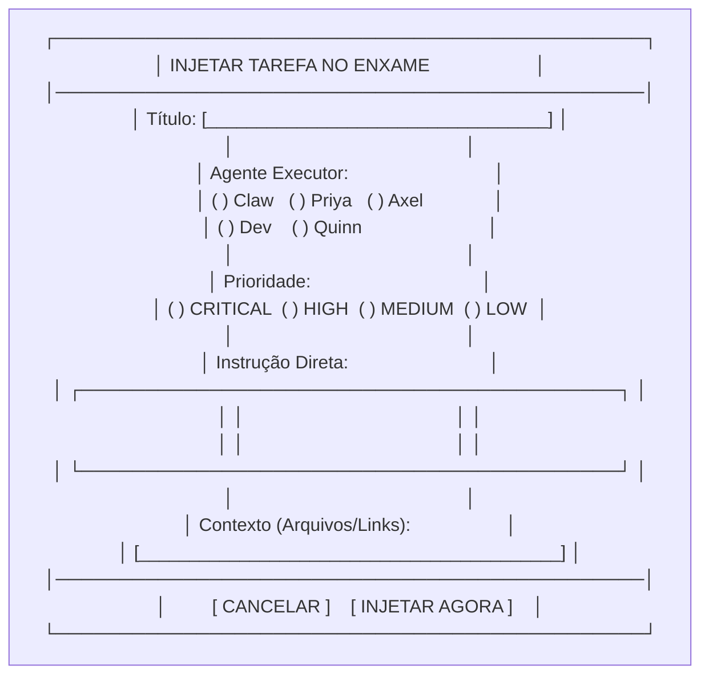

**Comportamento:**
- A tarefa entra no topo da fila (`state: PENDING`) do agente selecionado.
- Se a prioridade for `CRITICAL`, o agente atual pausa a tarefa em execução (`state: BLOCKED` por "Intervenção Diretor") e assume a nova tarefa imediatamente.
- O histórico da tarefa registra que foi uma "Iniciativa Manual do Diretor".

---

## Esquema de Dados — Tarefas e Estados

### Task State Machine

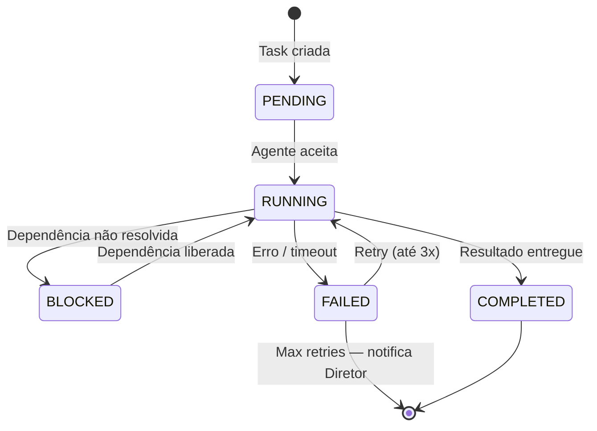

### Schema Redis por Task

```
# Task metadata (Hash)
task:{id}:meta          → {title, panel, type, priority, created_at, sprint}
task:{id}:state         → PENDING | RUNNING | BLOCKED | COMPLETED | FAILED
task:{id}:agent         → agent_id responsável atual
task:{id}:step          → etapa atual (ex: "code_review")
task:{id}:step_index    → 6 (de 11)
task:{id}:step_total    → 11
task:{id}:progress_pct  → 0-100
task:{id}:started_at    → unix timestamp
task:{id}:duration_s    → segundos decorridos
task:{id}:step_history  → JSON array [{step, agent, duration_s, status, completed_at}]
task:{id}:dependencies  → JSON array [task_id, ...]
task:{id}:blocked_by    → task_id | null
task:{id}:sla_deadline  → unix timestamp (críticos)
task:{id}:pr_number     → número do PR local (se aplicável)
task:{id}:branch        → nome da branch git
```

### Evento WebSocket — Tipos

```typescript
// Schema de eventos enviados via WebSocket para o frontend

type DashboardEvent =
  | { type: "FULL_STATE";        data: FullDashboardState }
  | { type: "TASK_CREATED";      data: Task }
  | { type: "TASK_STEP_UPDATED"; data: { taskId: string; step: string; stepIndex: number; agent: string; progressPct: number } }
  | { type: "TASK_STATUS_CHANGED"; data: { taskId: string; oldStatus: TaskStatus; newStatus: TaskStatus } }
  | { type: "TASK_BLOCKED";      data: { taskId: string; blockedBy: string; reason: string } }
  | { type: "TASK_COMPLETED";    data: { taskId: string; durationSeconds: number; artifacts: string[] } }
  | { type: "TASK_FAILED";       data: { taskId: string; error: string; retryCount: number } }
  | { type: "A2A_MESSAGE";       data: A2AMessage }
  | { type: "AGENT_STATUS";      data: { agentId: string; state: AgentState; currentTaskId?: string } }
  | { type: "ALERT";             data: Alert }
  | { type: "COST_UPDATE";       data: CostMetrics };

interface Task {
  id: string;            // "FEAT-088" | "BUG-031" | "REFAC-012"
  panel: "features" | "bugs" | "refactoring";
  title: string;
  priority: "CRITICAL" | "HIGH" | "MEDIUM" | "LOW";
  status: TaskStatus;
  currentAgent: string;
  currentStep: string;
  stepIndex: number;
  stepTotal: number;
  progressPct: number;
  durationSeconds: number;
  etaSeconds?: number;
  slaDeadline?: Date;
  blockedBy?: string;
  dependencies: string[];
  stepHistory: StepRecord[];
  prNumber?: number;
  branch?: string;
}

interface StepRecord {
  step: string;
  stepLabel: string;
  agent: string;
  durationSeconds: number;
  status: "completed" | "running" | "pending" | "failed";
  completedAt?: Date;
  artifact?: string;      // link para output (PR, issue, ADR, etc.)
}

interface A2AMessage {
  from: string;
  to: string;
  messageType: string;
  taskId: string;
  summary: string;        // versão legível para o feed do Diretor
  timestamp: Date;
}
```

---

## Implementação Backend

```python
# dashboard/backend/task_tracker.py
import redis.asyncio as aioredis
import json, time

redis = aioredis.from_url("redis://redis-svc:6379")

# ─── Publicar update de task (chamado pelos agentes) ───────────────────────────

async def update_task_step(
    task_id: str,
    step: str,
    step_label: str,
    step_index: int,
    step_total: int,
    agent_id: str,
    progress_pct: int,
    artifact: str | None = None,
):
    """Atualiza o estado de uma etapa e publica no dashboard."""
    pipe = redis.pipeline()

    # Atualiza estado no Redis
    pipe.hset(f"task:{task_id}:meta", mapping={
        "current_step": step,
        "step_index": step_index,
        "step_total": step_total,
        "current_agent": agent_id,
        "progress_pct": progress_pct,
        "updated_at": time.time(),
    })

    # Registra no histórico de etapas
    history_entry = json.dumps({
        "step": step,
        "step_label": step_label,
        "agent": agent_id,
        "started_at": time.time(),
        "status": "running",
        "artifact": artifact,
    })
    pipe.rpush(f"task:{task_id}:step_history", history_entry)

    await pipe.execute()

    # Publica no canal do dashboard
    await redis.publish("clawdevs.dashboard", json.dumps({
        "type": "TASK_STEP_UPDATED",
        "data": {
            "taskId": task_id,
            "step": step,
            "stepLabel": step_label,
            "stepIndex": step_index,
            "stepTotal": step_total,
            "agent": agent_id,
            "progressPct": progress_pct,
            "artifact": artifact,
            "ts": time.time(),
        }
    }))


async def complete_task_step(
    task_id: str,
    step: str,
    agent_id: str,
    artifact: str | None = None,
    next_step: str | None = None,
    next_agent: str | None = None,
):
    """Marca etapa como concluída e avança para a próxima."""
    # Atualiza histórico — marca step como completed
    history_raw = await redis.lrange(f"task:{task_id}:step_history", -1, -1)
    if history_raw:
        last = json.loads(history_raw[0])
        last["status"] = "completed"
        last["completed_at"] = time.time()
        last["duration_s"] = time.time() - last["started_at"]
        last["artifact"] = artifact
        await redis.lset(f"task:{task_id}:step_history", -1, json.dumps(last))

    await redis.publish("clawdevs.dashboard", json.dumps({
        "type": "TASK_STEP_COMPLETED",
        "data": {
            "taskId": task_id,
            "step": step,
            "agent": agent_id,
            "artifact": artifact,
            "nextStep": next_step,
            "nextAgent": next_agent,
            "ts": time.time(),
        }
    }))


async def block_task(task_id: str, blocked_by: str, reason: str):
    """Marca task como bloqueada por outra tarefa."""
    await redis.hset(f"task:{task_id}:meta", mapping={
        "status": "BLOCKED",
        "blocked_by": blocked_by,
        "block_reason": reason,
    })
    await redis.publish("clawdevs.dashboard", json.dumps({
        "type": "TASK_BLOCKED",
        "data": {"taskId": task_id, "blockedBy": blocked_by, "reason": reason}
    }))
```

---

## Implementação Frontend — 3 Painéis

```typescript
// frontend/components/panels/FeaturePanel.tsx
import { useDashboardStore } from "../../store/dashboardStore";

export function FeaturePanel() {
  const tasks = useDashboardStore((s) =>
    s.tasks.filter((t) => t.panel === "features")
  );

  const byStatus = {
    running:   tasks.filter((t) => t.status === "RUNNING"),
    blocked:   tasks.filter((t) => t.status === "BLOCKED"),
    pending:   tasks.filter((t) => t.status === "PENDING"),
    completed: tasks.filter((t) => t.status === "COMPLETED").slice(0, 3),
  };

  return (
    <div className="panel border rounded-lg bg-white shadow">
      <PanelHeader
        icon="🆕"
        title="Novas Features"
        counts={{ active: byStatus.running.length, pending: byStatus.pending.length }}
      />
      <div className="divide-y">
        {byStatus.running.map((task) => (
          <TaskCard key={task.id} task={task} />
        ))}
        {byStatus.blocked.map((task) => (
          <TaskCard key={task.id} task={task} />
        ))}
        {byStatus.pending.map((task) => (
          <TaskCard key={task.id} task={task} />
        ))}
      </div>
    </div>
  );
}


// frontend/components/TaskCard.tsx
export function TaskCard({ task }: { task: Task }) {
  const slaUrgent = task.slaDeadline && (task.slaDeadline.getTime() - Date.now()) < 30 * 60 * 1000;

  return (
    <div className={`p-3 ${slaUrgent ? "bg-red-50" : ""}`}>
      {/* Cabeçalho */}
      <div className="flex items-center justify-between">
        <span className="font-mono text-xs text-gray-500">{task.id}</span>
        <PriorityBadge priority={task.priority} />
        <StatusBadge status={task.status} />
      </div>
      <p className="font-medium text-sm mt-1">{task.title}</p>

      {/* Etapa atual */}
      <div className="flex items-center gap-2 mt-1 text-xs text-gray-600">
        <AgentAvatar agentId={task.currentAgent} />
        <span>→ {task.currentStep}</span>
        <span className="text-gray-400">({task.stepIndex}/{task.stepTotal})</span>
      </div>

      {/* Barra de progresso */}
      <div className="mt-2">
        <ProgressBar
          value={task.progressPct}
          color={task.status === "BLOCKED" ? "orange" : task.priority === "CRITICAL" ? "red" : "blue"}
          animated={task.status === "RUNNING"}
        />
      </div>

      {/* Timer + próxima etapa */}
      <div className="flex justify-between text-xs text-gray-500 mt-1">
        <span>⏱ {formatDuration(task.durationSeconds)}</span>
        {task.status === "BLOCKED" && (
          <span className="text-orange-600">⚠️ Bloqueado por {task.blockedBy}</span>
        )}
        {task.status === "RUNNING" && task.etaSeconds && (
          <span>ETA: {formatDuration(task.etaSeconds)}</span>
        )}
      </div>

      {/* SLA countdown para CRITICAL */}
      {task.priority === "CRITICAL" && task.slaDeadline && (
        <SLACountdown deadline={task.slaDeadline} />
      )}

      {/* Histórico de etapas (expandível) */}
      <StepHistoryAccordion steps={task.stepHistory} />
    </div>
  );
}
```

---

## Barra de Agentes (topo do dashboard)

```typescript
// frontend/components/AgentBar.tsx
const AGENT_CONFIG = {
  "claw-ceo":  { name: "Claw",  role: "CEO",  emoji: "🎯", color: "blue"   },
  "priya-po":  { name: "Priya", role: "PO",   emoji: "📋", color: "purple" },
  "axel-arch": { name: "Axel",  role: "Arch", emoji: "🏗️", color: "orange" },
  "dev-dev":   { name: "Dev",   role: "Dev",  emoji: "👨‍💻", color: "yellow" },
  "quinn-qa":  { name: "Quinn", role: "QA",   emoji: "🧪", color: "green"  },
};

export function AgentBar() {
  const agents = useDashboardStore((s) => s.agents);

  return (
    <div className="flex gap-3 p-3 border-b bg-gray-50">
      {Object.entries(AGENT_CONFIG).map(([id, config]) => {
        const agent = agents[id];
        return (
          <AgentMiniCard
            key={id}
            config={config}
            state={agent?.state ?? "OFFLINE"}
            activeTaskId={agent?.currentTaskId}
            tasksToday={agent?.todayStats?.completed ?? 0}
            healthScore={agent?.healthScore ?? 0}
          />
        );
      })}
    </div>
  );
}
```

---

## Feed A2A em Tempo Real

```typescript
// frontend/components/A2AFeed.tsx
export function A2AFeed() {
  const messages = useDashboardStore((s) => s.a2aMessages.slice(0, 20));

  return (
    <div className="border rounded p-2 bg-gray-900 text-green-400 font-mono text-xs h-32 overflow-y-auto">
      {messages.map((msg) => (
        <div key={msg.id} className="flex gap-2 items-start">
          <span className="text-gray-500">{formatTime(msg.timestamp)}</span>
          <AgentTag agent={msg.from} />
          <span className="text-gray-400">→</span>
          <AgentTag agent={msg.to} />
          <span className="text-gray-300">: {msg.summary}</span>
          <span className="text-gray-600">[{msg.taskId}]</span>
        </div>
      ))}
    </div>
  );
}
```

---

## Integração A2A — Como os Agentes Publicam no Dashboard

```python
# Exemplo: Dev agent publica update de step
# (dentro do agente dev-dev, ao abrir PR)

from dashboard.task_tracker import update_task_step, complete_task_step

async def open_pull_request(task_id: str, branch: str):
    # 1. Cria o PR no Git Local via bash_executor
    pr = await local_git.create_pull_request(
        repo="app",
        title=f"feat: {task_description}",
        head=branch,
        base="main",
    )

    # 2. Atualiza o step para "code_review" no dashboard
    await complete_task_step(
        task_id=task_id,
        step="development",
        agent_id="dev-dev",
        artifact=f"https://gitea/clawdevs/app/pulls/{pr['number']}",
        next_step="code_review",
        next_agent="quinn-qa",
    )

    # 3. Delega para Quinn via A2A
    await send_a2a_message(
        destination="quinn-qa",
        task_type="review_pr",
        payload={
            "pr_number": pr["number"],
            "task_id": task_id,
            "branch": branch,
        }
    )

    # O dashboard recebe automaticamente:
    # → TASK_STEP_COMPLETED (development → code_review)
    # → A2A_MESSAGE (dev-dev → quinn-qa: review_pr)
    # → TASK_STEP_UPDATED (step: code_review, agent: quinn-qa)
```

---

## Deploy Kubernetes

```yaml
# k8s/deployments/dashboard.yaml
apiVersion: apps/v1
kind: Deployment
metadata:
  name: dashboard
  namespace: clawdevs-monitoring
spec:
  replicas: 1
  selector:
    matchLabels:
      app: dashboard
  template:
    metadata:
      labels:
        app: dashboard
    spec:
      containers:
        - name: backend
          image: clawdevs/dashboard-backend:latest
          ports:
            - containerPort: 8080
          env:
            - name: REDIS_URL
              valueFrom:
                secretKeyRef:
                  name: redis-secret
                  key: url
            - name: DIRECTOR_JWT_SECRET
              valueFrom:
                secretKeyRef:
                  name: dashboard-secrets
                  key: jwt_secret
            - name: GITEA_BASE_URL
              value: "http://gitea-svc:3000"
          resources:
            requests:
              cpu: "100m"
              memory: "256Mi"
            limits:
              cpu: "500m"
              memory: "512Mi"

        - name: frontend
          image: clawdevs/dashboard-frontend:latest
          ports:
            - containerPort: 3000
          resources:
            requests:
              cpu: "50m"
              memory: "128Mi"
            limits:
              cpu: "200m"
              memory: "256Mi"
---
apiVersion: v1
kind: Service
metadata:
  name: dashboard-svc
  namespace: clawdevs-monitoring
spec:
  type: NodePort
  selector:
    app: dashboard
  ports:
    - name: backend-ws
      port: 8080
      nodePort: 30080
    - name: frontend
      port: 80
      targetPort: 3000
      nodePort: 30300
```

---

## Roadmap de Implementação

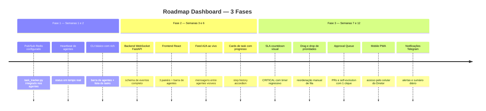

---

## Checklist de Integração

| Item | Responsável | Status |
|------|-------------|--------|
| `task_tracker.py` nos 5 agentes | Dev | ⬜ |
| Schema Redis para task state | Axel (Arch) | ⬜ |
| Redis Pub/Sub `clawdevs.dashboard` | Axel (Arch) | ⬜ |
| WebSocket backend (FastAPI) | Dev | ⬜ |
| Painel Novas Features (React) | Dev | ⬜ |
| Painel Bugs e Hotfix (React) | Dev | ⬜ |
| Painel Refatoração (React) | Dev | ⬜ |
| Barra de Agentes com status live | Dev | ⬜ |
| Feed A2A em tempo real | Dev | ⬜ |
| Step History Accordion | Dev | ⬜ |
| SLA countdown (CRITICAL) | Dev | ⬜ |
| Deploy K8s (Namespace monitoring) | Axel (Arch) | ⬜ |
| Notificações Telegram | Dev | ⬜ |
| Mobile PWA | Dev | ⬜ |

---

## Navegação

| ← Anterior | Índice | Próximo → |
|-----------|--------|----------|
| [17 — Resolução de Riscos](./17-resolucao-riscos.md) | [README](./README.md) | [19 — Fluxos de Desenvolvimento](./19-fluxos-desenvolvimento.md) |
