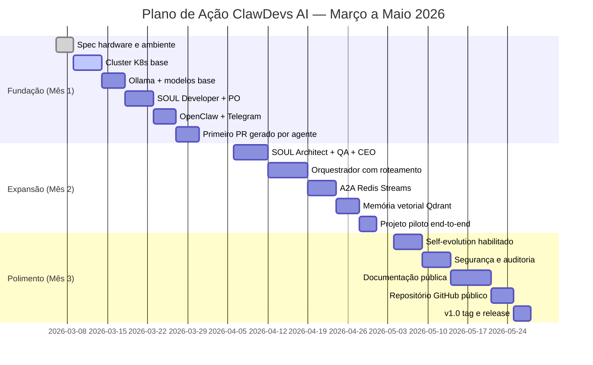
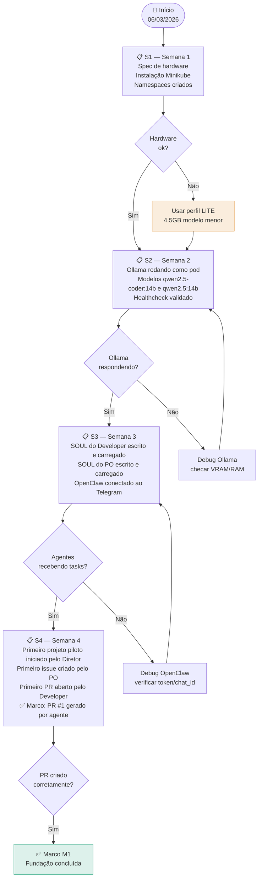
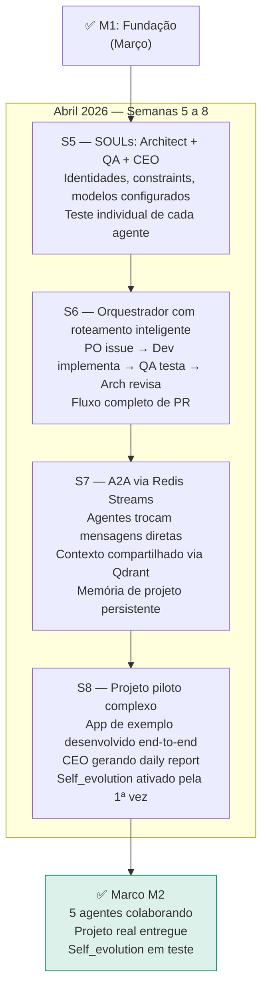
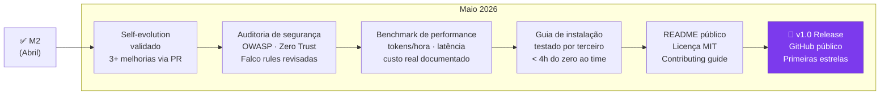
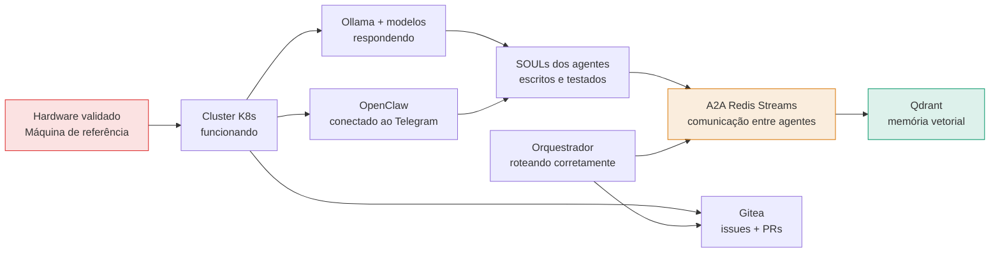
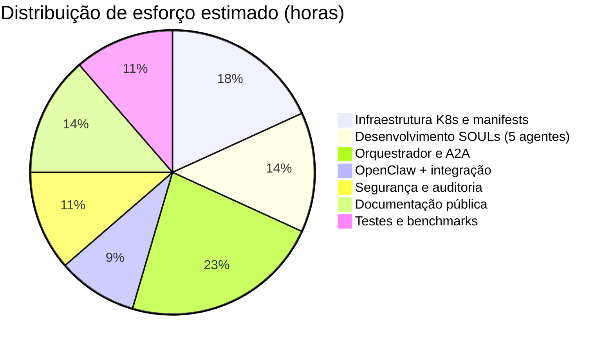

# 04 — Roadmap de Entregas (MVP v1.0)
> **Objetivo:** Estabelecer a linha do tempo de releases e sprints programadas.
> **Público-alvo:** PO, Scrum Master
> **Ação Esperada:** O PO e o SM devem acompanhar os marcos deste cronograma para priorizar as histórias de usuário e garantir as entregas no prazo acordado.

**v2.0 | Atualizado em: 06 de março de 2026**

---

## Visão do plano (90 dias)

---

## Fase 1 — Fundação (Março 2026)

**Entregas concretas da Fase 1:**
- `k8s/` — manifests para todos os namespaces e pods base
- `souls/developer.yaml` e `souls/po.yaml` — SOULs v1
- `config/openclaw.json` — configurado e testado com Telegram
- PR #1 no Gitea local — gerado pelo Developer a partir de issue do PO
- Documento de spec de hardware validada

---

## Fase 2 — Expansão do Time (Abril 2026)

**Critério de saída da Fase 2:**
O CEO consegue enviar ao Diretor um daily report com: issues abertas, PRs em revisão, bloqueios identificados e próximos passos — sem intervenção humana.

---

## Fase 3 — Polimento e Abertura Pública (Maio 2026)

---

## Dependências críticas

---

## Definição de pronto por entregável

| Entregável | Critério de pronto |
|---|---|
| Cluster K8s base | `kubectl get pods -A` mostra todos os pods Running |
| Ollama funcionando | `curl http://ollama-service:11434/api/tags` retorna lista de modelos |
| SOUL do Developer | Agente cria um arquivo Python válido a partir de uma instrução simples |
| OpenClaw + Telegram | Mensagem enviada pelo Diretor gera resposta do agente em < 30s |
| Fluxo PO → Dev → QA | Issue criada pelo PO vira PR revisado pelo QA sem intervenção humana |
| Self-evolution | Agente propõe PR de melhoria, Diretor aprova, configMap atualizado |
| Guia de instalação | Terceiro segue o guia e sobe o ambiente em < 4 horas |

---

## Recursos necessários por fase

**Total estimado: ~220 horas de desenvolvimento** (~3 meses, 1 desenvolvedor dedicado)

---

