# 05 — Fluxos de Trabalho e Ciclo de Vida
> **Objetivo:** Definir o Definition of Done (DoD), o workflow do board, code review e estratégias de CI/CD para novos produtos, manutenção e evolução.
> **Público-alvo:** Scrum Master, Devs
> **Ação Esperada:** SM deve garantir que as transições de estado sigam estes fluxos. Devs e QA devem consultar as responsabilidades e *gates* de auditoria.

**v2.0 | Atualizado em: 06 de março de 2026**

---

## Visão Geral dos Três Fluxos

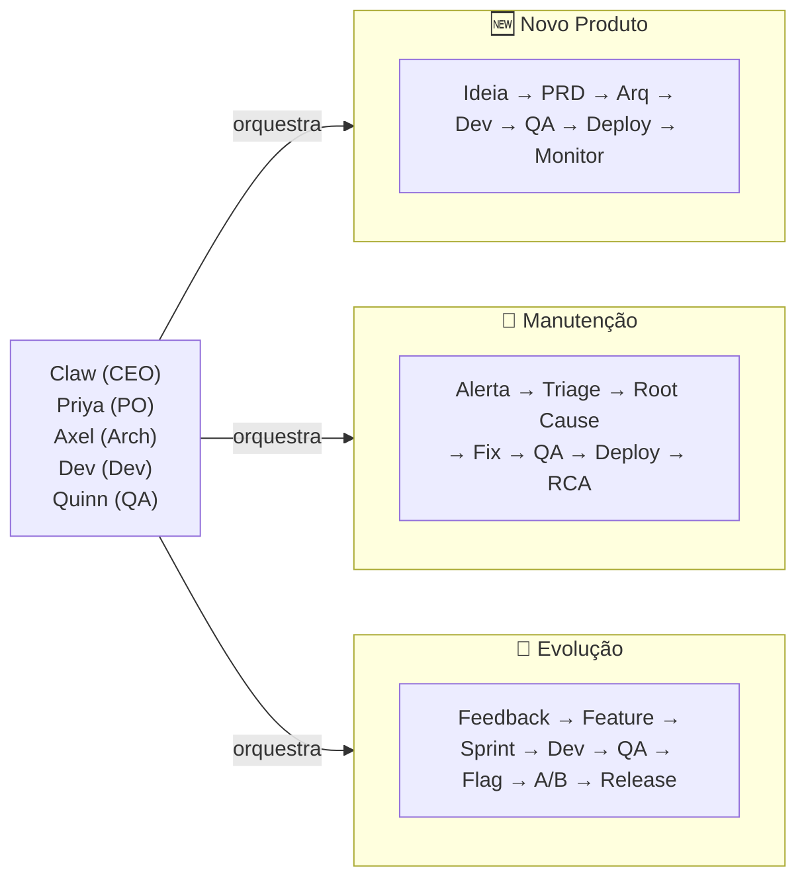

---

## Fluxo Completo — Desenvolvimento de um novo software (do zero)

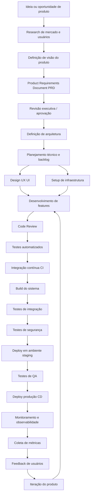

### Painel de tarefas — Desenvolvimento de um novo software (do zero)

```mermaid
flowchart LR

subgraph Ideacao
A1[Ideia do produto]
A2[Pesquisa de mercado]
A3[Definição da visão]
end

subgraph Planejamento
B1[PRD - Documento de requisitos]
B2[Definição da arquitetura]
B3[Criação do backlog]
end

subgraph Design
C1[UX Research]
C2[Design de interface]
C3[Prototipo]
end

subgraph Desenvolvimento
D1[Setup do repositório]
D2[Infraestrutura cloud]
D3[Desenvolvimento de features]
end

subgraph Qualidade
E1[Testes automatizados]
E2[Testes integração]
E3[QA manual]
end

subgraph Deploy
F1[Build CI]
F2[Deploy Staging]
F3[Deploy Produção]
end

subgraph Monitoramento
G1[Observabilidade]
G2[Logs e métricas]
G3[Feedback usuários]
end

A1 --> A2 --> A3
A3 --> B1 --> B2 --> B3
B3 --> C1 --> C2 --> C3
C3 --> D1 --> D2 --> D3
D3 --> E1 --> E2 --> E3
E3 --> F1 --> F2 --> F3
F3 --> G1 --> G2 --> G3
```

### Responsabilidade por Agente — Novo Produto

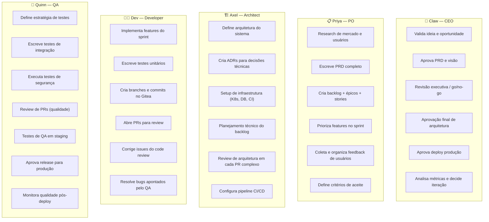

### Sequência A2A — Novo Produto (fase crítica: PRD → Implementação)

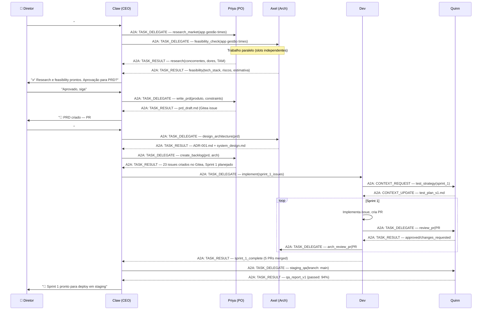

### Artefatos Produzidos por Etapa

| Etapa | Artefato | Agente Responsável | Onde |
|-------|----------|-------------------|------|
| Research | `research-report.md` | Priya (PO) | Gitea issue |
| PRD | `prd-v1.md` | Priya (PO) | Gitea issue #1 |
| Arquitetura | `ADR-001.md`, `system-design.md` | Axel (Arch) | Gitea repo /docs |
| Backlog | Issues Gitea + Milestones | Priya (PO) | Gitea issues |
| Infra | K8s manifests, CI config | Axel (Arch) | Gitea repo /infra |
| Feature | Branch + commits + PR | Dev | Gitea repo |
| Tests | `test_*.py`, cobertura | Quinn (QA) | Gitea repo /tests |
| Security | SAST report, `pentest.md` | Quinn (QA) | Gitea security tab |
| Deploy | Changelog, release tag | Dev + CEO | Gitea releases |
| Observability | Dashboards Grafana, alertas | Axel (Arch) | Grafana |

---

## Fluxo Completo — Manutenção de software

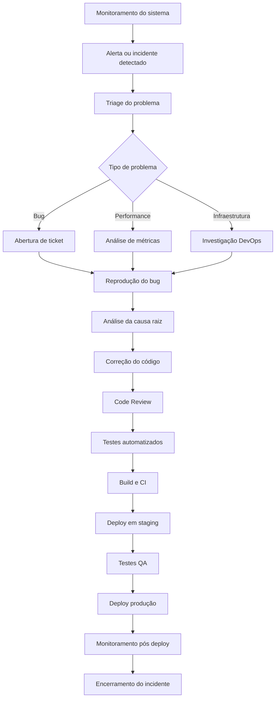

### Painel de tarefas — Manutenção de software

```mermaid
flowchart LR

subgraph Monitoramento
A1[Monitoramento sistema]
A2[Alerta detectado]
A3[Abertura de incidente]
end

subgraph Analise
B1[Triage do problema]
B2[Reprodução do bug]
B3[Análise causa raiz]
end

subgraph Correção
C1[Correção do código]
C2[Code Review]
C3[Testes automatizados]
end

subgraph Validacao
D1[Build CI]
D2[Deploy Staging]
D3[Testes QA]
end

subgraph Resolucao
E1[Deploy Produção]
E2[Monitoramento pós deploy]
E3[Encerramento incidente]
end

A1 --> A2 --> A3
A3 --> B1 --> B2 --> B3
B3 --> C1 --> C2 --> C3
C3 --> D1 --> D2 --> D3
D3 --> E1 --> E2 --> E3
```

### Responsabilidade por Agente — Manutenção

```mermaid
graph LR
    subgraph TRIAGE["🚨 Triage (Claw + Priya)"]
        T1["Claw: classifica severidade\n(CRITICAL/HIGH/MEDIUM/LOW)"]
        T2["Priya: cria ticket no Gitea\ncom contexto e impacto"]
        T3["Claw: aciona agente certo\nbug→Dev · perf→Arch · infra→Arch"]
    end

    subgraph ROOT_CAUSE["🔍 Root Cause (Dev + Arch)"]
        R1["Dev: reproduz o bug\n(branch hotfix/*)"]
        R2["Arch: analisa logs e métricas\nPrometheus + Grafana"]
        R3["Dev+Arch: identifica causa raiz\ndocumenta no ticket"]
    end

    subgraph FIX["🔨 Fix (Dev)"]
        F1["Dev: implementa correção\nbranch hotfix/issue-N"]
        F2["Dev: testa localmente\npassa unit tests"]
        F3["Dev: abre PR para review"]
    end

    subgraph VALIDATION["✅ Validação (Quinn + CEO)"]
        V1["Quinn: review do PR\n(foco em regressão)"]
        V2["Quinn: testes de regressão\nauto em staging"]
        V3["CEO: aprova deploy produção\npara CRITICAL/HIGH"]
    end

    subgraph POSTMORTEM["📋 Post-mortem (CEO + PO)"]
        P1["CEO: write post-mortem\nraiz, impacto, resolução"]
        P2["Priya: cria issue de prevenção\n(previne recorrência)"]
        P3["Axel: propõe melhorias\nna arquitetura se sistêmico"]
    end

    TRIAGE --> ROOT_CAUSE --> FIX --> VALIDATION --> POSTMORTEM
```

### SLA por Severidade

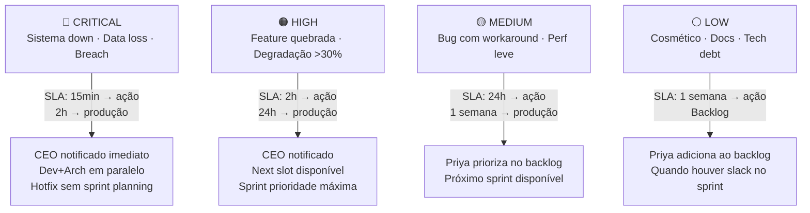

### Sequência A2A — Incidente Crítico (CRITICAL)

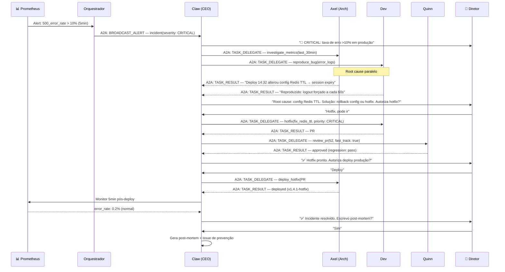

---

## Fluxo Completo — Evolução de software (novas features)

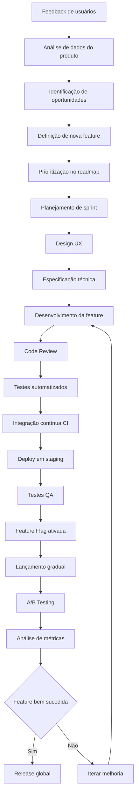

### Painel de tarefas — Evolução de software (novas features)

```mermaid
flowchart LR

subgraph Descoberta
A1[Feedback usuários]
A2[Análise de dados]
A3[Identificação de oportunidade]
end

subgraph Produto
B1[Definição da feature]
B2[Priorização roadmap]
B3[Planejamento sprint]
end

subgraph Design
C1[UX Design]
C2[Protótipo]
C3[Validação]
end

subgraph Engenharia
D1[Implementação]
D2[Code Review]
D3[Testes automatizados]
end

subgraph Release
E1[Build CI]
E2[Deploy Staging]
E3[Testes QA]
end

subgraph Experimento
F1[Feature Flag]
F2[A/B Test]
F3[Análise métricas]
end

subgraph Resultado
G1[Release global]
G2[Iteração melhoria]
end

A1 --> A2 --> A3
A3 --> B1 --> B2 --> B3
B3 --> C1 --> C2 --> C3
C3 --> D1 --> D2 --> D3
D3 --> E1 --> E2 --> E3
E3 --> F1 --> F2 --> F3
F3 --> G1
F3 --> G2
```

### Feature Flag + A/B Testing com Agentes

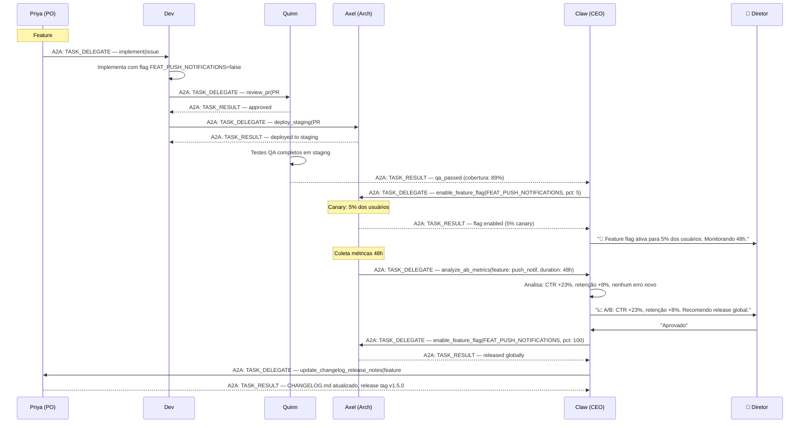

---

## Mapa Consolidado: Agente × Etapa × Ferramenta

| Etapa | Fluxo | Agente Principal | Agentes de Suporte | Ferramenta/MCP |
|-------|-------|-----------------|-------------------|----------------|
| Research de mercado | Novo | Priya (PO) | Claw (CEO) | WebSearch, Qdrant RAG |
| Definição de visão | Novo | Claw (CEO) | Priya (PO) | Gitea issue |
| PRD | Novo + Evol | Priya (PO) | Claw (CEO) | Gitea issue, mcp-filesystem |
| Aprovação executiva | Novo + Evol | Claw (CEO) | Diretor | Telegram (OpenClaw) |
| Arquitetura / ADR | Novo | Axel (Arch) | Claw (CEO) | Gitea repo, mcp-gitea |
| Setup infra / CI | Novo | Axel (Arch) | — | K8s manifests, Gitea CI |
| Design UX | Novo + Evol | Priya (PO) | Dev | Gitea issue (spec) |
| Especificação técnica | Evol | Axel (Arch) | Dev | Gitea issue, ADR |
| Planejamento backlog | Todos | Priya (PO) | Claw (CEO) | Gitea issues/milestones |
| Desenvolvimento | Todos | Dev | Axel (Arch) | mcp-gitea, mcp-filesystem |
| Code Review | Todos | Quinn (QA) | Axel (Arch) | mcp-gitea |
| Testes automáticos | Todos | Quinn (QA) | Dev | CI pipeline, Gitea Actions |
| Build / CI | Todos | Axel (Arch) | Quinn (QA) | Gitea Actions, K8s |
| Testes de segurança | Novo + Evol | Quinn (QA) | Axel (Arch) | SAST tools |
| Deploy staging | Todos | Axel (Arch) | Dev | K8s, mcp-gitea |
| QA staging | Todos | Quinn (QA) | — | Gitea, testes E2E |
| Deploy produção | Todos | Axel (Arch) | Claw (CEO) | K8s CD, aprovação CEO |
| Feature Flag | Evol | Axel (Arch) | Claw (CEO) | Feature flag service |
| A/B Testing | Evol | Claw (CEO) | Axel (Arch) | Métricas Prometheus |
| Monitoramento | Todos | Axel (Arch) | Quinn (QA) | Grafana, Prometheus |
| Triage incidente | Manutenção | Claw (CEO) | Priya (PO) | Prometheus alerts |
| Root cause analysis | Manutenção | Dev + Axel | Quinn (QA) | Logs Loki, Prometheus |
| Hotfix | Manutenção | Dev | Quinn (QA) | mcp-gitea, fast-track |
| Post-mortem | Manutenção | Claw (CEO) | Priya (PO) | Gitea issue |
| Coleta de feedback | Todos | Priya (PO) | Claw (CEO) | Dados produto, Telegram |

---

## Estados do Produto e Transições

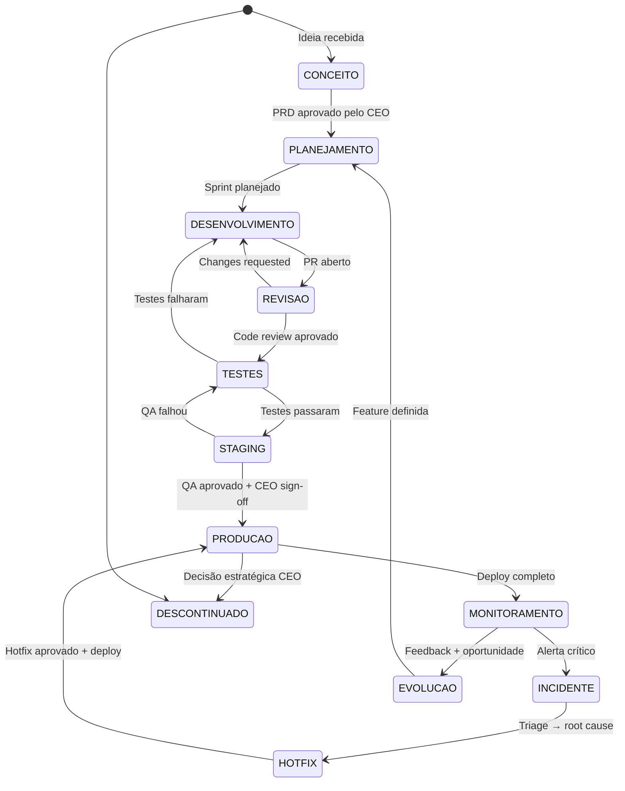

---

## Regras de Governança nos Fluxos

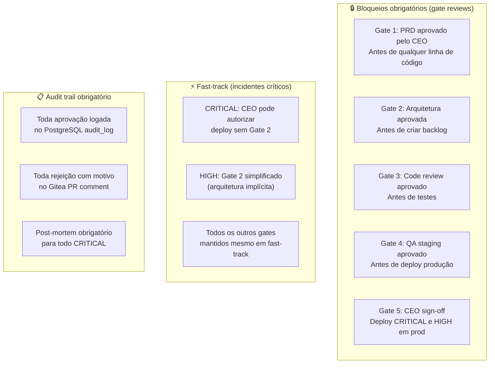

---

## Templates de Issues por Fluxo

### Template: Bug Report (Manutenção)

```markdown
<!-- Criado automaticamente por Claw (CEO) ao receber alerta -->
## 🐛 Bug Report #{{NUMBER}}

**Severidade:** {{CRITICAL|HIGH|MEDIUM|LOW}}
**Detectado em:** {{staging|production}}
**Data/hora:** {{TIMESTAMP}}

### Descrição
{{DESCRIÇÃO DO BUG}}

### Impacto
- Usuários afetados: {{N}}
- Funcionalidades afetadas: {{LISTA}}
- SLA de resolução: {{PRAZO}}

### Como reproduzir
1. {{PASSO 1}}
2. {{PASSO 2}}

### Logs relevantes
```
{{STACK TRACE / LOG}}
```

### Root cause (preenchido por Dev/Arch)
{{A PREENCHER}}

### Correção aplicada
{{A PREENCHER}}

**Assignee:** @dev-dev
**Reviewer:** @quinn-qa
**Aprovação deploy:** @claw-ceo (se CRITICAL/HIGH)
```

### Template: Feature Request (Evolução)

```markdown
<!-- Criado por Priya (PO) após análise de feedback -->
## ✨ Feature #{{NUMBER}}: {{NOME}}

**Épico:** {{EPICO}}
**Sprint:** {{SPRINT}}
**Story Points:** {{SP}}

### Por que (Why)
{{PROBLEMA QUE RESOLVE}}

### O que (What)
{{DESCRIÇÃO DA FEATURE}}

### Critérios de aceite
- [ ] {{CRITÉRIO 1}}
- [ ] {{CRITÉRIO 2}}
- [ ] {{CRITÉRIO 3}}

### Design UX
{{LINK PARA SPEC}}

### Notas técnicas (Arch)
{{A PREENCHER POR AXEL}}

### Feature flag
- [ ] Implementar com flag `FEAT_{{NOME_UPPER}}`
- [ ] A/B test planejado? {{SIM/NÃO}}

**Assignee:** @dev-dev
**Reviewer:** @quinn-qa
```

---

## Métricas de Saúde dos Fluxos (dashboard)

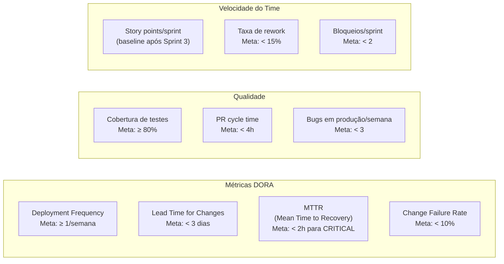

---


