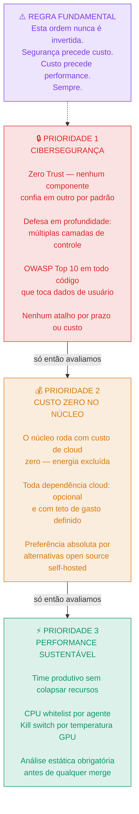
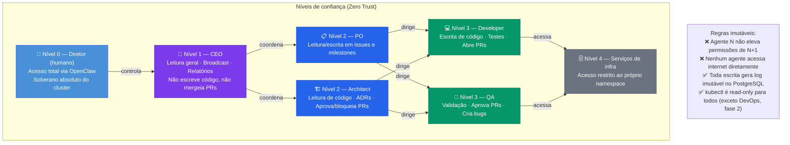
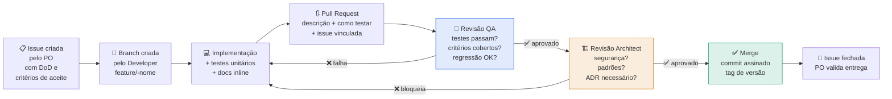
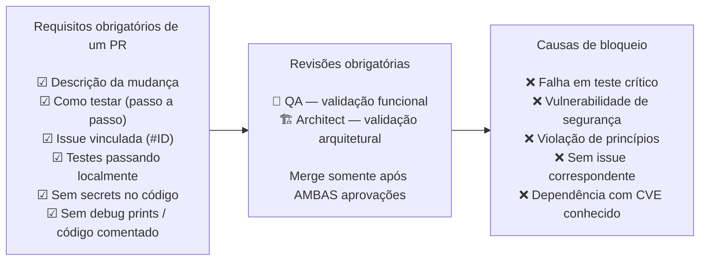
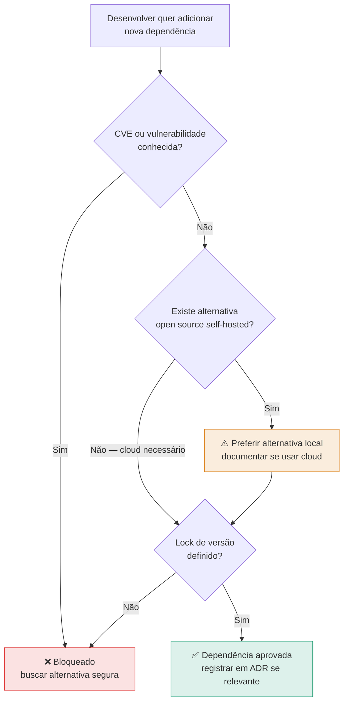
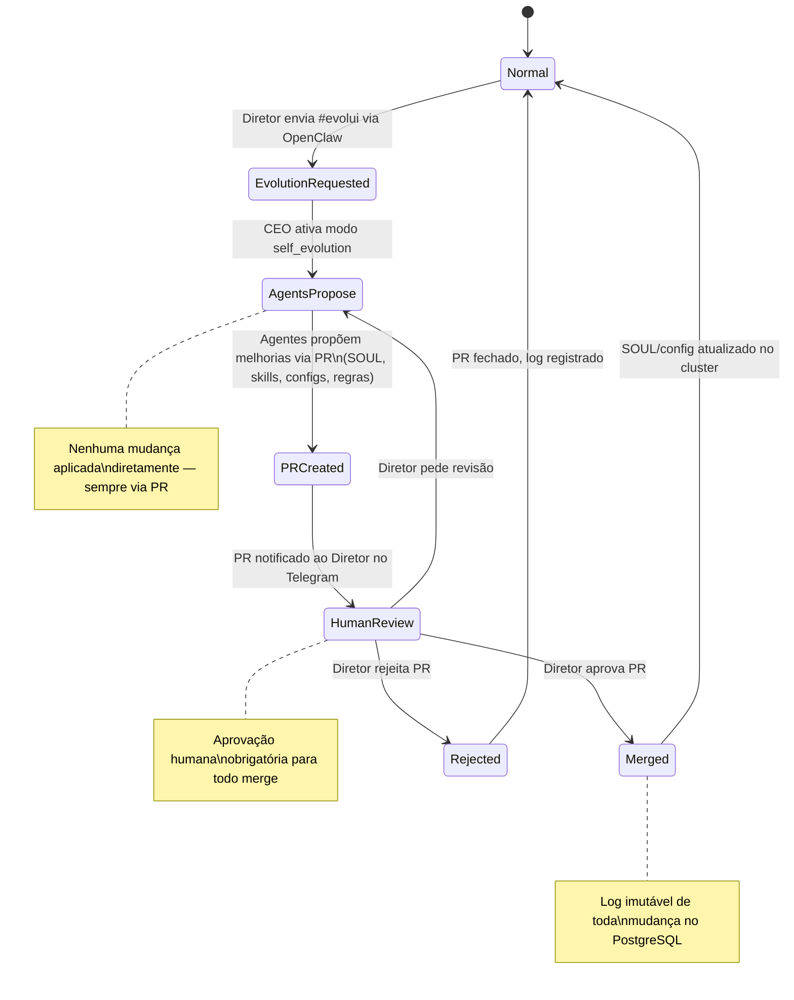
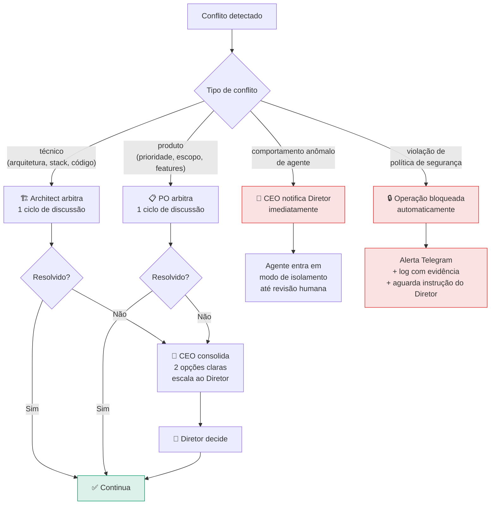

# 06 — Políticas Rígidas de Engenharia
> **Objetivo:** Estabelecer a "constituição" do projeto. Nenhum agente, prazo ou pressão de negócio sobrepõe essas primícias.
> **Público-alvo:** Devs, Scrum Master
> **Ação Esperada:** Devs e SM devem usar isso como checklist no *Definition of Ready* e *Definition of Done*. Arquitetos usarão para aprovar PRs.

**v2.0 | Atualizado em: 06 de março de 2026**

---

## Primícias — Ordem de prioridade absoluta



---

## Modelo Zero Trust entre agentes



---

## Políticas operacionais

### Ciclo de vida de uma feature



---

### Política de commits

```
✅ Todo commit deve ser assinado         git commit -s
✅ Formato:                              tipo(escopo): descrição curta
✅ Tipos válidos:                        feat · fix · refactor · test · docs · chore · sec
❌ Nenhum commit direto em main/develop  somente via PR
❌ Sem secrets, tokens ou credenciais   use K8s Secrets ou env vars
```

**Exemplos de commit válidos:**
```
feat(auth): add JWT refresh token endpoint
fix(api): handle null response from Ollama timeout
sec(deps): update requests to 2.32.3 (CVE-2024-XXX)
test(login): add edge cases for invalid tokens
```

---

### Política de Pull Requests



---

### Política de secrets

| Regra | Detalhe |
|---|---|
| **Zero secrets em código** | Sempre via K8s Secrets ou env vars |
| **Rotação automática** | Tokens rotacionam a cada 30 dias |
| **Auditoria** | Falco monitora acesso a secrets em tempo real |
| **Scan obrigatório** | git-secrets ou truffleHog antes de todo merge |
| **Sem secrets em logs** | Mascaramento obrigatório em todos os outputs |

---

### Política de dependências



---

## Política de self_evolution



**Regras imutáveis do self_evolution:**
- Modo ativado apenas pelo Diretor — nunca pelo próprio time
- Toda proposta vira PR — nunca aplicada diretamente
- Aprovação humana obrigatória antes de qualquer merge
- Log completo de mudanças propostas, aprovadas e rejeitadas
- Rollback imediato disponível para qualquer mudança de SOUL

---

## Escalação e resolução de conflitos



---

