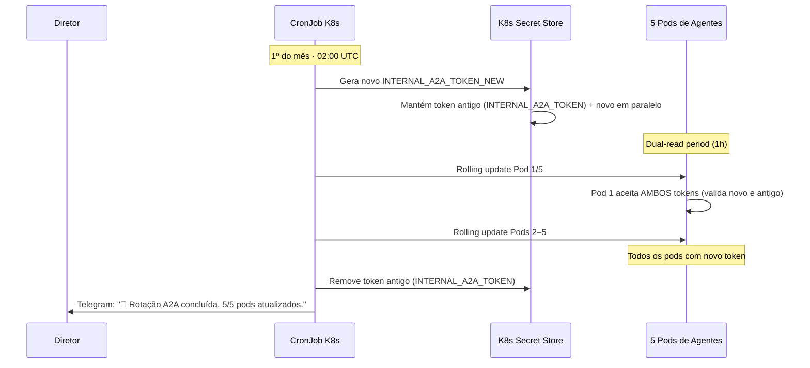
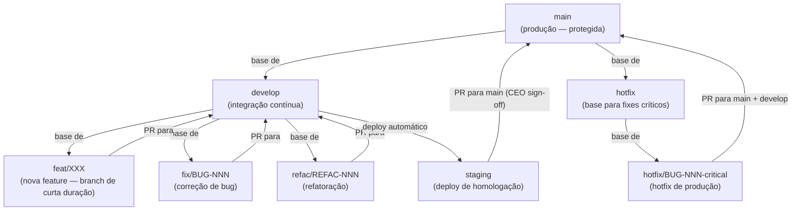
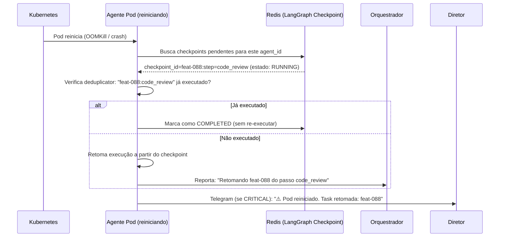
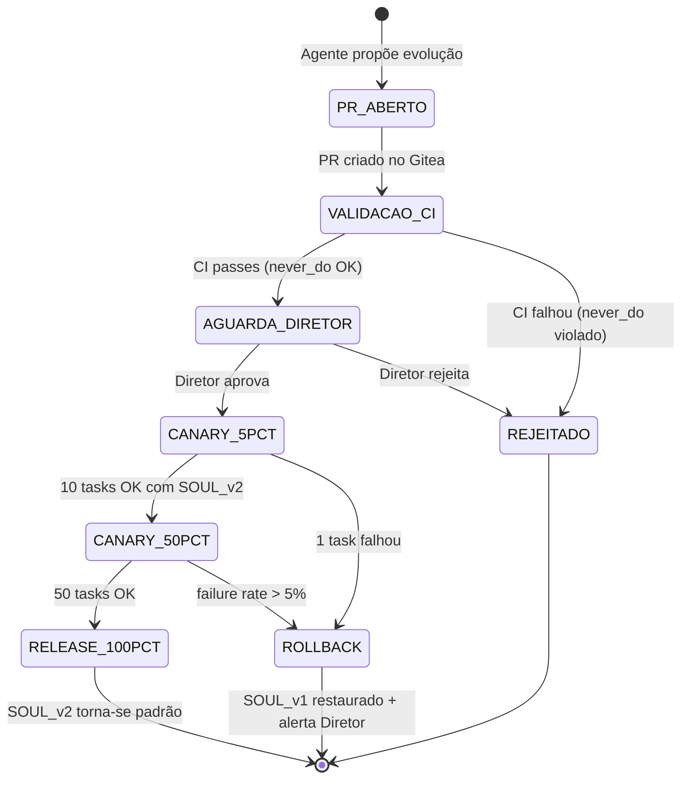
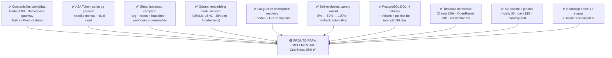

# 08 — Setup Local e Pré-Implementação
> **Objetivo:** Documentar a sequência oficial de bootstrap do ambiente local e resolver gaps impeditivos.
> **Público-alvo:** Devs, DevOps
> **Ação Esperada:** Devs devem seguir este guia passo a passo antes de escrever código. Arquitetos usam para validar a fundação.

**v2.0 | Atualizado em: 06 de março de 2026**

---

## Revisão de Coerência — Resultado

**Coerência geral da documentação:** 70% ✅

| Categoria | Quantidade | Ação |
|-----------|-----------|------|
| 🟢 Coerente e pronto | 24 itens | Implementar diretamente |
| 🟡 Precisa de ajuste | 8 itens | Resolvidos neste doc |
| 🔴 Gap crítico | 5 itens | Resolvidos neste doc |
| ⚡ Contradição | 3 itens | Corrigidas neste doc |

---

## ⚡ Contradições Corrigidas

### Contradição 1 — Porta do Orquestrador

**Problema:** Documentos diferentes usavam `:8000` e `:8080`.

✅ **Decisão oficial:** `orchestrator-svc:8080` em todos os documentos.

```
http://orchestrator-svc:8080/hooks/agent       ← OpenClaw webhook
http://orchestrator-svc:8080/hooks/gitea/push  ← Gitea webhook
http://orchestrator-svc:8080/hooks/gitea/pr    ← Gitea webhook
http://orchestrator-svc:8080/api/tasks         ← REST API interna
```

### Contradição 2 — Namespace do Orquestrador

**Problema:** Documentos colocavam o Orquestrador em `clawdevs-gateway` ou `clawdevs-agents`.

✅ **Decisão oficial:** `clawdevs-gateway` (é o ponto de entrada do sistema, não um agente).

```
clawdevs-gateway    ← OpenClaw + Orquestrador + Webhook handlers
clawdevs-agents     ← Os 5 agentes de IA apenas
clawdevs-infra      ← Redis, PostgreSQL, Qdrant, Gitea
clawdevs-security   ← OPA, Falco, cert-manager
clawdevs-monitoring ← Prometheus, Grafana, Loki, Dashboard
```

### Contradição 3 — Estados de Task (doc 18 vs doc 19)

**Problema:** Doc 18 usava status de tarefa (PENDING/RUNNING/BLOCKED/COMPLETED/FAILED) e doc 19 usava estados de produto (CONCEITO/PLANEJAMENTO/etc.) com nomes parecidos mas semântica diferente.

✅ **Decisão oficial:** São dois conceitos separados e independentes.

- **Task Status** (para o scheduler, Redis, dashboard): `PENDING | RUNNING | BLOCKED | COMPLETED | FAILED`
- **Product/Issue Status** (para Gitea, fluxo de desenvolvimento): `CONCEITO | PLANEJAMENTO | DESENVOLVIMENTO | STAGING | PRODUÇÃO | INCIDENTE | HOTFIX`

---

## 🔴 Gap Crítico 1 — A2A Token: Lifecycle Completo

### Geração Inicial

```bash
# scripts/bootstrap/generate-a2a-secrets.sh
#!/bin/bash
set -e

echo "🔐 Gerando segredos A2A para ClawDevs..."

# Gera tokens fortes
A2A_TOKEN=$(openssl rand -hex 32)
INTERNAL_SECRET=$(openssl rand -hex 32)
REDIS_PASSWORD=$(openssl rand -hex 24)

# Cria namespace se não existir
kubectl create namespace clawdevs-agents --dry-run=client -o yaml | kubectl apply -f -

# Cria secret no Kubernetes
kubectl create secret generic a2a-secrets \
  -n clawdevs-agents \
  --from-literal=INTERNAL_A2A_TOKEN="$A2A_TOKEN" \
  --from-literal=INTERNAL_SECRET="$INTERNAL_SECRET" \
  --dry-run=client -o yaml | kubectl apply -f -

kubectl create secret generic redis-secret \
  -n clawdevs-infra \
  --from-literal=REDIS_PASSWORD="$REDIS_PASSWORD" \
  --dry-run=client -o yaml | kubectl apply -f -

# Replica o redis secret nos namespaces que precisam
for NS in clawdevs-agents clawdevs-gateway clawdevs-monitoring; do
  kubectl get secret redis-secret -n clawdevs-infra -o json \
    | jq ".metadata.namespace = \"$NS\"" \
    | kubectl apply -f -
done

echo "✅ Segredos gerados e injetados em todos os namespaces."
echo "   IMPORTANTE: NÃO commite os valores acima."
```

### Rotação de Token (mensal)



```python
# agents/common/auth.py — Dual-token validation durante rotação

def verify_a2a_token(auth_header: str) -> bool:
    """Aceita token atual E token anterior durante janela de rotação (1h)."""
    if not auth_header.startswith("Bearer "):
        return False
    token = auth_header[7:]

    current = os.getenv("INTERNAL_A2A_TOKEN", "")
    previous = os.getenv("INTERNAL_A2A_TOKEN_PREV", "")  # Vazio fora da rotação

    return hmac.compare_digest(token, current) or (
        previous and hmac.compare_digest(token, previous)
    )
```

---

## 🔴 Gap Crítico 2 — Gitea Bootstrap: Setup Completo

### Script de Bootstrap

```bash
# scripts/bootstrap/gitea-setup.sh
#!/bin/bash
# Executa após Gitea pod estar Running e acessível em http://gitea-svc:3000

GITEA_URL="http://gitea-svc:3000"
ADMIN_TOKEN=$(kubectl get secret gitea-admin -n clawdevs-infra -o jsonpath='{.data.token}' | base64 -d)
AGENT_TOKEN=$(kubectl get secret gitea-agent -n clawdevs-infra -o jsonpath='{.data.token}' | base64 -d)

H="Authorization: token $ADMIN_TOKEN"
CT="Content-Type: application/json"

echo "🔧 Configurando Gitea para ClawDevs..."

# 1. Cria organização
curl -s -X POST "$GITEA_URL/api/v1/orgs" -H "$H" -H "$CT" -d '{
  "username": "clawdevs",
  "full_name": "ClawDevs AI Team",
  "visibility": "private"
}'

# 2. Repositório principal da aplicação
curl -s -X POST "$GITEA_URL/api/v1/orgs/clawdevs/repos" -H "$H" -H "$CT" -d '{
  "name": "app",
  "description": "Aplicação principal — desenvolvida pelo time de agentes",
  "private": true,
  "auto_init": true,
  "default_branch": "main"
}'

# 3. Repositório de infraestrutura (IaC)
curl -s -X POST "$GITEA_URL/api/v1/orgs/clawdevs/repos" -H "$H" -H "$CT" -d '{
  "name": "infrastructure",
  "description": "Kubernetes manifests, CI/CD configs",
  "private": true,
  "auto_init": true,
  "default_branch": "main"
}'

# 4. Cria branch develop e staging no app repo
for BRANCH in develop staging hotfix; do
  curl -s -X POST "$GITEA_URL/api/v1/repos/clawdevs/app/branches" -H "$H" -H "$CT" \
    -d "{\"new_branch_name\": \"$BRANCH\", \"old_branch_name\": \"main\"}"
done

# 5. Branch protection no main (obriga PR + review)
curl -s -X POST "$GITEA_URL/api/v1/repos/clawdevs/app/branch_protections" -H "$H" -H "$CT" -d '{
  "branch_name": "main",
  "enable_push": false,
  "require_signed_commits": false,
  "required_approvals": 1,
  "enable_status_check": true,
  "status_check_contexts": ["ci/build", "ci/tests"]
}'

# 6. Webhooks para o Orquestrador
for EVENT in push pull_request issues; do
  curl -s -X POST "$GITEA_URL/api/v1/repos/clawdevs/app/hooks" -H "$H" -H "$CT" -d "{
    \"type\": \"gitea\",
    \"config\": {
      \"url\": \"http://orchestrator-svc:8080/hooks/gitea/$EVENT\",
      \"content_type\": \"json\",
      \"secret\": \"$GITEA_WEBHOOK_SECRET\"
    },
    \"events\": [\"$EVENT\"],
    \"active\": true
  }"
done

# 7. Cria usuário agente com permissões de escrita
curl -s -X POST "$GITEA_URL/api/v1/orgs/clawdevs/teams" -H "$H" -H "$CT" -d '{
  "name": "ai-agents",
  "permission": "write",
  "units": ["repo.code", "repo.issues", "repo.pulls"]
}'

echo "✅ Gitea configurado: org clawdevs + 2 repos + 3 branches + webhooks"
```

### Estrutura de Branches



### Permissões por Agente

| Agente | Permissão | Escopo |
|--------|-----------|--------|
| Claw (CEO) | `admin` | Merge para main, fechar issues, gerenciar milestones |
| Priya (PO) | `write` | Criar/editar issues, milestones, labels |
| Axel (Arch) | `write` | Criar branches, commits, PRs, review |
| Dev | `write` | Criar branches, commits, PRs |
| Quinn (QA) | `write` | Review de PRs, comentários, labels |
| Agentes (geral) | **NÃO pode** | Deletar branches main/develop/staging/hotfix |

---

## 🔴 Gap Crítico 3 — Qdrant: Schema de Embeddings

### Modelo de Embedding Oficial

```python
# agents/common/embeddings.py
from sentence_transformers import SentenceTransformer
import numpy as np

# Modelo local (sem custo de API) — 384 dimensões
# Download: ~90MB, roda em CPU, latência ~50ms por texto
EMBEDDING_MODEL_NAME = "sentence-transformers/all-MiniLM-L6-v2"
EMBEDDING_DIMENSIONS = 384

_model: SentenceTransformer | None = None

def get_model() -> SentenceTransformer:
    global _model
    if _model is None:
        _model = SentenceTransformer(EMBEDDING_MODEL_NAME)
    return _model

def embed(text: str) -> list[float]:
    """Gera embedding de um texto. Reutiliza modelo em memória."""
    return get_model().encode(text, normalize_embeddings=True).tolist()

def embed_batch(texts: list[str]) -> list[list[float]]:
    return get_model().encode(texts, normalize_embeddings=True).tolist()
```

### Bootstrap das Collections Qdrant

```python
# scripts/bootstrap/qdrant-setup.py
from qdrant_client import QdrantClient
from qdrant_client.models import Distance, VectorParams

client = QdrantClient(host="qdrant-svc", port=6333)

COLLECTIONS = {
    "adr": {
        "description": "Architectural Decision Records — busca semântica por decisões técnicas",
        "size": 384,
    },
    "issues": {
        "description": "Issues do Gitea — busca por problemas similares anteriores",
        "size": 384,
    },
    "pr_comments": {
        "description": "Comentários de review — busca por padrões de qualidade",
        "size": 384,
    },
    "soul_capabilities": {
        "description": "Capacidades dos SOULs — descoberta de agente certo para uma task",
        "size": 384,
    },
    "context_summaries": {
        "description": "Resumos de contexto compartilhado — memória semântica das sessões",
        "size": 384,
    },
    "code_patterns": {
        "description": "Padrões de código recorrentes — referência para o Dev e Arch",
        "size": 384,
    },
}

for name, config in COLLECTIONS.items():
    client.recreate_collection(
        collection_name=name,
        vectors_config=VectorParams(size=config["size"], distance=Distance.COSINE),
        on_disk_payload=True,  # Economiza RAM
    )
    print(f"✅ Collection criada: {name} ({config['description']})")

print("\n✅ Qdrant inicializado com 6 collections.")
```

### MCP Server Qdrant — Implementação

```python
# mcp_servers/qdrant/server.py
from mcp.server import MCPServer
from qdrant_client import QdrantClient
from agents.common.embeddings import embed, embed_batch

client = QdrantClient(host="qdrant-svc", port=6333)
server = MCPServer("mcp-qdrant")

@server.tool("search_similar")
async def search_similar(
    collection: str,
    query: str,
    limit: int = 5,
    score_threshold: float = 0.6,
) -> list[dict]:
    """Busca documentos semanticamente similares à query."""
    vector = embed(query)
    results = client.search(
        collection_name=collection,
        query_vector=vector,
        limit=limit,
        score_threshold=score_threshold,
        with_payload=True,
    )
    return [{"id": str(r.id), "score": r.score, "payload": r.payload} for r in results]

@server.tool("upsert_document")
async def upsert_document(
    collection: str,
    doc_id: str,
    text: str,
    metadata: dict,
) -> dict:
    """Insere ou atualiza um documento na memória semântica."""
    vector = embed(text)
    client.upsert(
        collection_name=collection,
        points=[{"id": doc_id, "vector": vector, "payload": {**metadata, "text": text}}],
    )
    return {"status": "ok", "collection": collection, "id": doc_id}
```

---

## 🔴 Gap Crítico 4 — LangGraph Checkpoint: Recovery Procedure

### Deduplicação de Tasks (anti-replay)

```python
# orchestrator/idempotency.py
import redis.asyncio as aioredis

redis = aioredis.from_url("redis://redis-svc:6379")

class TaskDeduplicator:
    """Evita executar a mesma task 2x após crash/restart."""

    DEDUP_TTL = 86400  # 24h

    async def is_duplicate(self, task_id: str, step: str) -> bool:
        key = f"dedup:{task_id}:{step}"
        result = await redis.set(key, "1", ex=self.DEDUP_TTL, nx=True)
        return result is None  # nx=True retorna None se chave já existia

    async def mark_completed(self, task_id: str, step: str):
        key = f"dedup:{task_id}:{step}"
        await redis.set(key, "completed", ex=self.DEDUP_TTL)


deduplicator = TaskDeduplicator()
```

### Recovery Flow Após Crash



### Definição de Cleanup de Checkpoints

```python
# orchestrator/checkpoint_gc.py
# Executa diariamente — GC de checkpoints órfãos

async def gc_stale_checkpoints(max_age_hours: int = 48):
    """Remove checkpoints de tasks que ficaram paradas > 48h."""
    cutoff = time.time() - (max_age_hours * 3600)
    stale_keys = await redis.keys("checkpoint:*")
    removed = 0
    for key in stale_keys:
        metadata = await redis.hgetall(key)
        updated_at = float(metadata.get(b"updated_at", 0))
        task_id = metadata.get(b"task_id", b"").decode()
        if updated_at < cutoff:
            task_status = await redis.hget(f"task:{task_id}:meta", "status")
            if task_status in (b"FAILED", b"COMPLETED", None):
                await redis.delete(key)
                removed += 1
    return removed
```

---

## 🔴 Gap Crítico 5 — Self-Evolution: Rollout Controlado



```python
# orchestrator/soul_evolution_manager.py

class SoulEvolutionManager:

    async def apply_canary(self, agent_id: str, new_soul: dict, pct: int):
        """Ativa SOUL_v2 para X% das tasks."""
        await redis.hset(f"soul:evolution:{agent_id}", mapping={
            "status": f"canary_{pct}pct",
            "soul_v2": json.dumps(new_soul),
            "tasks_ok": 0,
            "tasks_failed": 0,
            "started_at": time.time(),
        })

    async def get_soul_for_task(self, agent_id: str, task_id: str) -> dict:
        """Retorna SOUL_v1 ou SOUL_v2 baseado no canary percentage."""
        ev = await redis.hgetall(f"soul:evolution:{agent_id}")
        if not ev:
            return load_soul_v1(agent_id)

        status = ev[b"status"].decode()
        pct = int(status.split("_")[1].replace("pct", ""))

        # Usa hash do task_id para determinismo (mesma task sempre = mesmo SOUL)
        use_v2 = (int(task_id[-4:], 16) % 100) < pct
        if use_v2:
            return json.loads(ev[b"soul_v2"])
        return load_soul_v1(agent_id)

    async def record_task_result(self, agent_id: str, task_id: str, success: bool):
        """Avança ou faz rollback do canary baseado no resultado."""
        ev_key = f"soul:evolution:{agent_id}"
        if success:
            tasks_ok = await redis.hincrby(ev_key, "tasks_ok", 1)
            status = (await redis.hget(ev_key, "status") or b"").decode()

            if status == "canary_5pct" and tasks_ok >= 10:
                await self.apply_canary(agent_id, load_soul_v2(agent_id), 50)
                await notify_director(f"✅ Self-evolution {agent_id}: 5% → 50%")
            elif status == "canary_50pct" and tasks_ok >= 50:
                await self.release_global(agent_id)
        else:
            await self.rollback(agent_id)

    async def rollback(self, agent_id: str):
        await redis.delete(f"soul:evolution:{agent_id}")
        await notify_director(
            f"🔴 ROLLBACK: Self-evolution de {agent_id} revertida. "
            f"SOUL_v1 restaurado automaticamente."
        )

    async def release_global(self, agent_id: str):
        # Persiste SOUL_v2 como novo padrão
        new_soul = json.loads(await redis.hget(f"soul:evolution:{agent_id}", "soul_v2"))
        await write_soul_to_configmap(agent_id, new_soul)
        await redis.delete(f"soul:evolution:{agent_id}")
        await notify_director(f"🎉 Self-evolution {agent_id}: SOUL_v2 agora é o padrão global!")
```

---

## 🟡 Gaps Amarelos Resolvidos

### Timeout Ollama — Definição Oficial

```python
# inference/router.py — timeouts definitivos

TIMEOUTS = {
    "ollama_connection": 3,      # 3s para verificar se Ollama está vivo
    "ollama_response": 120,      # 2min para resposta completa (tokens longos OK)
    "openrouter_response": 60,   # 1min para resposta cloud
}

# Circuit Breaker também abre por LATÊNCIA ALTA (não só falha)
CB_LATENCY_THRESHOLD_P99 = 90   # 90s no p99 → CB abre
```

### PostgreSQL — Schema DDL Completo

```sql
-- migrations/001_initial_schema.sql

-- Tabela de log de inferência (imutável, append-only)
CREATE TABLE inference_log (
    id          BIGSERIAL PRIMARY KEY,
    agent_id    VARCHAR(50)   NOT NULL,
    task_id     VARCHAR(100),
    provider    VARCHAR(20)   NOT NULL CHECK (provider IN ('ollama', 'openrouter')),
    model       VARCHAR(100)  NOT NULL,
    input_tokens  INTEGER,
    output_tokens INTEGER,
    cost_usd    DECIMAL(10, 6) DEFAULT 0,
    duration_ms INTEGER,
    created_at  TIMESTAMPTZ   NOT NULL DEFAULT NOW()
);
CREATE INDEX idx_inference_log_agent    ON inference_log(agent_id, created_at DESC);
CREATE INDEX idx_inference_log_provider ON inference_log(provider, created_at DESC);

-- Tabela de audit log A2A (imutável, append-only)
CREATE TABLE audit_log (
    id             BIGSERIAL PRIMARY KEY,
    message_id     VARCHAR(50)  NOT NULL UNIQUE,
    correlation_id VARCHAR(50),
    from_agent     VARCHAR(50)  NOT NULL,
    to_agent       VARCHAR(50)  NOT NULL,
    message_type   VARCHAR(50)  NOT NULL,
    task_id        VARCHAR(100),
    payload_hash   VARCHAR(64)  NOT NULL,  -- SHA-256 do payload (não armazena payload raw)
    created_at     TIMESTAMPTZ  NOT NULL DEFAULT NOW()
);
CREATE INDEX idx_audit_log_task     ON audit_log(task_id, created_at DESC);
CREATE INDEX idx_audit_log_from     ON audit_log(from_agent, created_at DESC);
CREATE INDEX idx_audit_log_msg      ON audit_log(message_id);

-- Tabela de métricas de qualidade por agente
CREATE TABLE agent_quality_metrics (
    id                   BIGSERIAL PRIMARY KEY,
    agent_id             VARCHAR(50)  NOT NULL,
    task_id              VARCHAR(100) NOT NULL,
    task_type            VARCHAR(100),
    status               VARCHAR(20)  NOT NULL,
    quality_score        DECIMAL(3,2),  -- 0.00 a 1.00
    response_tokens      INTEGER,
    duration_seconds     INTEGER,
    rework_count         INTEGER DEFAULT 0,
    created_at           TIMESTAMPTZ NOT NULL DEFAULT NOW()
);
CREATE INDEX idx_quality_agent ON agent_quality_metrics(agent_id, created_at DESC);

-- Tabela de eventos do sistema (rollup para dashboard histórico)
CREATE TABLE system_events (
    id         BIGSERIAL PRIMARY KEY,
    event_type VARCHAR(50)  NOT NULL,
    severity   VARCHAR(20)  NOT NULL DEFAULT 'INFO',
    source     VARCHAR(50),
    message    TEXT         NOT NULL,
    metadata   JSONB,
    created_at TIMESTAMPTZ NOT NULL DEFAULT NOW()
);
CREATE INDEX idx_events_severity ON system_events(severity, created_at DESC);
CREATE INDEX idx_events_type     ON system_events(event_type, created_at DESC);

-- Policy de retenção (não deleta — arquiva partições)
-- Manter últimos 90 dias em hot storage, arquivar em cold (S3/disco)
```

### Kill Switch OpenRouter — Verificação Oficial

```python
# inference/budget_tracker.py — períodos de verificação definitivos

BUDGET_WINDOWS = {
    "hourly":  {"limit_env": "OPENROUTER_HOURLY_LIMIT_USD",  "default": 5.0,  "ttl": 3600},
    "daily":   {"limit_env": "OPENROUTER_DAILY_LIMIT_USD",   "default": 15.0, "ttl": 86400},
    "monthly": {"limit_env": "OPENROUTER_KILL_SWITCH_USD",   "default": 50.0, "ttl": None},  # reset 1º do mês
}

# Reset mensal: CronJob K8s "0 0 1 * *" → DEL openrouter:monthly_spend
# Reset diário:  TTL automático via Redis (SETEX com 86400s)
# Reset horário: TTL automático via Redis (SETEX com 3600s)
```

---

## Ordem de Bootstrap — Sequência Oficial

```mermaid
graph TD
    B0["0. Pré-requisitos\nMinikube + kubectl + helm + docker"]
    B1["1. Namespaces e NetworkPolicy\nkubectl apply -f k8s/namespaces/"]
    B2["2. Secrets\nscripts/bootstrap/generate-a2a-secrets.sh"]
    B3["3. Redis\nhelm install redis k8s/charts/redis/"]
    B4["4. PostgreSQL\nhelm install postgres k8s/charts/postgres/"]
    B5["5. Qdrant\nkubectl apply -f k8s/deployments/qdrant.yaml"]
    B6["6. Migrations SQL\npython scripts/bootstrap/run-migrations.py"]
    B7["7. Qdrant Collections\npython scripts/bootstrap/qdrant-setup.py"]
    B8["8. Gitea\nkubectl apply -f k8s/deployments/gitea.yaml"]
    B9["9. Gitea Bootstrap\nscripts/bootstrap/gitea-setup.sh"]
    B10["10. Ollama\nkubectl apply -f k8s/deployments/ollama.yaml"]
    B11["11. Pull modelos\nollama pull qwen2.5:14b + qwen2.5-coder:14b + qwen2.5-coder:7b"]
    B12["12. OpenClaw\nkubectl apply -f k8s/deployments/openclaw.yaml"]
    B13["13. Orquestrador\nkubectl apply -f k8s/deployments/orchestrator.yaml"]
    B14["14. Agentes (5)\nkubectl apply -f k8s/deployments/agents/"]
    B15["15. Dashboard\nkubectl apply -f k8s/deployments/dashboard.yaml"]
    B16["16. Monitoring\nprometheus + grafana + loki"]
    B17["17. Smoke Test\nscripts/smoke-test.sh"]

    B0 --> B1 --> B2 --> B3 --> B4 --> B5
    B5 --> B6 --> B7 --> B8 --> B9 --> B10
    B10 --> B11 --> B12 --> B13 --> B14
    B14 --> B15 --> B16 --> B17
```



### Smoke Test

```bash
# scripts/smoke-test.sh
#!/bin/bash
set -e

echo "🧪 Smoke Test ClawDevs AI..."

# 1. Todos os pods Running
kubectl get pods -A | grep -v Running | grep clawdevs && echo "❌ Pods não-Running encontrados" && exit 1

# 2. Redis responde
kubectl exec -n clawdevs-infra redis-0 -- redis-cli PING | grep PONG || { echo "❌ Redis down"; exit 1; }

# 3. PostgreSQL responde
kubectl exec -n clawdevs-infra postgres-0 -- psql -U clawdevs -c "SELECT 1" | grep -q "1 row" || { echo "❌ PG down"; exit 1; }

# 4. Qdrant collections existem
curl -s http://qdrant-svc:6333/collections | jq '.result.collections | length' | grep -q "6" || { echo "❌ Qdrant collections faltando"; exit 1; }

# 5. Gitea responde e repo existe
curl -s http://gitea-svc:3000/api/v1/repos/clawdevs/app -H "Authorization: token $GITEA_AGENT_TOKEN" | jq '.full_name' | grep -q "clawdevs/app" || { echo "❌ Gitea/repo"; exit 1; }

# 6. Ollama tem modelos
kubectl exec -n clawdevs-infra ollama-0 -- ollama list | grep -q "qwen2.5" || { echo "❌ Modelos Ollama faltando"; exit 1; }

# 7. OpenClaw webhook responde
curl -s -o /dev/null -w "%{http_code}" http://openclaw-svc:18789/health | grep -q "200" || { echo "❌ OpenClaw down"; exit 1; }

# 8. Orquestrador responde
curl -s -o /dev/null -w "%{http_code}" http://orchestrator-svc:8080/health | grep -q "200" || { echo "❌ Orquestrador down"; exit 1; }

# 9. Heartbeat dos 5 agentes
for AGENT in claw-ceo priya-po axel-arch dev-dev quinn-qa; do
  HB=$(kubectl exec -n clawdevs-infra redis-0 -- redis-cli GET "agent:${AGENT}:heartbeat")
  AGE=$(($(date +%s) - ${HB:-0}))
  [ $AGE -lt 30 ] || echo "⚠️  Agente $AGENT: heartbeat antigo (${AGE}s)"
done

# 10. Teste A2A real: Diretor → CEO → resposta
curl -s -X POST http://orchestrator-svc:8080/hooks/agent \
  -H "Authorization: Bearer $OPENCLAW_AGENT_TOKEN" \
  -H "Content-Type: application/json" \
  -d '{"channel":"test","chat_id":"smoke_test","text":"#ceo responde OK para smoke test","timestamp":"now"}' \
  | jq '.status' | grep -q "accepted" || { echo "❌ Webhook não aceito"; exit 1; }

echo ""
echo "✅ Smoke Test passou! ClawDevs AI está operacional."
```

---

## Checklist Final Pré-Implementação




