# 09 — Arquitetura de Sistema e ADRs
> **Objetivo:** Definir a stack tecnológica definitiva (Kubernetes, OpenClaw, Ollama) e documentar as Decisões Arquiteturais (ADRs).
> **Público-alvo:** Arquitetos, Devs
> **Ação Esperada:** Arquitetos consultam ADRs antes de aprovar PRs; Devs usam como norte técnico proibindo tecnologias fora da stack.

**v2.0 | Atualizado em: 06 de março de 2026**

---

## Visão da stack por camada

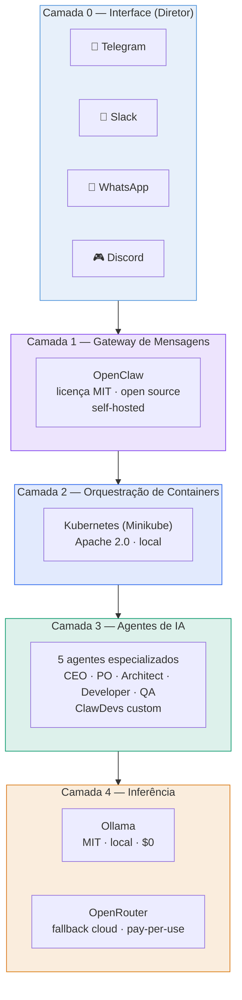

---

## Tabela completa da stack

| Camada | Tecnologia | Versão | Licença | Custo/mês |
|---|---|---|---|---|
| Gateway de mensagens | OpenClaw | latest | MIT | $0 |
| Orquestração | Kubernetes (Minikube) | 1.29+ | Apache 2.0 | $0 |
| Inferência local | Ollama | latest | MIT | $0 |
| Inferência cloud | OpenRouter | API | Proprietário | Pay-per-use |
| Modelos LLM | Qwen2.5-Coder 14B | latest | Apache 2.0 | $0 |
| Modelos LLM | Qwen2.5 14B | latest | Apache 2.0 | $0 |
| Modelos LLM | Llama 3.1 8B | latest | Meta Llama License | $0 |

| **Total núcleo** | | | | **$0/mês** |
| **OpenRouter (teto)** | | | | **≤ $50/mês** |

---

## Custo de operação estimado

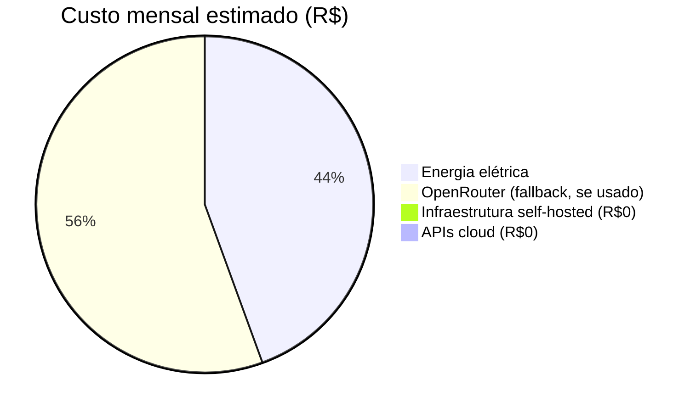

| Item | Custo estimado |
|---|---|
| Núcleo (software) | R$ 0 |
| Energia (máquina ligada 24/7) | R$ 80 – 150 |
| OpenRouter com uso moderado | R$ 0 – 200 |
| **Total realista** | **< R$ 350/mês** |

---

## Comparativo: ClawDevs vs. alternativas

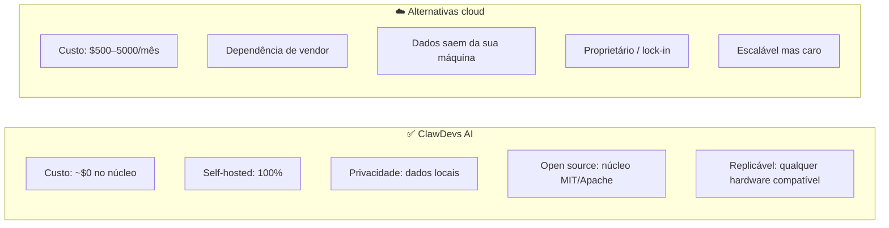

---

## Modelos LLM — tamanho e requisitos

| Modelo | Tamanho | VRAM mínima | Contexto | Caso de uso |
|---|---|---|---|---|
| `qwen2.5-coder:14b` | ~9 GB | 10 GB | 64k | Developer, Architect |
| `qwen2.5:14b` | ~9 GB | 10 GB | 32k | CEO, PO |
| `qwen2.5-coder:7b` | ~4.5 GB | 5 GB | 32k | QA (lite) |
| `llama3.1:8b` | ~4.7 GB | 5 GB | 32k | Fallback geral |
## D1 — Protocolo A2A: padrão aberto (A2A Protocol) vs. custom

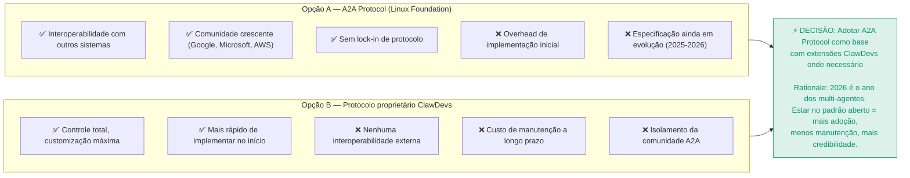

---

## D2 — Orquestração: framework vs. custom

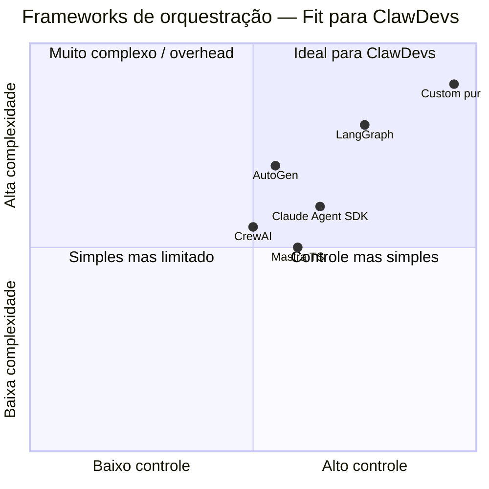

**Decisão:** LangGraph como orquestrador core + extensões customizadas para o modelo de SOUL do ClawDevs.

**Rationale:** LangGraph é stateful, tem checkpoints, suporta grafos complexos de colaboração e é o mais adotado em produção em 2025-2026. Construir do zero gastaria 3x mais tempo sem vantagem real.

---

## D3 — Modelo de memória compartilhada

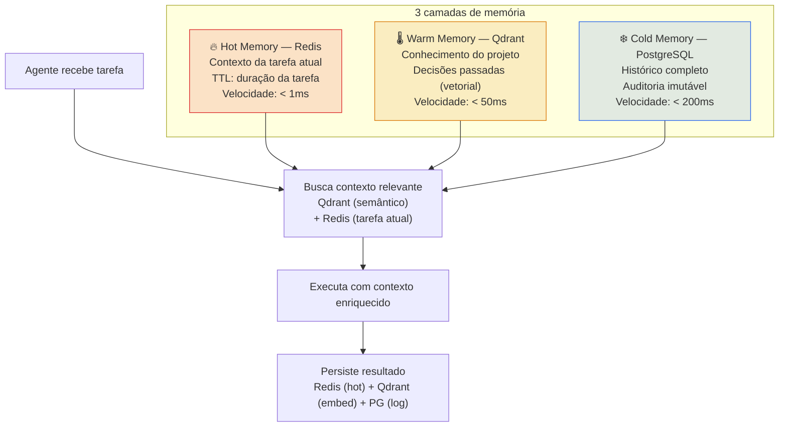

---

## D4 — Inferência: Ollama local puro vs. híbrido

**Decisão: Híbrido com Ollama como primário**

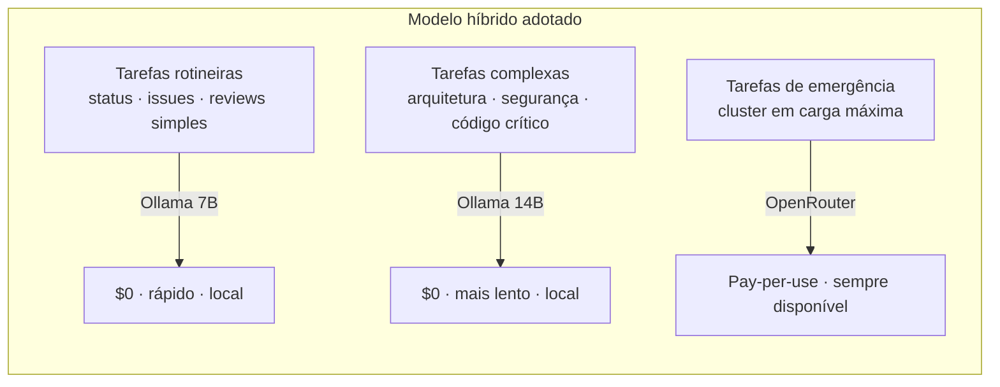

**Rationale:** Local puro limita capacidade. Cloud puro cria dependência e custo. Híbrido com Ollama primário é o único modelo que honra os 3 princípios: segurança, custo zero no core, performance.

---

## D5 — Licença: MIT vs. Dual Licensing

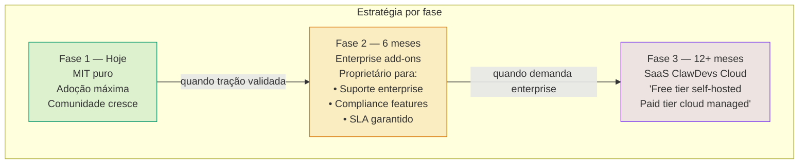

---

## D6 — Público-alvo primário

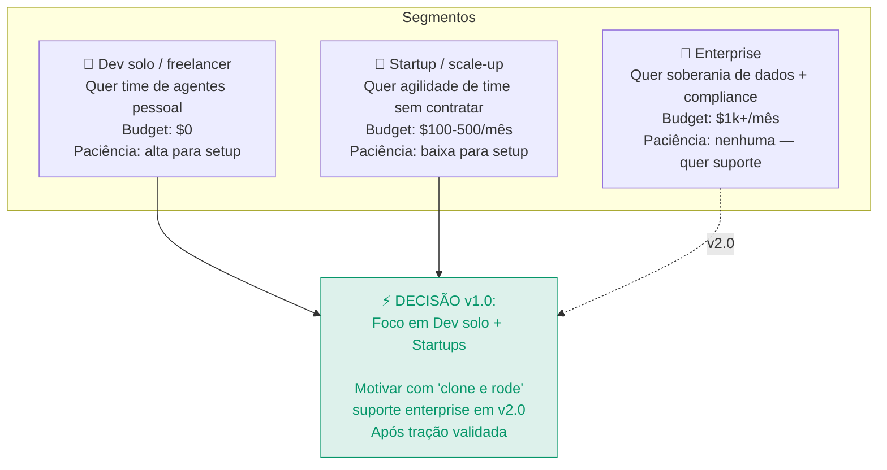

---

## D7 — Modelo de monetização

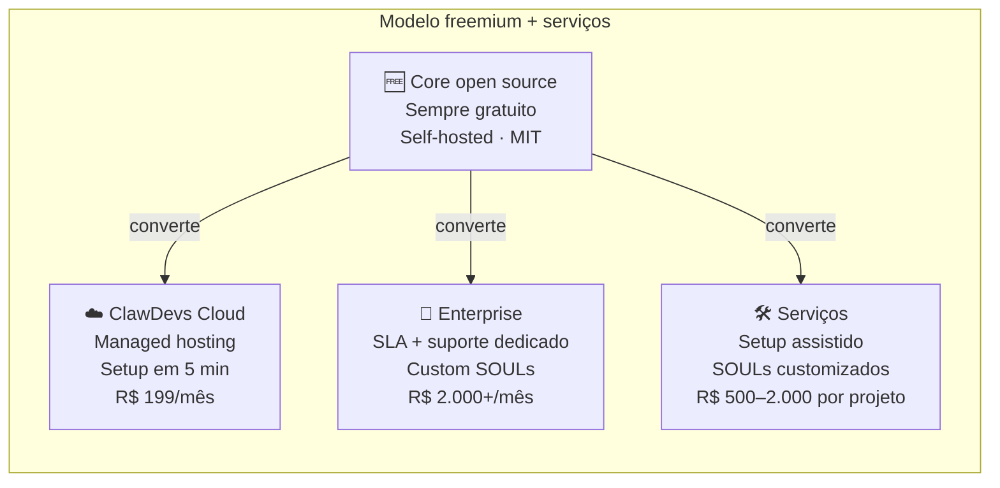

---

## D8 — Build vs. integrar (o que construir vs. usar pronto)

| Componente | Decisão | Justificativa |
|---|---|---|
| Orquestrador | **Integrar LangGraph** | 3x mais rápido; battle-tested |
| Protocolo A2A | **Integrar A2A Protocol** | Padrão de mercado emergente |
| Gateway de mensagens | **Integrar OpenClaw** | É o produto da ClawDevs |
| SOUL engine | **Construir** | Diferencial competitivo core |
| Memória vetorial | **Integrar Qdrant** | Open source melhor da categoria |
| Self-evolution | **Construir** | Não existe pronto — é IP do ClawDevs |
| Dashboard | **Construir** | UX específica para o produto |
| CI/CD | **Integrar Gitea + Forgejo** | Evitar reinventar SCM |

---

## D9 — Velocidade vs. Perfeição

**Decisão: MVP em 30 dias, perfeição em 90 dias**

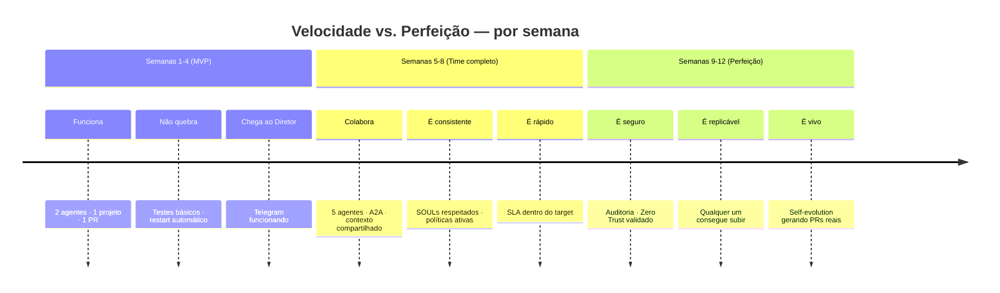

---

## D10 — Open source vs. SaaS: quando bifurcar

**Decisão: Nunca fechar o core. Monetizar a camada gerenciada.**

O modelo de sucesso é HashiCorp (Terraform), Elastic, Grafana: core sempre open source, serviço gerenciado pago. Fechar o core destruiria a comunidade — e a comunidade é o diferencial competitivo do ClawDevs contra sistemas proprietários.
