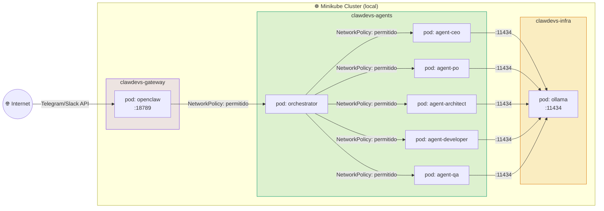
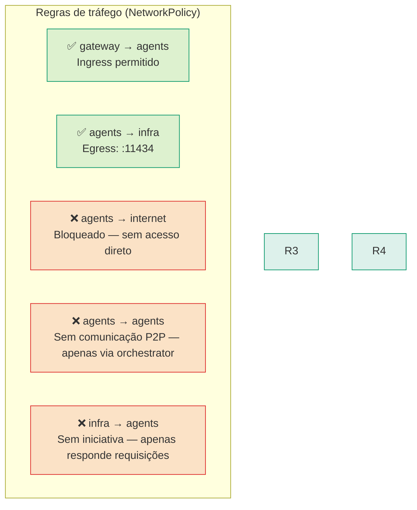
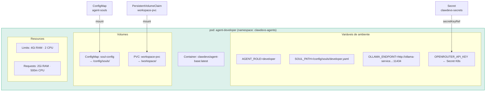
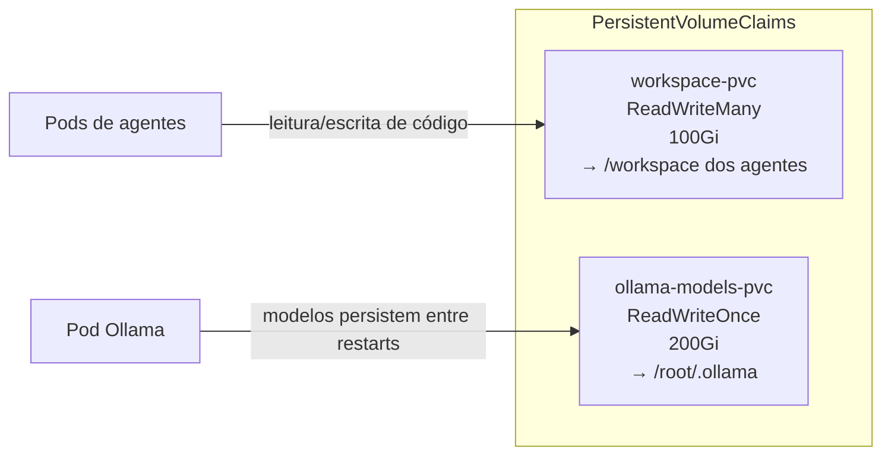
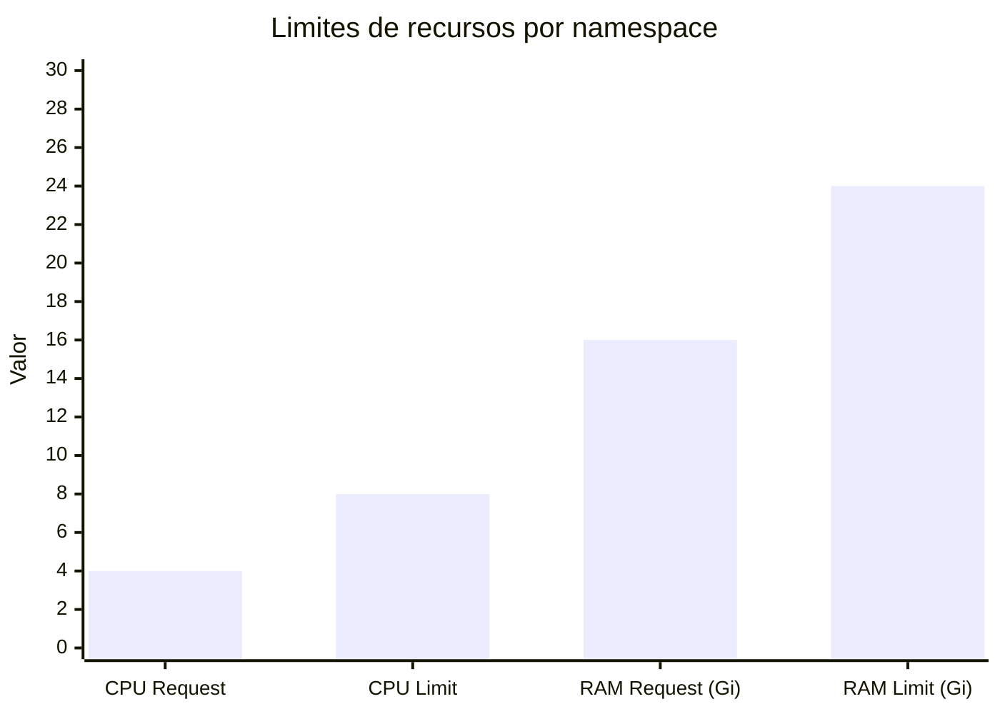
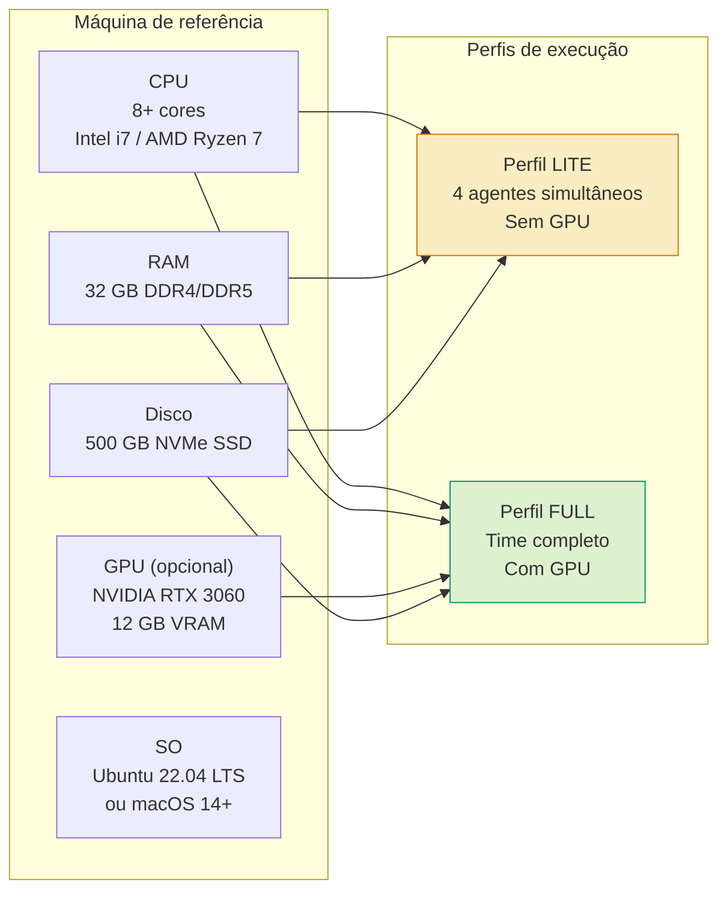

# 10 — Infraestrutura e Kubernetes
> **Objetivo:** Mapear a topologia e as configurações (NetworkPolicies, ResourceQuotas) do cluster Minikube local.
> **Público-alvo:** DevOps, Devs
> **Ação Esperada:** Devs utilizam como referência para deployments e troubleshooting; garante a política de Zero Trust.

**v2.0 | Atualizado em: 06 de março de 2026**

---

## Visão dos Namespaces



---

## NetworkPolicy — Zero Trust entre namespaces



---

## Anatomia de um pod de agente



---

## Volumes e persistência



---

## ResourceQuotas — Proteção do cluster



| Namespace | CPU Request | CPU Limit | RAM Request | RAM Limit | Max Pods |
|---|---|---|---|---|---|
| clawdevs-agents | 4 cores | 8 cores | 16 Gi | 24 Gi | 10 |
| clawdevs-infra | 6 cores | 10 cores | 24 Gi | 32 Gi | 8 |
| clawdevs-gateway | 1 core | 2 cores | 2 Gi | 4 Gi | 3 |

---

## Hardware de referência



---

## Manifests YAML de referência

### Namespace base

```yaml
apiVersion: v1
kind: Namespace
metadata:
  name: clawdevs-agents
  labels:
    name: clawdevs-agents
    env: production
    managed-by: clawdevs
```

### NetworkPolicy — isolamento de agentes

```yaml
apiVersion: networking.k8s.io/v1
kind: NetworkPolicy
metadata:
  name: agent-isolation
  namespace: clawdevs-agents
spec:
  podSelector: {}
  policyTypes:
  - Ingress
  - Egress
  ingress:
  - from:
    - namespaceSelector:
        matchLabels:
          name: clawdevs-gateway
  egress:
  - to:
    - namespaceSelector:
        matchLabels:
          name: clawdevs-infra
    ports:
    - port: 11434   # Ollama
```

### ResourceQuota — agentes

```yaml
apiVersion: v1
kind: ResourceQuota
metadata:
  name: agents-quota
  namespace: clawdevs-agents
spec:
  hard:
    requests.cpu: "4"
    requests.memory: 16Gi
    limits.cpu: "8"
    limits.memory: 24Gi
    pods: "10"
```

### Deployment — agente genérico

```yaml
apiVersion: apps/v1
kind: Deployment
metadata:
  name: agent-developer
  namespace: clawdevs-agents
  labels:
    app: clawdevs
    role: developer
spec:
  replicas: 1
  selector:
    matchLabels:
      role: developer
  template:
    metadata:
      labels:
        role: developer
    spec:
      containers:
      - name: agent-developer
        image: clawdevs/agent-base:latest
        env:
        - name: AGENT_ROLE
          value: "developer"
        - name: SOUL_PATH
          value: "/config/souls/developer.yaml"
        - name: OLLAMA_ENDPOINT
          value: "http://ollama-service.clawdevs-infra:11434"
        - name: OPENROUTER_API_KEY
          valueFrom:
            secretKeyRef:
              name: clawdevs-secrets
              key: openrouter-key
        resources:
          requests:
            memory: "2Gi"
            cpu: "500m"
          limits:
            memory: "4Gi"
            cpu: "2000m"
        volumeMounts:
        - name: soul-config
          mountPath: /config/souls
          readOnly: true
        - name: workspace
          mountPath: /workspace
      volumes:
      - name: soul-config
        configMap:
          name: agent-souls
      - name: workspace
        persistentVolumeClaim:
          claimName: workspace-pvc
```

### Deployment — Ollama

```yaml
apiVersion: apps/v1
kind: Deployment
metadata:
  name: ollama
  namespace: clawdevs-infra
spec:
  replicas: 1
  selector:
    matchLabels:
      app: ollama
  template:
    metadata:
      labels:
        app: ollama
    spec:
      containers:
      - name: ollama
        image: ollama/ollama:latest
        ports:
        - containerPort: 11434
        resources:
          limits:
            nvidia.com/gpu: 1       # remover se sem GPU
            memory: "20Gi"
            cpu: "4000m"
          requests:
            memory: "8Gi"
            cpu: "2000m"
        volumeMounts:
        - name: ollama-models
          mountPath: /root/.ollama
      volumes:
      - name: ollama-models
        persistentVolumeClaim:
          claimName: ollama-models-pvc
---
apiVersion: v1
kind: Service
metadata:
  name: ollama-service
  namespace: clawdevs-infra
spec:
  selector:
    app: ollama
  ports:
  - port: 11434
    targetPort: 11434
  type: ClusterIP
```


