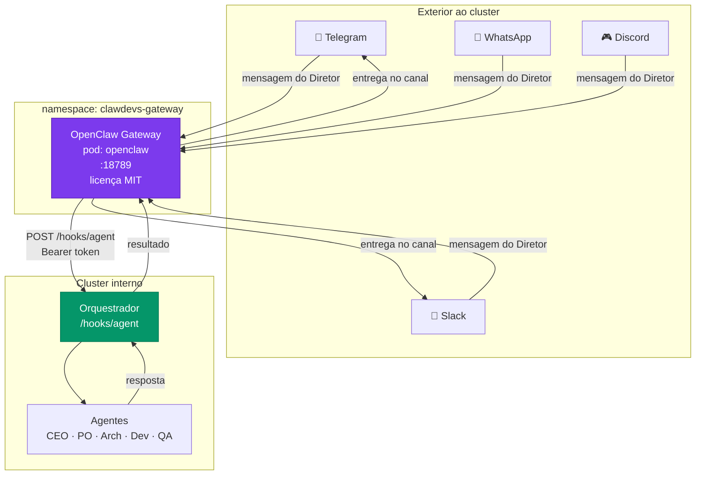
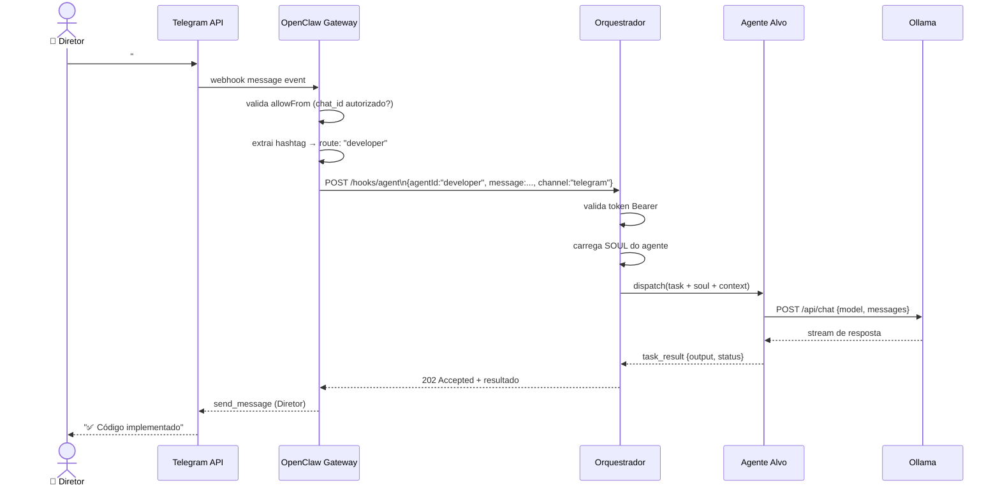
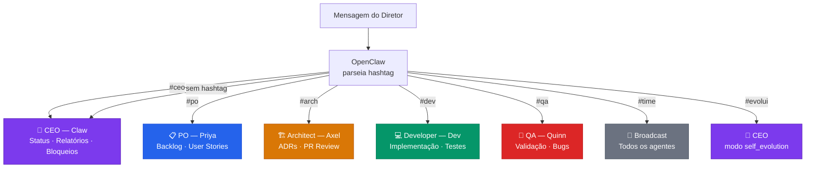
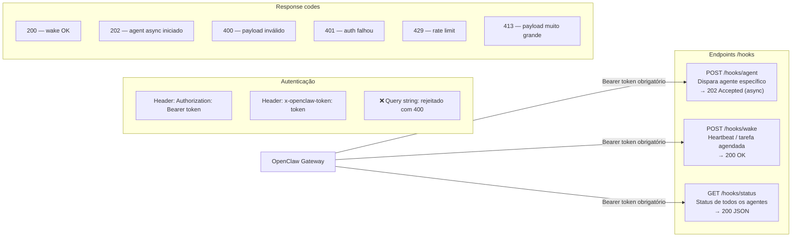
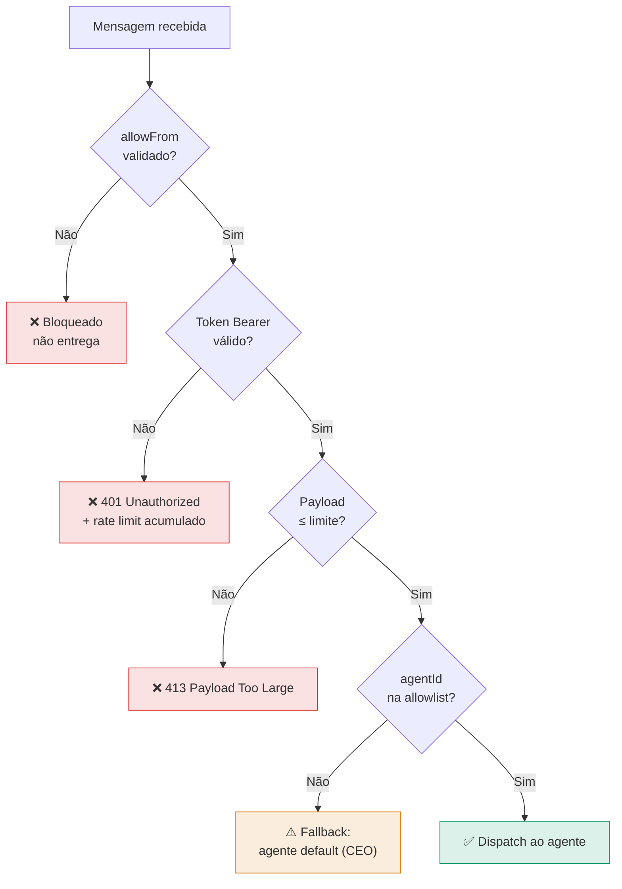
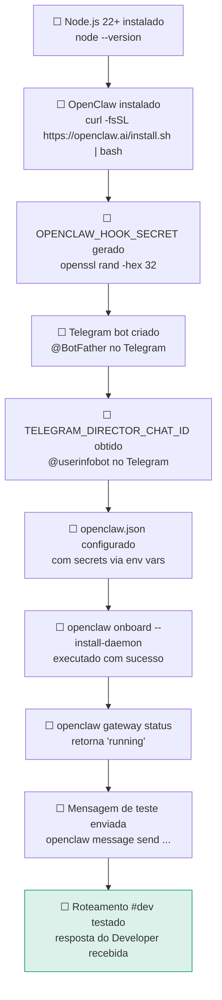

# 11 — Gateway de Comunicação (OpenClaw)
> **Objetivo:** Definir a arquitetura, roteamento e segurança do gateway central OpenClaw.
> **Público-alvo:** Devs, DevOps
> **Ação Esperada:** Devs implementam os endpoints de webhook descritos; DevOps mantêm a infra de comunicação.

**v2.0 | Atualizado em: 06 de março de 2026**

---

## Posição no stack



---

## Fluxo completo de uma mensagem



---

## Roteamento por hashtag



---

## Endpoints de webhook (Orquestrador)



---

## Payloads de referência

### Acionar agente específico

```json
{
  "message": "Implemente a feature X conforme issue #42",
  "agentId": "developer",
  "channel": "telegram",
  "model": "ollama/qwen2.5-coder:14b",
  "thinking": "high",
  "timeoutSeconds": 300,
  "deliver": true
}
```

### Orquestrador decide o agente (via hashtag)

```json
{
  "message": "#arch revise o ADR-003 sobre banco de dados",
  "channel": "telegram",
  "deliver": true
}
```

### Broadcast para o time

```json
{
  "message": "#time mudança de prioridade: feature Y é crítica agora",
  "channel": "telegram",
  "deliver": true
}
```

### Wake (heartbeat diário)

```json
{
  "text": "daily-standup: CEO gera relatório consolidado",
  "mode": "now"
}
```

---

## Segurança do Gateway



---

## Comandos OpenClaw (CLI)

```bash
# Instalar OpenClaw
curl -fsSL https://openclaw.ai/install.sh | bash

# Setup inicial (configura daemon, canais, gateway)
openclaw onboard --install-daemon

# Verificar status
openclaw gateway status

# Conectar canal Telegram
openclaw channels login

# Iniciar gateway em foreground (debug)
openclaw gateway --port 18789

# Abrir dashboard web
openclaw dashboard
# → http://127.0.0.1:18789/

# Enviar mensagem de teste ao Diretor
openclaw message send --target <CHAT_ID> --message "ClawDevs online ✅"
```

---

## Configuração do OpenClaw (openclaw.json)
  // GATEWAY — porta e binding
  // ─────────────────────────────────────────
  "gateway": {
    "port": 18789,
    "host": "0.0.0.0"
    // "0.0.0.0" expõe no cluster — use "127.0.0.1" para local-only
  },

  // ─────────────────────────────────────────
  // HOOKS — webhook do Orquestrador → OpenClaw
  // ─────────────────────────────────────────
  "hooks": {
    "enabled": true,

    // Token compartilhado — NUNCA hardcode, use env var
    "token": "${OPENCLAW_HOOK_SECRET}",

    // Path base dos endpoints
    "path": "/hooks",

    // Agentes que podem ser acionados explicitamente via agentId
    // Use ["*"] para permitir qualquer agente
    "allowedAgentIds": ["ceo", "po", "architect", "developer", "qa"],

    // Session key padrão para requests via webhook
    "defaultSessionKey": "hook:ingress",

    // SEGURANÇA: não permitir que caller defina session key
    "allowRequestSessionKey": false,
    "allowedSessionKeyPrefixes": ["hook:"],

    // SEGURANÇA: não permitir conteúdo externo sem sanitização
    "allowUnsafeExternalContent": false
  },

  // ─────────────────────────────────────────
  // CHANNELS — canais de mensagem autorizados
  // ─────────────────────────────────────────
  "channels": {
    "telegram": {
      "enabled": true,

      // CRÍTICO: apenas o chat_id do Diretor pode enviar comandos
      // Obter com @userinfobot no Telegram
      "allowFrom": ["${TELEGRAM_DIRECTOR_CHAT_ID}"],

      // false: qualquer mensagem é processada
      // true: só processa se mencionar @clawdevs
      "requireMention": false
    },
    "slack": {
      "enabled": false,          // Habilitar quando Slack for configurado
      "allowFrom": [],
      "requireMention": true,
      "mentionPatterns": ["@clawdevs"]
    },
    "whatsapp": {
      "enabled": false           // Reservado para fase 2
    },
    "discord": {
      "enabled": false           // Reservado para fase 2
    }
  },

  // ─────────────────────────────────────────
  // AGENTS — roteamento por hashtag
  // ─────────────────────────────────────────
  "agents": {
    // Agente padrão quando nenhuma hashtag é detectada
    "default": "ceo",

    "routing": {
      // Formato: "hashtag": { "agentId": "id" }
      "#ceo":    { "agentId": "ceo" },
      "#po":     { "agentId": "po" },
      "#arch":   { "agentId": "architect" },
      "#dev":    { "agentId": "developer" },
      "#qa":     { "agentId": "qa" },

      // Broadcast: entrega para todos os agentes
      "#time":   { "broadcast": true },

      // Modo especial: ativa self_evolution no CEO
      "#evolui": { "agentId": "ceo", "mode": "self_evolution" }
    },

    // Endpoint interno do Orquestrador (dentro do cluster)
    "orchestratorEndpoint": "http://orchestrator-service.clawdevs-gateway:8080"
  },

  // ─────────────────────────────────────────
  // INFERENCE — provedores de LLM
  // ─────────────────────────────────────────
  "inference": {
    "providers": {
      "ollama": {
        "enabled": true,

        // Endpoint interno do pod Ollama no cluster
        "baseUrl": "http://ollama-service.clawdevs-infra:11434",

        // Prioridade 1 = primeira tentativa
        "priority": 1,

        // Descoberta automática de modelos disponíveis
        "autoDiscover": true
      },
      "openrouter": {
        "enabled": true,
        "baseUrl": "https://openrouter.ai/api/v1",

        // NUNCA hardcode — use K8s Secret
        "apiKey": "${OPENROUTER_API_KEY}",

        // Prioridade 2 = fallback quando Ollama não é viável
        "priority": 2,

        // Kill switch: desabilita OpenRouter automaticamente ao atingir o teto
        "budgetLimitUSD": 50,

        // Headers de identificação para OpenRouter (boas práticas)
        "headers": {
          "HTTP-Referer": "https://github.com/clawdevs/clawdevs-ai",
          "X-Title": "ClawDevs AI"
        }
      }
    }
  },

  // ─────────────────────────────────────────
  // SECURITY — controles de segurança do gateway
  // ─────────────────────────────────────────
  "security": {
    // Rejeita qualquer sender não listado em allowFrom
    "allowlistOnly": true,

    // Log imutável de todas as interações
    "auditLog": true,

    // Proteção contra contextos excessivamente grandes
    "maxTokensPerRequest": 16384,

    // Rate limiting por sender (mensagens/minuto)
    "rateLimitPerMinute": 20,

    // Bloqueia query string tokens (somente Bearer header)
    "rejectQueryStringTokens": true
  }
}
```

---

## Variáveis de ambiente necessárias

```bash
# ─── Obrigatórias ───────────────────────────────────────────────
OPENCLAW_HOOK_SECRET=<gerar com: openssl rand -hex 32>
TELEGRAM_DIRECTOR_CHAT_ID=<obter com @userinfobot no Telegram>

# ─── OpenRouter (opcional — fallback cloud) ──────────────────────
OPENROUTER_API_KEY=sk-or-<sua-chave>

# ─── Diretórios do OpenClaw ──────────────────────────────────────
OPENCLAW_HOME=/data/openclaw
OPENCLAW_STATE_DIR=/data/openclaw/state
OPENCLAW_CONFIG_PATH=/data/openclaw/openclaw.json
```

### Como criar o Secret K8s

```bash
kubectl create secret generic clawdevs-openclaw-secrets \
  --namespace clawdevs-gateway \
  --from-literal=hook-secret=$(openssl rand -hex 32) \
  --from-literal=telegram-chat-id=<SEU_CHAT_ID> \
  --from-literal=openrouter-api-key=sk-or-...
```

---

## ConfigMap — openclaw.json no cluster

```yaml
apiVersion: v1
kind: ConfigMap
metadata:
  name: openclaw-config
  namespace: clawdevs-gateway
data:
  openclaw.json: |
    {
      "version": "1.0",
      "gateway": { "port": 18789, "host": "0.0.0.0" },
      "hooks": {
        "enabled": true,
        "token": "$(OPENCLAW_HOOK_SECRET)",
        "path": "/hooks",
        "allowedAgentIds": ["ceo", "po", "architect", "developer", "qa"],
        "defaultSessionKey": "hook:ingress",
        "allowRequestSessionKey": false,
        "allowedSessionKeyPrefixes": ["hook:"],
        "allowUnsafeExternalContent": false
      }
    }
```

---

## Deployment OpenClaw no cluster

```yaml
apiVersion: apps/v1
kind: Deployment
metadata:
  name: openclaw
  namespace: clawdevs-gateway
spec:
  replicas: 1
  selector:
    matchLabels:
      app: openclaw
  template:
    metadata:
      labels:
        app: openclaw
    spec:
      containers:
      - name: openclaw
        image: openclaw/gateway:latest
        ports:
        - containerPort: 18789
        env:
        - name: OPENCLAW_CONFIG_PATH
          value: "/config/openclaw.json"
        - name: OPENCLAW_HOOK_SECRET
          valueFrom:
            secretKeyRef:
              name: clawdevs-openclaw-secrets
              key: hook-secret
        - name: TELEGRAM_DIRECTOR_CHAT_ID
          valueFrom:
            secretKeyRef:
              name: clawdevs-openclaw-secrets
              key: telegram-chat-id
        - name: OPENROUTER_API_KEY
          valueFrom:
            secretKeyRef:
              name: clawdevs-openclaw-secrets
              key: openrouter-api-key
        volumeMounts:
        - name: openclaw-config
          mountPath: /config
        - name: openclaw-data
          mountPath: /data/openclaw
        resources:
          requests:
            memory: "512Mi"
            cpu: "250m"
          limits:
            memory: "1Gi"
            cpu: "1000m"
      volumes:
      - name: openclaw-config
        configMap:
          name: openclaw-config
      - name: openclaw-data
        persistentVolumeClaim:
          claimName: openclaw-pvc
---
apiVersion: v1
kind: Service
metadata:
  name: openclaw-service
  namespace: clawdevs-gateway
spec:
  selector:
    app: openclaw
  ports:
  - port: 18789
    targetPort: 18789
  type: ClusterIP
```

---

## Checklist de setup do OpenClaw



---

## Referências

- [OpenClaw Documentation](https://docs.openclaw.ai)
- [OpenRouter API](https://openrouter.ai)
- [Kubernetes Secrets](https://kubernetes.io/docs/concepts/configuration/secret/)
```
