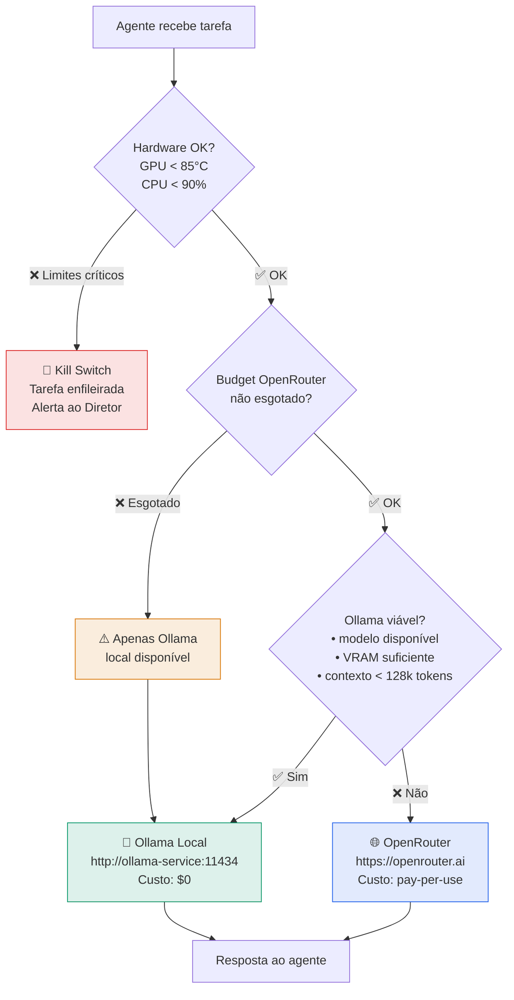
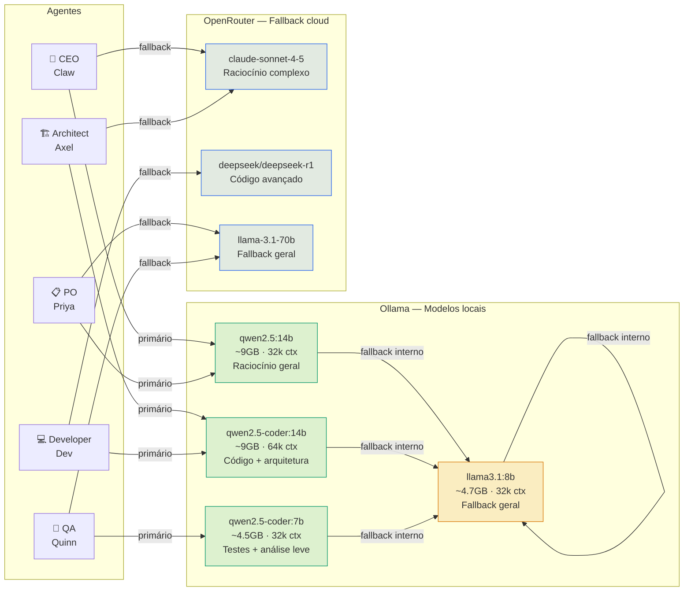
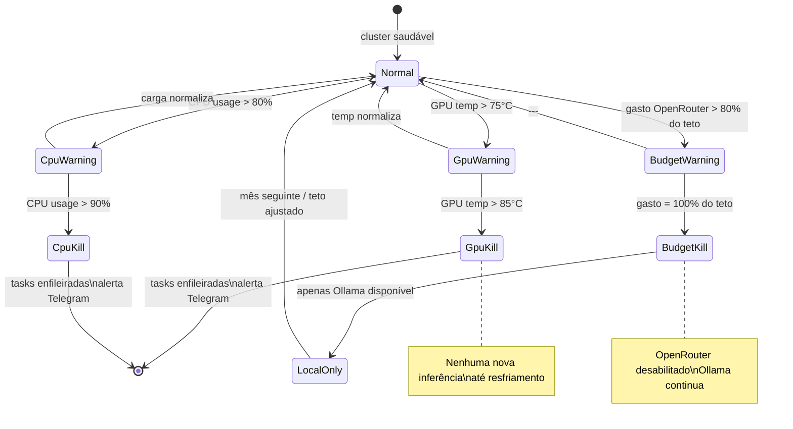
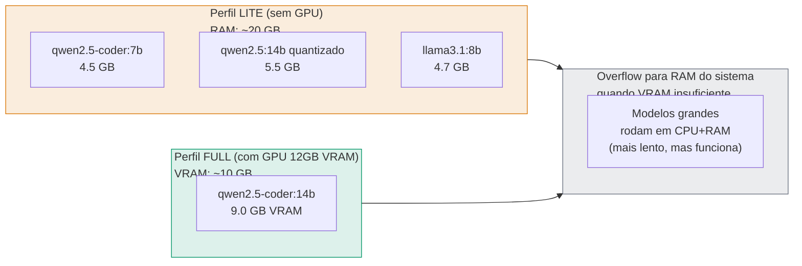

# 12 — Inferência LLM (Ollama + OpenRouter)
> **Objetivo:** Estabelecer a estratégia híbrida de inferência (Local First, Cloud Fallback).
> **Público-alvo:** Devs, Arquitetos
> **Ação Esperada:** Arquitetos calibram os thresholds de custo/fallback; Devs integram as APIs seguindo os perfis de cada agente.

**v2.0 | Atualizado em: 06 de março de 2026**

---

## Estratégia de roteamento de inferência



---

## Modelos por agente



---

## Tabela de modelos e parâmetros por agente

| Agente | Modelo Ollama | Fallback OpenRouter | Temp | Tokens | Thinking |
|---|---|---|---|---|---|
| CEO | `qwen2.5:14b` | `anthropic/claude-sonnet-4-5` | 0.3 | 4k | medium |
| PO | `qwen2.5:14b` | `meta-llama/llama-3.1-70b` | 0.4 | 4k | medium |
| Architect | `qwen2.5-coder:14b` | `anthropic/claude-sonnet-4-5` | 0.2 | 8k | high |
| Developer | `qwen2.5-coder:14b` | `deepseek/deepseek-r1` | 0.1 | 16k | high |
| QA | `qwen2.5-coder:7b` | `meta-llama/llama-3.1-70b` | 0.2 | 8k | medium |

---

## Kill switches — Proteção de hardware



---

## Setup dos modelos Ollama

```bash
# Conectar ao pod Ollama
kubectl exec -it deploy/ollama -n clawdevs-infra -- bash

# Pull dos modelos necessários (~27GB total)
ollama pull qwen2.5-coder:14b      # ~9.0 GB — Developer + Architect (primário)
ollama pull qwen2.5:14b            # ~8.9 GB — CEO + PO (primário)
ollama pull qwen2.5-coder:7b       # ~4.5 GB — QA (primário)
ollama pull llama3.1:8b            # ~4.7 GB — fallback geral

# Verificar modelos instalados
ollama list

# Teste rápido de inferência
ollama run qwen2.5-coder:14b "Escreva um hello world em Python"

# Endpoints internos ao cluster
# Chat:     POST http://ollama-service.clawdevs-infra:11434/api/chat
# Generate: POST http://ollama-service.clawdevs-infra:11434/api/generate
# Models:   GET  http://ollama-service.clawdevs-infra:11434/api/tags
```

---

## Configuração OpenRouter (Secret K8s)

```yaml
apiVersion: v1
kind: Secret
metadata:
  name: clawdevs-secrets
  namespace: clawdevs-agents
type: Opaque
stringData:
  openrouter-key: "sk-or-..."
  openrouter-base-url: "https://openrouter.ai/api/v1"
  openrouter-budget-limit-usd: "50"   # Kill switch: $50/mês máximo
```

### Modelos OpenRouter por caso de uso

| Caso de uso | Modelo | Custo estimado |
|---|---|---|
| Raciocínio complexo (Architect) | `anthropic/claude-sonnet-4-5` | ~$3/M tokens |
| Código de alta complexidade | `deepseek/deepseek-r1` | ~$0.55/M tokens |
| Análise de segurança crítica | `openai/gpt-4o` | ~$2.50/M tokens |
| Tarefas gerais (fallback barato) | `meta-llama/llama-3.1-70b-instruct` | ~$0.12/M tokens |

---

## Consumo estimado de VRAM por perfil




