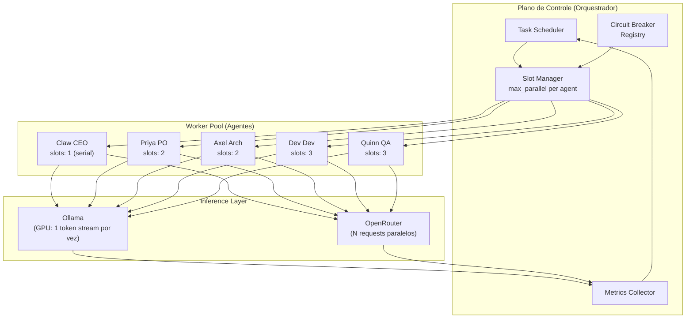
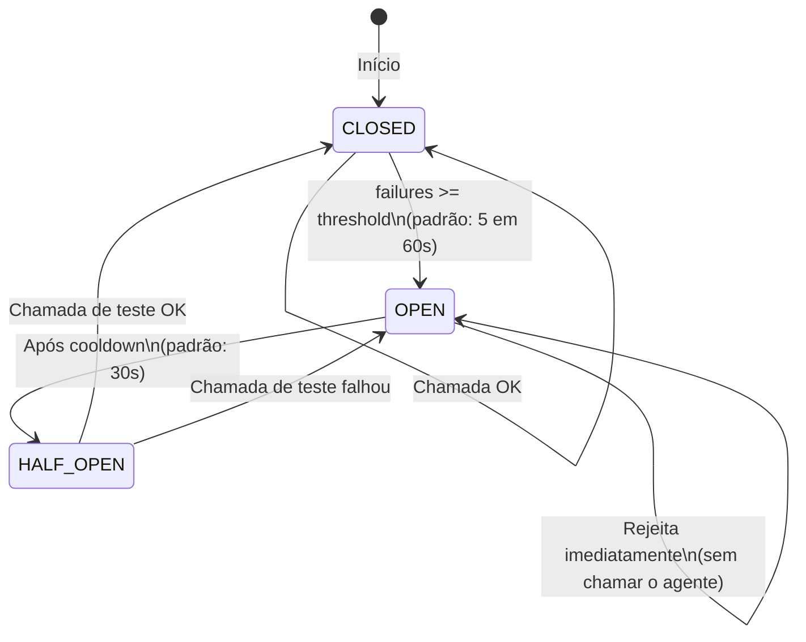
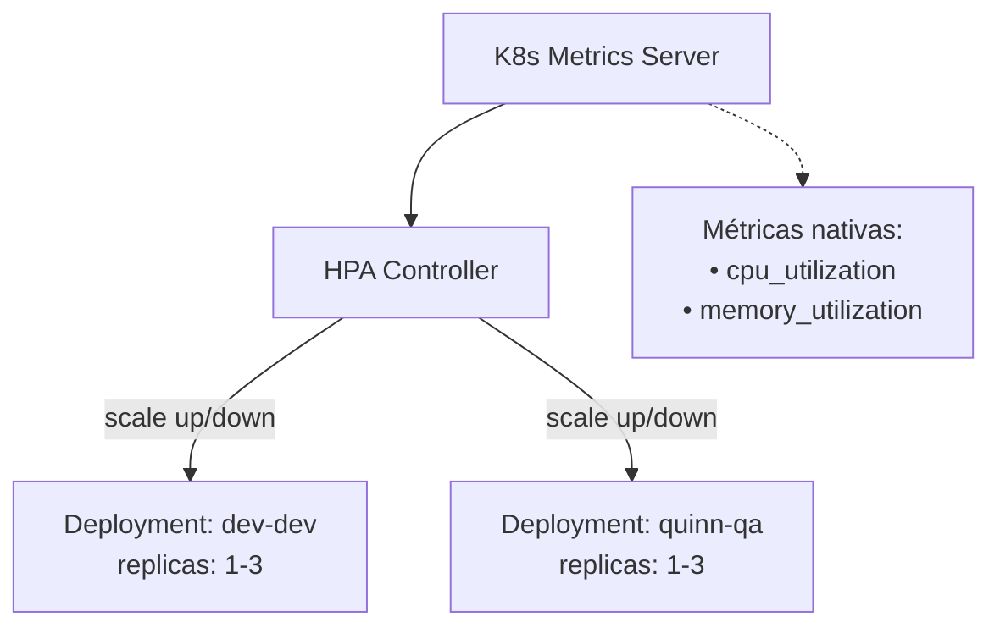
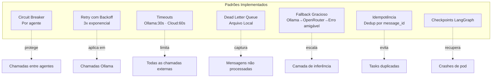

# 14 — Performance e Escalabilidade do Cluster
> **Objetivo:** Definir as regras de concorrência técnica, HPA (Horizontal Pod Autoscaler) e circuit breakers.
> **Público-alvo:** Devs, DevOps
> **Ação Esperada:** DevOps configuram automações de escala; Devs escrevem código seguro considerando concorrência restrita.

**v2.0 | Atualizado em: 06 de março de 2026**

---

## Modelo Mental: Agente como Worker Pool



### Por que o CEO é serial?
Claw toma decisões estratégicas que dependem de estado global — paralelismo causaria decisões conflitantes. CEO é o único **single-threaded by design**.

---

## Paralelismo Controlado com LangGraph

### Grafo de Tarefas com Branches Paralelos

```python
# orchestrator/graph.py
from langgraph.graph import StateGraph, END
from langgraph.checkpoint.memory import MemorySaver
import asyncio

class ClawDevState(TypedDict):
    task_id: str
    description: str
    priority: Literal["LOW", "NORMAL", "HIGH", "CRITICAL"]
    context_id: str
    # Resultados por fase
    spec_result: Optional[dict]
    arch_result: Optional[dict]
    impl_result: Optional[dict]
    qa_result: Optional[dict]
    # Controle
    errors: list[str]
    phase: str


def build_feature_graph() -> StateGraph:
    graph = StateGraph(ClawDevState)

    # Nós
    graph.add_node("ceo_approve",   ceo_approve_task)
    graph.add_node("po_spec",       po_write_spec)
    graph.add_node("arch_design",   arch_design_task)   # pode rodar em paralelo com po_spec após ceo_approve
    graph.add_node("dev_implement", dev_implement)
    graph.add_node("qa_review",     qa_review)
    graph.add_node("ceo_merge",     ceo_approve_merge)
    graph.add_node("notify_done",   notify_director)
    graph.add_node("handle_error",  handle_error_escalation)

    # Edges sequenciais
    graph.set_entry_point("ceo_approve")
    graph.add_edge("ceo_approve", "po_spec")

    # Branch paralelo: após spec, Arch começa em paralelo com revisão do CEO
    graph.add_conditional_edges("po_spec", route_after_spec, {
        "parallel_arch": ["arch_design"],   # LangGraph suporta fan-out
        "error": "handle_error",
    })

    graph.add_edge("arch_design",   "dev_implement")
    graph.add_edge("dev_implement", "qa_review")

    graph.add_conditional_edges("qa_review", route_after_qa, {
        "approved":   "ceo_merge",
        "needs_fix":  "dev_implement",   # Loop de correção
        "critical":   "handle_error",
    })

    graph.add_edge("ceo_merge",  "notify_done")
    graph.add_edge("notify_done", END)
    graph.add_edge("handle_error", END)

    return graph


# Checkpoint local para controle de estado
memory_saver = MemorySaver()
graph = build_feature_graph().compile(checkpointer=memory_saver)
```

### Slot Manager — Controle de Concorrência

```python
# orchestrator/slot_manager.py
import asyncio
from typing import Dict

AGENT_SLOTS = {
    "claw-ceo":  1,   # serial — decisões estratégicas
    "priya-po":  2,   # pode processar 2 features em paralelo
    "axel-arch": 2,
    "dev-dev":   3,   # implementação é paralelizável
    "quinn-qa":  3,   # reviews em paralelo
}

class SlotManager:
    def __init__(self):
        self.semaphores: Dict[str, asyncio.Semaphore] = {
            agent: asyncio.Semaphore(slots)
            for agent, slots in AGENT_SLOTS.items()
        }

    async def acquire_slot(self, agent_id: str, timeout: int = 300) -> bool:
        """Tenta adquirir um slot para o agente."""
        sem = self.semaphores.get(agent_id)
        if not sem:
            return False
            
        try:
            return await asyncio.wait_for(sem.acquire(), timeout=timeout)
        except asyncio.TimeoutError:
            return False

    def release_slot(self, agent_id: str):
        sem = self.semaphores.get(agent_id)
        if sem:
            sem.release()
```

---

## Circuit Breaker — Resiliência entre Agentes



```python
# orchestrator/circuit_breaker.py
from enum import Enum
import time

class CBState(Enum):
    CLOSED = "closed"
    OPEN = "open"
    HALF_OPEN = "half_open"

class CircuitBreaker:
    def __init__(
        self, agent_id: str,
        threshold: int = 5,        # falhas antes de abrir
        window_seconds: int = 60,  # janela de contagem
        cooldown_seconds: int = 30 # tempo com CB aberto antes de tentar
    ):
        self.agent_id = agent_id
        self.threshold = threshold
        self.window = window_seconds
        self.cooldown = cooldown_seconds
        self.state = CBState.CLOSED
        self.failures = 0
        self.opened_at = 0
        self.last_failure_time = 0

    async def record_success(self):
        if self.state == CBState.HALF_OPEN:
            self.state = CBState.CLOSED
            self.failures = 0
            await notify_director(f"✅ Circuit breaker {self.agent_id} fechado")

    async def record_failure(self):
        now = time.time()
        if now - self.last_failure_time > self.window:
            self.failures = 0
            
        self.failures += 1
        self.last_failure_time = now

        if self.failures >= self.threshold and self.state == CBState.CLOSED:
            self.state = CBState.OPEN
            self.opened_at = now
            await notify_director(
                f"⚠️ Circuit breaker ABERTO: {self.agent_id} "
                f"({self.failures} falhas em {self.window}s)"
            )

    async def call(self, func, *args, fallback=None, **kwargs):
        if self.state == CBState.OPEN:
            if time.time() - self.opened_at > self.cooldown:
                self.state = CBState.HALF_OPEN
            else:
               if fallback:
                   return await fallback(*args, **kwargs)
               raise Exception(f"Circuit breaker OPEN for {self.agent_id}")
               
        try:
            result = await func(*args, **kwargs)
            await self.record_success()
            return result
        except Exception as e:
            await self.record_failure()
            raise
```

---

## Otimizações de Performance LLM

### 1. Prompt Compression (reduz tokens ~40%)

```python
# utils/prompt_compressor.py
async def compress_context(messages: list[dict], max_tokens: int = 4000) -> list[dict]:
    """
    Estratégia de compressão de contexto longo:
    1. Mantém system prompt completo
    2. Mantém últimas N mensagens intactas
    3. Resume mensagens antigas com LLM leve
    """
    KEEP_RECENT = 10  # sempre mantém as últimas 10 mensagens

    if count_tokens(messages) <= max_tokens:
        return messages  # não precisa comprimir

    system = [m for m in messages if m["role"] == "system"]
    history = [m for m in messages if m["role"] != "system"]

    recent = history[-KEEP_RECENT:]
    old = history[:-KEEP_RECENT]

    if not old:
        return messages

    # Resume o histórico antigo com modelo leve
    summary_prompt = [
        {"role": "system", "content": "Resume o histórico abaixo em ≤200 tokens, mantendo decisões e fatos críticos."},
        {"role": "user", "content": "\n".join(f"{m['role']}: {m['content']}" for m in old)}
    ]
    summary = await call_inference("quinn-qa", summary_prompt, temperature=0.1)

    return system + [
        {"role": "assistant", "content": f"[Histórico resumido]: {summary}"}
    ] + recent
```

### 2. Response Streaming com Progress

```python
async def stream_agent_response(agent_id: str, messages: list, chat_id: str):
    """Envia chunks da resposta em tempo real para não parecer travado."""
    full_response = []
    last_sent_at = 0
    MIN_INTERVAL = 3  # envia update a cada 3 segundos no mínimo

    async with httpx.AsyncClient() as client:
        async with client.stream(
            "POST",
            "http://ollama-svc:11434/api/chat",
            json={"model": AGENT_MODELS[agent_id]["ollama"],
                  "messages": messages, "stream": True}
        ) as r:
            async for chunk in r.aiter_lines():
                if not chunk:
                    continue
                data = json.loads(chunk)
                token = data.get("message", {}).get("content", "")
                full_response.append(token)

                # Envia progresso periódico (evita timeout no Telegram)
                now = time.time()
                if now - last_sent_at > MIN_INTERVAL:
                    partial = "".join(full_response)
                    await send_typing_indicator(chat_id)
                    last_sent_at = now

    return "".join(full_response)
```

### 3. Caching de Respostas Idempotentes

```python
# Para tasks idempotentes (review do mesmo diff, etc.)
_response_cache = {}

async def cached_inference(agent_id: str, messages: list, ttl: int = 3600) -> str:
    cache_key = f"cache:{agent_id}:{hashlib.sha256(json.dumps(messages).encode()).hexdigest()[:16]}"

    if cache_key in _response_cache:
        # Simplificação local de cache em memória
        return _response_cache[cache_key]

    result = await call_inference(agent_id, messages)
    _response_cache[cache_key] = result
    return result
```

---

## Auto-Scaling de Agentes (Kubernetes HPA + Custom Metrics)



```yaml
# k8s/hpa/dev-agent-hpa.yaml
apiVersion: autoscaling/v2
kind: HorizontalPodAutoscaler
metadata:
  name: dev-agent-hpa
  namespace: clawdevs-agents
spec:
  scaleTargetRef:
    apiVersion: apps/v1
    kind: Deployment
    name: dev-dev
  minReplicas: 1
  maxReplicas: 3    # nunca mais que 3 — GPU compartilhada
  metrics:
    - type: Resource
      resource:
        name: cpu
        target:
          type: Utilization
          averageUtilization: 80
  behavior:
    scaleUp:
      stabilizationWindowSeconds: 60   # aguarda 1min antes de escalar para cima
      policies:
        - type: Pods
          value: 1
          periodSeconds: 120
    scaleDown:
      stabilizationWindowSeconds: 300  # aguarda 5min antes de reduzir
```

> ⚠️ **CEO e Architect nunca escalam** — serial by design e stateful. HPA apenas para Dev e QA.

---

## Priority Queue — Priorização Automática

```python
# orchestrator/priority_queue.py
import heapq
from dataclasses import dataclass, field

PRIORITY_SCORES = {
    "CRITICAL": 0,    # menor = maior prioridade no heap
    "HIGH": 1,
    "NORMAL": 2,
    "LOW": 3,
}

# Regras de priorização automática
def auto_classify_priority(task: dict) -> str:
    text = task.get("description", "").lower()

    # Segurança = sempre CRITICAL
    if any(k in text for k in ["sql injection", "xss", "cve", "vulnerabilidade", "breach", "falha de segurança"]):
        return "CRITICAL"

    # Bugs em produção = HIGH
    if any(k in text for k in ["prod", "produção", "down", "offline", "erro crítico", "data loss"]):
        return "HIGH"

    # Features normais
    if any(k in text for k in ["feature", "melhoria", "refactor"]):
        return "NORMAL"

    return "NORMAL"


@dataclass(order=True)
class PrioritizedTask:
    score: int
    created_at: float
    task: dict = field(compare=False)


class AgentPriorityQueue:
    def __init__(self):
        self._heap: list[PrioritizedTask] = []
        self._counter = 0  # desempate por ordem de chegada

    def push(self, task: dict, priority: str | None = None):
        p = priority or auto_classify_priority(task)
        score = PRIORITY_SCORES.get(p, 2)
        heapq.heappush(self._heap, PrioritizedTask(
            score=score,
            created_at=time.time() + self._counter * 0.0001,
            task={**task, "priority": p}
        ))
        self._counter += 1

    def pop(self) -> dict | None:
        if self._heap:
            return heapq.heappop(self._heap).task
        return None

    def peek_priority(self) -> str | None:
        if self._heap:
            score = self._heap[0].score
            return {v: k for k, v in PRIORITY_SCORES.items()}.get(score)
        return None
```

---

## Benchmarks e Limites Práticos

### Hardware de Referência (FULL Profile)

| Componente | Spec | Throughput |
|-----------|------|-----------|
| CPU | 8 cores / 16 threads | 8 tasks CPU simultâneas |
| RAM | 32 GB | 3 agentes + Ollama ~20 GB |
| GPU | RTX 3060 12 GB | ~35 tokens/s (qwen2.5:14b Q4) |
| SSD | NVMe 500 MB/s | Qdrant + PostgreSQL sem bottleneck |

### Latência por Tipo de Task

| Task | Modelo | Latência típica | p99 |
|------|--------|-----------------|-----|
| Resposta simples (<500 tokens) | qwen2.5:7b | 8-12s | 18s |
| Análise de código (1k tokens) | qwen2.5-coder:14b | 18-25s | 40s |
| Review de PR (2k tokens out) | qwen2.5-coder:14b | 35-50s | 90s |
| Planejamento estratégico | qwen2.5:14b | 25-40s | 70s |
| OpenRouter fallback | claude-sonnet | 3-8s | 15s |

### Capacidade Máxima Estimada (FULL Profile)

```
Com GPU + Ollama serial (1 stream por vez):
  - ~60-80 tokens/s
  - Uma task de 1000 tokens = ~12s
  - Capacidade: ~300 tasks/hora (simples)
  - Pico realista: ~150 tasks/hora (tasks mistas)

Com OpenRouter (fallback, paralelo):
  - Sem limite de throughput (custo variável)
  - Kill switch bloqueia após $50/mês
  - ~$0.003-0.008 por task média
```

---

## Padrões de Resiliência — Resumo




