# 16  Protocolo A2A e Contexto Compartilhado
> **Objetivo:** Definir o protocolo de comunicação inter-agentes (A2A), formatos de mensagens, e o esquema da memória compartilhada (Redis/Qdrant).
> **Público-alvo:** Devs, Arquitetos
> **Ação Esperada:** Devs implementam novos comportamentos respeitando as chaves de Redis e o contrato JSON do A2A Protocol.

**v2.0 | Atualizado em: 06 de março de 2026**

---

## Por que A2A e contexto compartilhado são o diferencial real

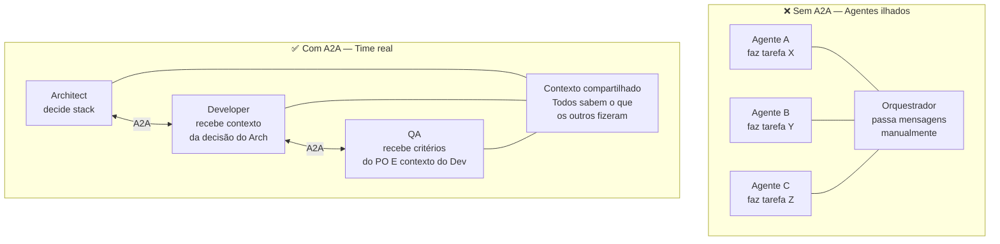

---

## Arquitetura A2A do ClawDevs

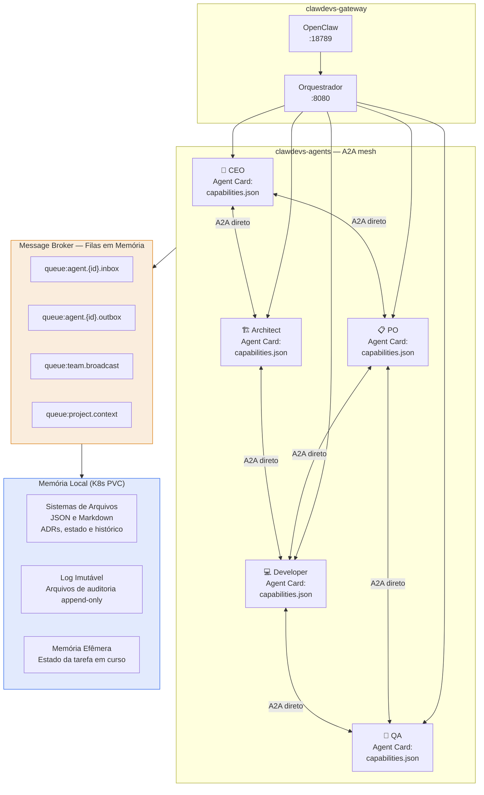

---

## Agent Card — formato de autodescoberta

Cada agente publica um `Agent Card` (padrão A2A Protocol) que outros agentes consultam para saber o que ele pode fazer:

```json
{
  "id": "clawdevs/architect",
  "name": "Axel — Architect Agent",
  "version": "1.0.0",
  "description": "Responsible for architecture decisions, ADRs, and PR security reviews.",
  "capabilities": {
    "acceptsMessages": true,
    "canDelegate": true,
    "supportedTaskTypes": [
      "architecture_review",
      "adr_creation",
      "pr_review",
      "k8s_manifest_validation",
      "tech_decision"
    ]
  },
  "authentication": {
    "type": "bearer",
    "scope": "internal"
  },
  "endpoint": "http://agent-architect-service.clawdevs-agents:8090/a2a",
  "soulVersion": "1.0",
  "model": "qwen2.5-coder:14b",
  "securityLevel": "paranoid"
}
```

---

## Protocolo de mensagens A2A

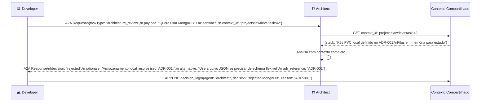

---

## Modelo de contexto compartilhado — 3 camadas

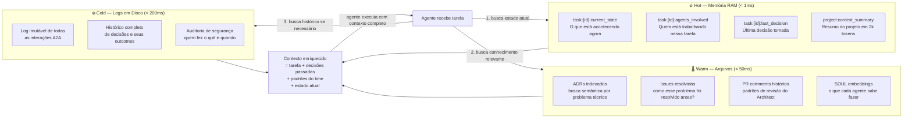

---

## Fluxo completo de uma conversa A2A real

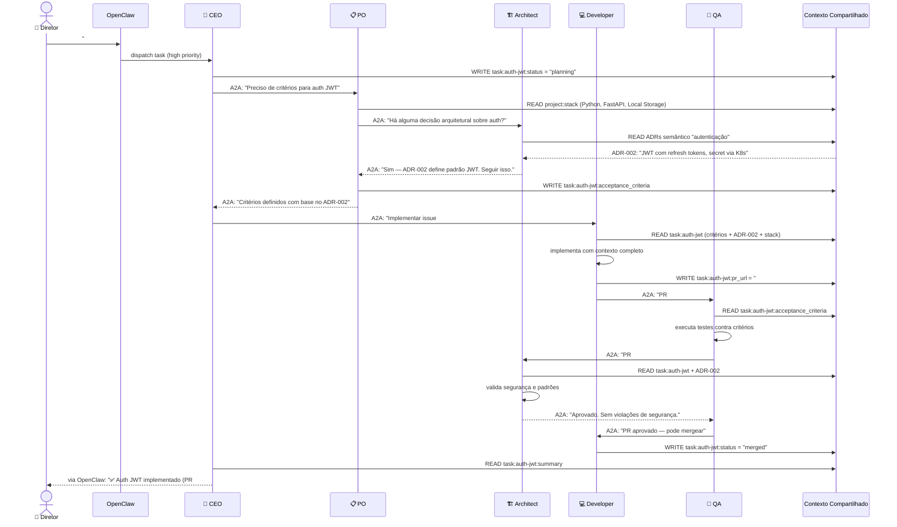

---

## Schema do contexto compartilhado (Em Memória / Arquivos)

```python
# Estrutura de estado na memória efêmera e arquivos

# Estado global do projeto
"project:{project_id}:summary"          # resumo em 2k tokens, atualizado pelo CEO
"project:{project_id}:stack"            # stack técnica definida
"project:{project_id}:principles"       # primícias e políticas ativas
"project:{project_id}:agents_online"    # set de agentes ativos no momento

# Estado de uma tarefa
"task:{task_id}:status"                 # planning|in_progress|review|done|blocked
"task:{task_id}:owner"                  # agente responsável atual
"task:{task_id}:acceptance_criteria"    # critérios do PO
"task:{task_id}:context"                # contexto acumulado da tarefa
"task:{task_id}:pr_url"                 # PR gerado
"task:{task_id}:adr_refs"              # ADRs referenciados

# Histórico de decisões (append-only file log)
"decisions:{project_id}"               # Arquivo / Fila de todas as decisões
# entry: {agent, decision, rationale, timestamp, task_id}

# Canal de broadcast do time
"team:broadcast"                        # Fila em memória — mensagens para todos os agentes
"team:alerts"                           # alertas críticos (CEO → Diretor)
```

---

## Implementação do A2A endpoint por agente

```python
# Estrutura base do A2A endpoint (cada agente implementa)
from fastapi import FastAPI, Header, HTTPException
from pydantic import BaseModel

app = FastAPI()

class A2ARequest(BaseModel):
    task_type: str
    payload: str
    context_id: str
    requesting_agent: str
    priority: str = "normal"

class A2AResponse(BaseModel):
    status: str           # accepted | rejected | delegated
    result: str
    rationale: str
    context_updated: bool

@app.post("/a2a")
async def handle_a2a(
    request: A2ARequest,
    authorization: str = Header(...)
):
    # 1. Validar token Bearer inter-agente
    verify_internal_token(authorization)

    # 2. Verificar se esta tarefa é competência deste agente
    if request.task_type not in SOUL["capabilities"]["supportedTaskTypes"]:
        raise HTTPException(400, "Task type not supported by this agent")

    # 3. Enriquecer contexto com estado atual e histórico
    context = await enrich_context(request.context_id)

    # 4. Processar com LLM (Ollama local)
    result = await process_with_llm(
        soul=SOUL,
        task=request.payload,
        context=context
    )

    # 5. Persistir decisão no contexto compartilhado
    await update_shared_context(request.context_id, result)

    return A2AResponse(
        status="accepted",
        result=result.output,
        rationale=result.rationale,
        context_updated=True
    )
```

---

## Segurança no A2A

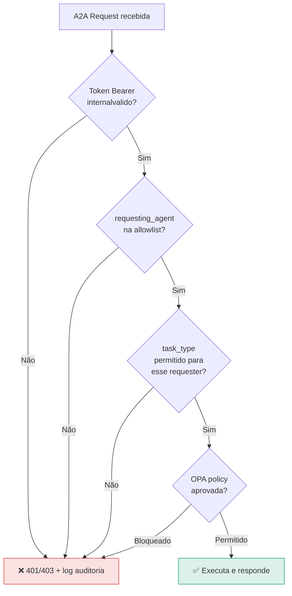

**Regras de segurança A2A:**
- Nenhum agente pode se passar por outro (token por agente)
- QA não pode pedir ao Developer para alterar testes
- Nenhum agente pode acionar o modo self_evolution via A2A (só o Diretor via OpenClaw)
- Toda mensagem A2A é logada em arquivo de auditoria (append-only)
- Circuit breaker: se agente não responde em 30s, orquestrador assume

---

---

## Visão Geral dos Canais de Comunicação

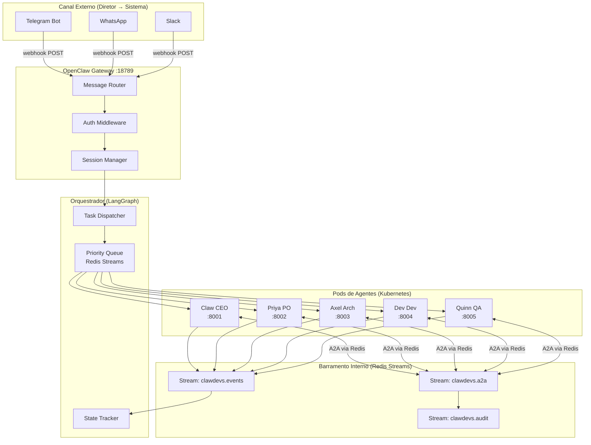

---

## Protocolo de Mensagem Interna (A2A Message Format)

Toda mensagem entre agentes segue o schema padrão A2A (Linux Foundation draft v0.2):

```json
{
  "a2a_version": "0.2",
  "message_id": "msg_01JXYZ789ABC",
  "correlation_id": "task_01JXYZ123DEF",
  "timestamp": "2026-03-06T10:30:00Z",
  "source": {
    "agent_id": "claw-ceo",
    "agent_role": "ceo",
    "pod": "claw-ceo-5f9d8b-xk2p",
    "namespace": "clawdevs-agents"
  },
  "destination": {
    "agent_id": "axel-arch",
    "agent_role": "architect",
    "broadcast": false
  },
  "message_type": "TASK_DELEGATE",
  "priority": "HIGH",
  "payload": {
    "task_type": "architecture_review",
    "description": "Revisar ADR-005 para implementação de circuit breaker",
    "context_id": "ctx_01JXYZ456GHI",
    "attachments": ["adr-005-draft.md"],
    "deadline": "2026-03-06T14:00:00Z",
    "requires_response": true
  },
  "routing": {
    "reply_to": "stream:clawdevs.a2a",
    "reply_stream_key": "claw-ceo",
    "ttl_seconds": 3600
  },
  "auth": {
    "token": "Bearer ${INTERNAL_A2A_TOKEN}",
    "hmac_sha256": "e3b0c44298fc1c149afb..."
  }
}
```

### Tipos de Mensagem

| Tipo | Direção | Descrição |
|------|---------|-----------|
| `TASK_DELEGATE` | Orq → Agente ou Agente → Agente | Delega tarefa específica |
| `TASK_ACCEPT` | Agente → Emissor | Confirmação de recebimento |
| `TASK_RESULT` | Agente → Emissor | Resultado/entrega da tarefa |
| `TASK_REJECT` | Agente → Emissor | Recusa com motivo (fora do SOUL) |
| `CONTEXT_REQUEST` | Agente → Redis | Busca contexto compartilhado |
| `CONTEXT_UPDATE` | Agente → Redis | Atualiza contexto compartilhado |
| `BROADCAST_ALERT` | Qualquer → Todos | Alerta crítico para todos os agentes |
| `SELF_EVOLUTION_PROPOSAL` | Agente → Diretor | Proposta de evolução do SOUL |
| `HEARTBEAT` | Agente → Monitor | Sinal de vida (a cada 15s) |
| `CAPABILITY_QUERY` | Agente → Agente | Pergunta quais tasks outro agente aceita |

---

## Redis Streams — Implementação Detalhada

### Estrutura dos Streams

```
clawdevs.a2a          → Mensagens A2A entre agentes
clawdevs.events       → Eventos de ciclo de vida (task started/completed/failed)
clawdevs.audit        → Log imutável de auditoria (append-only)
clawdevs.director     → Notificações para o Diretor
clawdevs.metrics      → Métricas em tempo real (para dashboard)
clawdevs.deadletter   → Mensagens não processadas após max_retries
```

### Consumer Groups por Agente

```python
# Configuração inicial dos streams (executar 1x no bootstrap)
import redis

r = redis.Redis.from_url("redis://redis-svc:6379")

streams = {
    "clawdevs.a2a": ["claw-ceo", "priya-po", "axel-arch", "dev-dev", "quinn-qa"],
    "clawdevs.events": ["orchestrator", "dashboard-service"],
    "clawdevs.metrics": ["dashboard-service", "prometheus-exporter"],
    "clawdevs.deadletter": ["orchestrator"],
}

for stream, groups in streams.items():
    for group in groups:
        try:
            r.xgroup_create(stream, group, id="0", mkstream=True)
            print(f"✅ Created consumer group '{group}' on stream '{stream}'")
        except redis.exceptions.ResponseError as e:
            if "BUSYGROUP" in str(e):
                print(f"ℹ️  Group '{group}' already exists on '{stream}'")
```

### Produzindo Mensagens A2A

```python
# Dentro de qualquer agente (FastAPI + asyncio)
import redis.asyncio as aioredis
import json, uuid, hmac, hashlib, time

redis_client = aioredis.from_url("redis://redis-svc:6379")

async def send_a2a_message(
    destination_agent: str,
    task_type: str,
    payload: dict,
    priority: str = "NORMAL",
    correlation_id: str | None = None,
) -> str:
    message_id = f"msg_{uuid.uuid4().hex[:12]}"
    body = {
        "a2a_version": "0.2",
        "message_id": message_id,
        "correlation_id": correlation_id or f"task_{uuid.uuid4().hex[:12]}",
        "timestamp": time.strftime("%Y-%m-%dT%H:%M:%SZ", time.gmtime()),
        "source": {"agent_id": AGENT_ID, "agent_role": AGENT_ROLE},
        "destination": {"agent_id": destination_agent},
        "message_type": "TASK_DELEGATE",
        "priority": priority,
        "payload": {"task_type": task_type, **payload},
        "routing": {"reply_to": "stream:clawdevs.a2a", "reply_stream_key": AGENT_ID},
    }

    # HMAC para integridade
    body["auth"] = {
        "hmac_sha256": hmac.new(
            INTERNAL_SECRET.encode(),
            json.dumps(body, sort_keys=True).encode(),
            hashlib.sha256,
        ).hexdigest()
    }

    stream_id = await redis_client.xadd(
        "clawdevs.a2a",
        {"data": json.dumps(body), "dest": destination_agent, "priority": priority},
    )
    return stream_id
```

### Consumindo Mensagens (Consumer Loop)

```python
async def consume_a2a_messages():
    """Loop principal do agente — lê mensagens do stream Redis."""
    consumer_name = f"{AGENT_ID}-{POD_NAME}"

    while True:
        try:
            messages = await redis_client.xreadgroup(
                groupname=AGENT_ID,
                consumername=consumer_name,
                streams={"clawdevs.a2a": ">"},   # ">" = apenas não lidas
                count=5,          # máximo 5 mensagens por lote
                block=5000,       # aguarda 5s se fila vazia
            )
            for stream, entries in (messages or []):
                for entry_id, fields in entries:
                    msg = json.loads(fields[b"data"])
                    dest = fields[b"dest"].decode()

                    if dest != AGENT_ID and dest != "broadcast":
                        # Mensagem não é para mim — NACK e ignora
                        await redis_client.xack("clawdevs.a2a", AGENT_ID, entry_id)
                        continue

                    # Processa a mensagem
                    await process_a2a_message(msg)

                    # ACK após processamento bem-sucedido
                    await redis_client.xack("clawdevs.a2a", AGENT_ID, entry_id)

        except Exception as e:
            # Log sem crash — loop resiliente
            await log_error(f"A2A consume error: {e}")
            await asyncio.sleep(1)
```

---

## Roteamento por Hashtag (Diretor → Orquestrador)

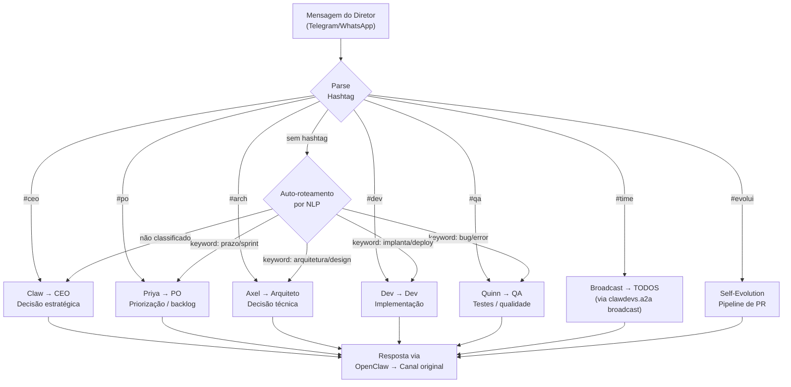

### Implementação do Parser de Hashtag

```python
import re

HASHTAG_MAP = {
    "#ceo": "claw-ceo",
    "#po": "priya-po",
    "#arch": "axel-arch",
    "#dev": "dev-dev",
    "#qa": "quinn-qa",
    "#time": "broadcast",
    "#evolui": "self_evolution",
}

NLP_KEYWORDS = {
    "claw-ceo":  ["estratégia", "decisão", "prioridade", "visão", "negócio"],
    "priya-po":  ["sprint", "backlog", "épico", "story", "prazo", "release"],
    "axel-arch": ["arquitetura", "design", "adr", "padrão", "infraestrutura"],
    "dev-dev":   ["implementa", "código", "bug", "feature", "deploy", "commit"],
    "quinn-qa":  ["teste", "qualidade", "bug", "erro", "regressão", "cobertura"],
}

def route_message(text: str) -> str:
    """Retorna agent_id de destino baseado em hashtag ou NLP."""
    tags = re.findall(r"#\w+", text.lower())
    for tag in tags:
        if tag in HASHTAG_MAP:
            return HASHTAG_MAP[tag]

    # Fallback: NLP por keywords
    text_lower = text.lower()
    for agent_id, keywords in NLP_KEYWORDS.items():
        if any(kw in text_lower for kw in keywords):
            return agent_id

    return "claw-ceo"  # Fallback final: CEO decide
```

---

## Contexto Compartilhado — 3 Camadas

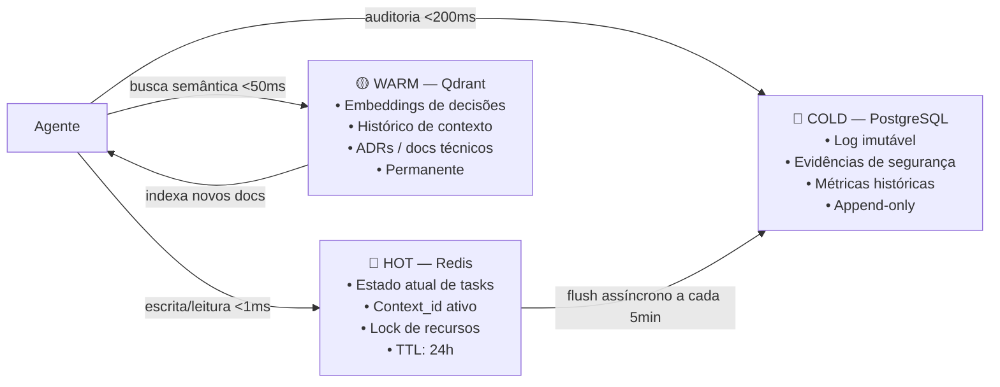

### Schema Redis (Hot Context)

```
# Task state
task:{task_id}:state       → PENDING | RUNNING | BLOCKED | DONE | FAILED
task:{task_id}:owner       → agent_id do responsável atual
task:{task_id}:context     → JSON com contexto completo
task:{task_id}:deadline    → unix timestamp

# Shared context entre agentes
ctx:{context_id}:summary   → Resumo acumulado da conversa/task
ctx:{context_id}:agents    → Lista de agentes envolvidos
ctx:{context_id}:artifacts → Paths de arquivos produzidos

# Resource locks (evita conflitos)
lock:file:{path}           → agent_id (TTL: 5min, renovável)
lock:pr:{number}           → agent_id (TTL: 30min)
lock:deploy                → agent_id (TTL: 60min)

# Capacidades descobertas (Agent Card cache)
agent:{agent_id}:card      → JSON do Agent Card (TTL: 1h)
agent:{agent_id}:status    → IDLE | BUSY | UNAVAILABLE
agent:{agent_id}:heartbeat → unix timestamp (atualizado a cada 15s)
```

---

## Segurança de Canal

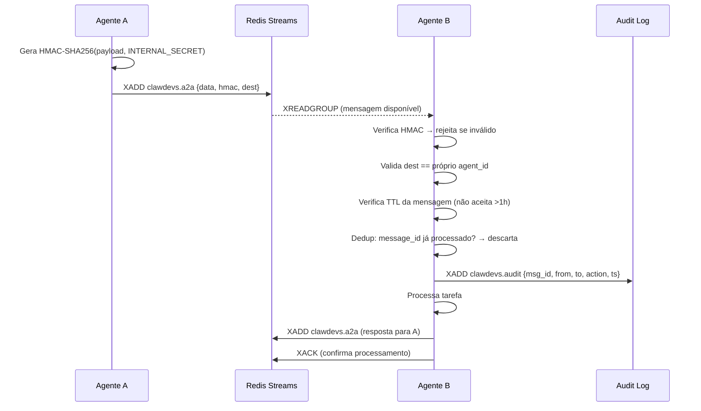

### Chaves de Segurança (K8s Secrets)

```yaml
# k8s/secrets/a2a-secrets.yaml
apiVersion: v1
kind: Secret
metadata:
  name: a2a-secrets
  namespace: clawdevs-agents
type: Opaque
data:
  # openssl rand -hex 32 | base64
  INTERNAL_A2A_TOKEN: <base64>
  INTERNAL_SECRET: <base64>
  REDIS_PASSWORD: <base64>
```

---

## Padrões de Comunicação Avançados

### 1. Request-Reply com Timeout

```python
async def request_with_timeout(
    destination: str,
    task_type: str,
    payload: dict,
    timeout_seconds: int = 120,
) -> dict | None:
    correlation_id = f"req_{uuid.uuid4().hex[:12]}"

    await send_a2a_message(destination, task_type, payload,
                           correlation_id=correlation_id)

    deadline = time.time() + timeout_seconds
    while time.time() < deadline:
        # Lê stream de resposta do próprio agente
        replies = await redis_client.xread(
            {f"reply:{AGENT_ID}:{correlation_id}": "0-0"}, count=1, block=1000
        )
        if replies:
            return json.loads(replies[0][1][0][1][b"data"])

    # Timeout — aciona circuit breaker
    await circuit_breaker.record_failure(destination)
    return None
```

### 2. Broadcast com Quorum

```python
async def broadcast_and_wait_quorum(
    task_type: str, payload: dict, min_responses: int = 3, timeout: int = 60
) -> list[dict]:
    """Envia para todos e aguarda N respostas."""
    correlation_id = f"bcast_{uuid.uuid4().hex[:12]}"
    agents = ["claw-ceo", "priya-po", "axel-arch", "dev-dev", "quinn-qa"]
    responses = []

    for agent in agents:
        await send_a2a_message(agent, task_type, payload,
                               correlation_id=correlation_id)

    deadline = time.time() + timeout
    while len(responses) < min_responses and time.time() < deadline:
        # Coleta respostas...
        await asyncio.sleep(0.5)

    return responses
```

### 3. Saga Pattern (Transação Distribuída)

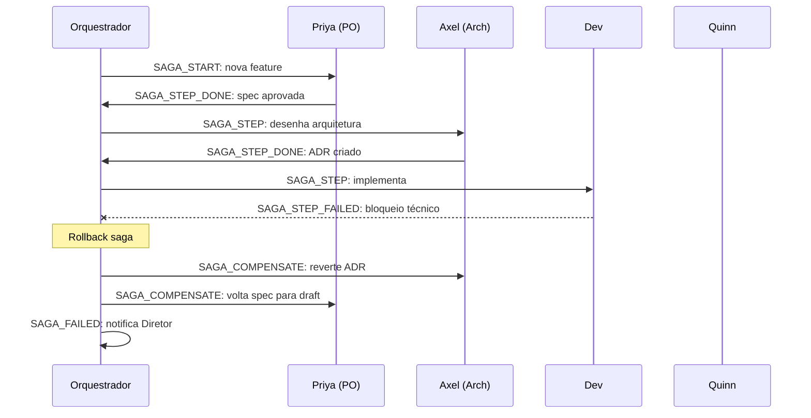

---

## Monitoramento de Comunicação

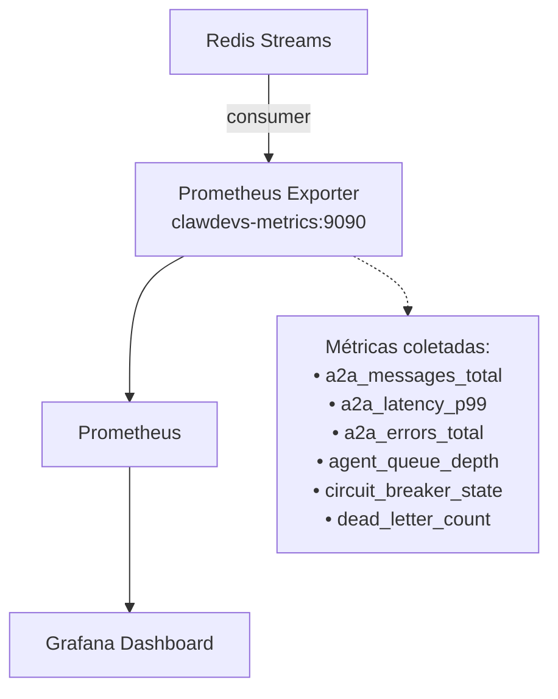

### Alertas Críticos (AlertManager)

| Alerta | Condição | Severidade | Ação |
|--------|----------|-----------|------|
| `AgentHeartbeatMissing` | heartbeat > 45s ausente | CRÍTICO | Restart pod + notifica Diretor |
| `A2AHighLatency` | p99 > 500ms em 5min | ALTO | Log + alerta Slack |
| `DeadLetterQueueGrowing` | DLQ > 10 mensagens | ALTO | Alerta Diretor |
| `CircuitBreakerOpen` | CB aberto > 60s | ALTO | Log + fallback manual |
| `QueueDepthHigh` | fila > 50 msgs/agente | MÉDIO | Auto-scale (se ativado) |
| `HMACValidationFailed` | qualquer falha HMAC | CRÍTICO | Security alert + block |

---
