# 17 — Simulação de Cenários e Resposta do Time
> **Objetivo:** Fornecer provas de conceito e cenários táticos (ex: Novo Produto vs. Sustentação) do comportamento orquestrado do time de agentes.
> **Público-alvo:** Scrum Master, PO
> **Ação Esperada:** Scrum Master usa essas simulações para guiar a condução das reuniões e melhorar o prompt do Diretor.

**v2.0 | Atualizado em: 06 de março de 2026**

---

## Os dois times

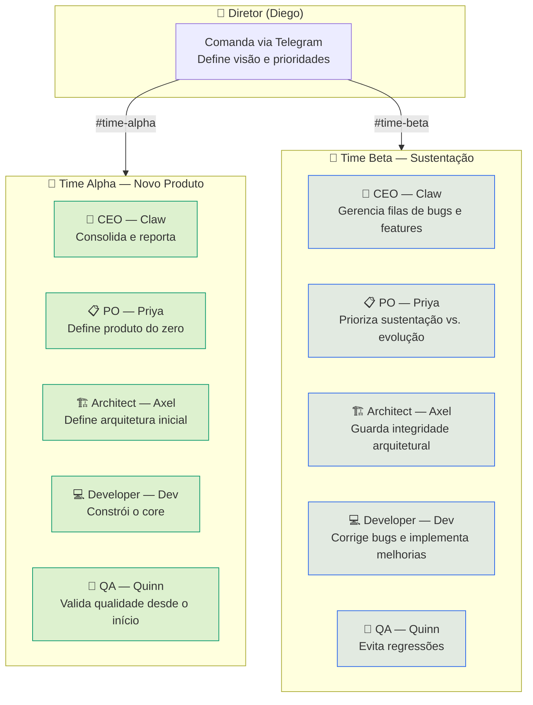

---

# CENÁRIO 1 — Time Alpha: Novo Produto do Zero

**Projeto:** API de gerenciamento de tarefas com autenticação JWT, WebSocket para notificações em tempo real e deploy containerizado.

---

## Semana 1 — Kickoff e Definição

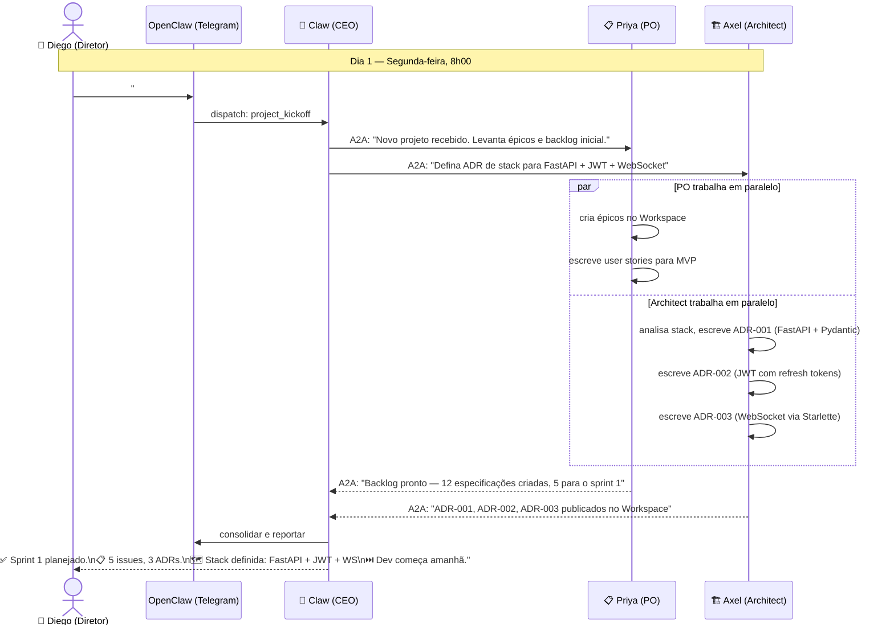

---

## Semana 1 — Implementação e Primeiros PRs

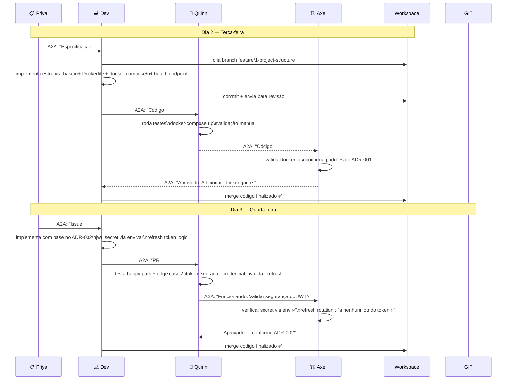

---

## Semana 2 — WebSocket, Testes e First Deploy

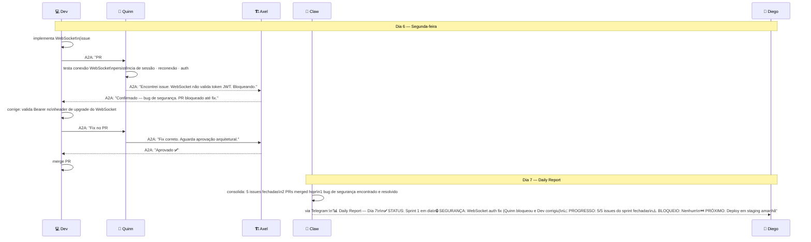

---

## Fim da Semana 2 — Release v0.1

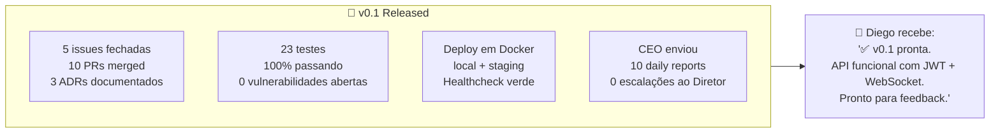

---

# CENÁRIO 2 — Time Beta: Sustentação e Evolução

**Contexto:** O produto (API de tasks) está em produção há 2 meses. Tem usuários reais. Chegaram 3 bugs críticos, 1 pedido de nova feature e 1 issue de performance.

---

## Fila de trabalho inicial

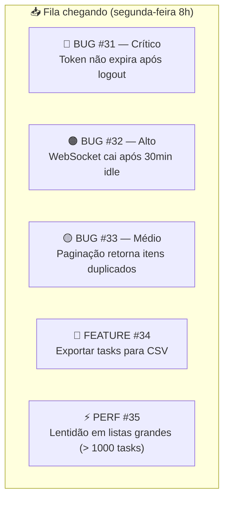

---

## PO prioriza a fila

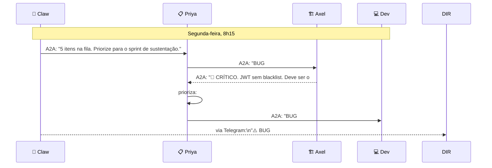

---

## Resolução do BUG #31 — emergência de segurança

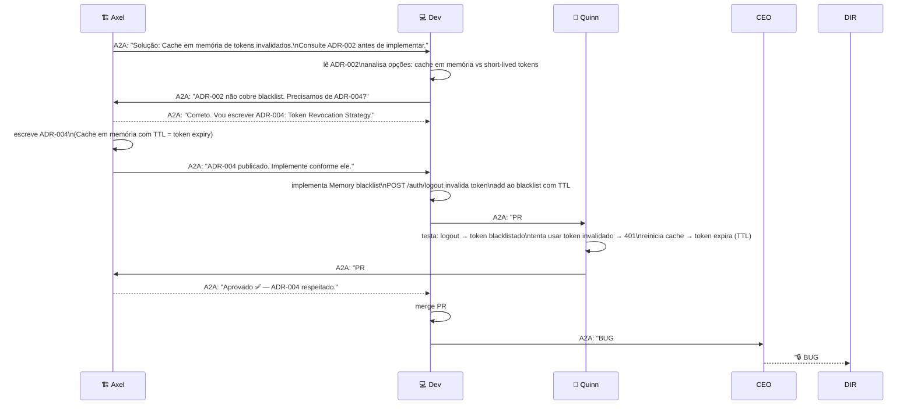

---

## Semana de sustentação — visão completa

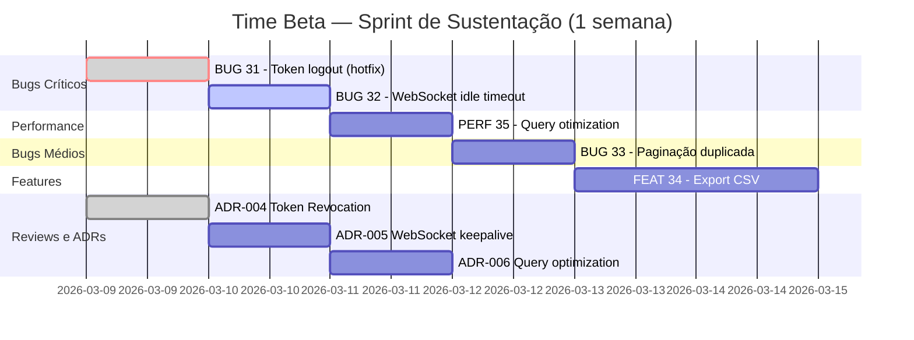

---

## Quinta-feira — BUG #33 e descoberta de dívida técnica

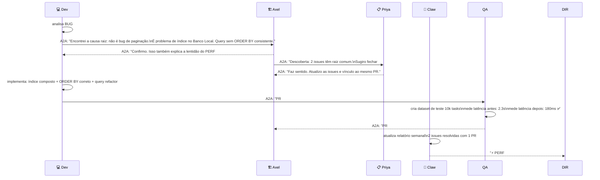

---

## Sexta-feira — FEAT #34 e self_evolution proposta

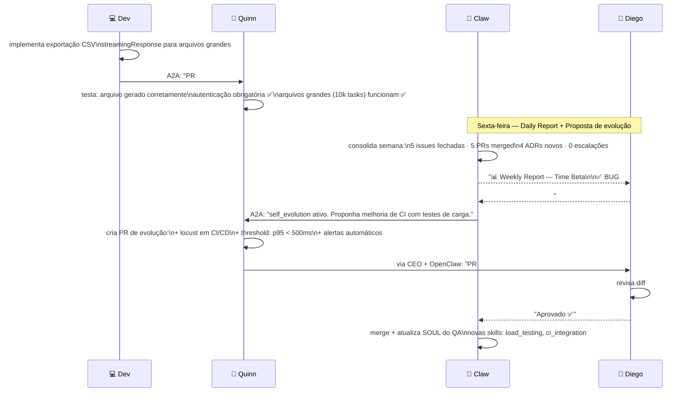

---

## Comparativo: Time Alpha vs. Time Beta

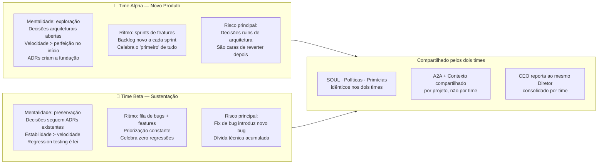

---

## Daily report CEO — formato padrão

```
📊 Daily Report — [Time Alpha/Beta] — [Data]

✅ STATUS: [Em dia / Atrasado / Bloqueado]

📈 PROGRESSO:
• Issues fechadas hoje: N
• PRs merged: N
• ADRs criados: N

🔒 SEGURANÇA: [nenhum incidente / incidente X resolvido]

⚠️ BLOQUEIOS: [nenhum / descreve bloqueio e quem está resolvendo]

💡 DESCOBERTAS: [insights técnicos ou de produto relevantes]

⏭️ PRÓXIMOS PASSOS:
• Amanhã: [Dev implementa issue #X]
• Esta semana: [QA valida milestone Y]
• Atenção: [item que pode precisar de decisão do Diretor]
```

---

## Estados emocionais dos agentes (simulação realista)

O time de agentes não é neutro — cada SOUL tem uma "voz" característica:

| Situação | Claw (CEO) | Priya (PO) | Axel (Architect) | Dev (Developer) | Quinn (QA) |
|---|---|---|---|---|---|
| Projeto novo | Energizado, foca no "por que" | Pergunta tudo até entender o usuário | Analisa trade-offs antes de decidir | Quer saber a issue e começar | Quer saber como vai testar |
| Bug crítico | Alerta imediato ao Diretor | Reavalia prioridades do sprint | Analisa raiz + ADR antes de permitir fix | Investiga sem hackear | Monta casos de teste primeiro |
| PR bloqueado | Notifica bloqueio no daily | Verifica se critérios estavam claros | Explica o porquê do bloqueio com alternativa | Pergunta o que falta para desbloquear | Documenta o que falhou |
| Self-evolution | Coordena e reporta | Questiona se a melhoria entrega valor | Avalia impacto arquitetural antes de aprovar | Implementa a melhoria proposta | Cria testes para a evolução |


