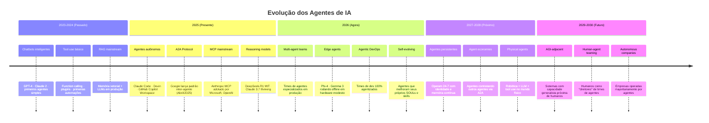
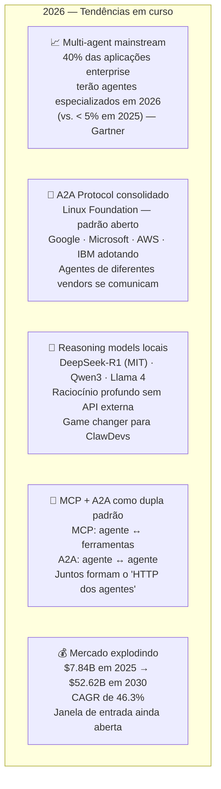
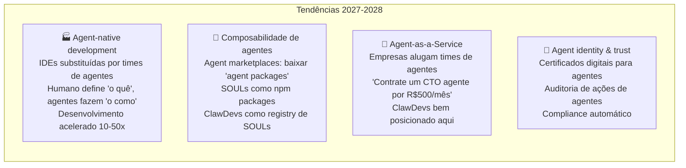
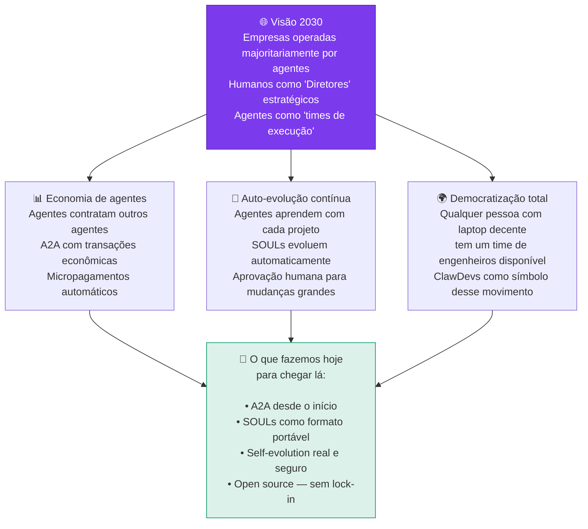
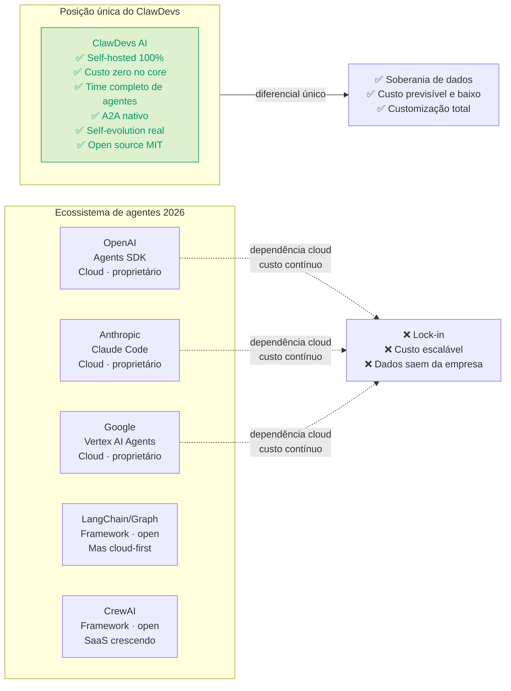
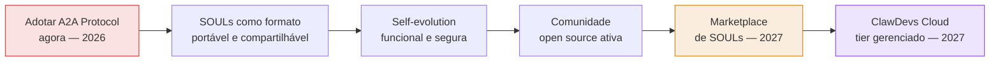

# 18 — Visão de Futuro e Estratégia de Evolução
> **Objetivo:** Alinhar as decisões de curto prazo do projeto com as tendências de longo prazo do mercado de IA (2026-2030).
> **Público-alvo:** Diretor, Stakeholders, PO
> **Ação Esperada:** O time e o Diretor utilizam esta visão para não tomar decisões (ex: lock-in em closed-source) que prejudiquem a evolução nativa do projeto.

**v2.0 | Atualizado em: 06 de março de 2026**

---
> "Se 2025 foi o ano dos agentes de IA, 2026 é o ano dos sistemas multi-agentes." — Gartner (1.445% de aumento em consultas sobre multi-agent systems entre Q1/2024 e Q2/2025)

---

## Linha do tempo: onde estamos e para onde vamos

---

## Curto prazo (2026) — O que está acontecendo agora

**O que isso significa para o ClawDevs:**
- A2A protocol deve ser adotado agora — não em 6 meses
- Modelos como DeepSeek-R1 e Qwen3 locais tornam o time de agentes muito mais capaz sem custo de API
- A janela de ser referência em "time de agentes self-hosted" está aberta em 2026, não em 2027

---

## Médio prazo (2027-2028) — Onde o mercado está indo

**Implicação estratégica para ClawDevs:**
- SOUL como formato padrão de identidade de agente → potencial para marketplace de SOULs
- ClawDevs como plataforma onde empresas criam e publicam seus próprios times de agentes
- Vantagem competitiva: ser o primeiro "time de agentes open source e replicável"

---

## Longo prazo (2029-2030) — A visão que orienta decisões de hoje

---

## Posicionamento do ClawDevs no ecossistema

---

## O que o ClawDevs precisa fazer para capturar essa onda

---

## Mercado — números reais

| Métrica | 2025 | 2026 | 2030 |
|---|---|---|---|
| Mercado global de AI agents | $7.84B | ~$11.5B | $52.62B |
| CAGR | — | 46.3% | 46.3% |
| Empresas com multi-agent | < 5% | ~40% | ~80% |
| Agentic AI spending (IDC) | — | crescendo | >$1.3T em 2029 |
| Consultas sobre multi-agent (Gartner) | — | +1.445% vs. 2024 | — |

