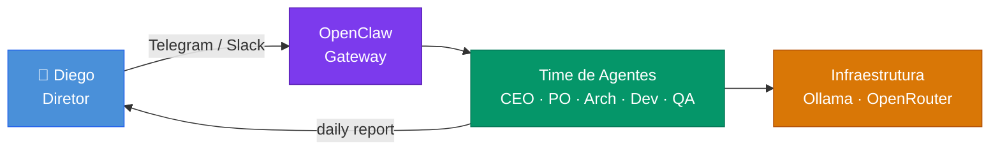
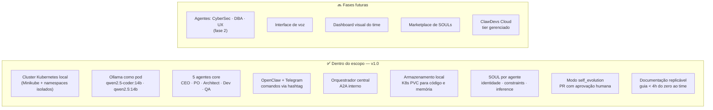
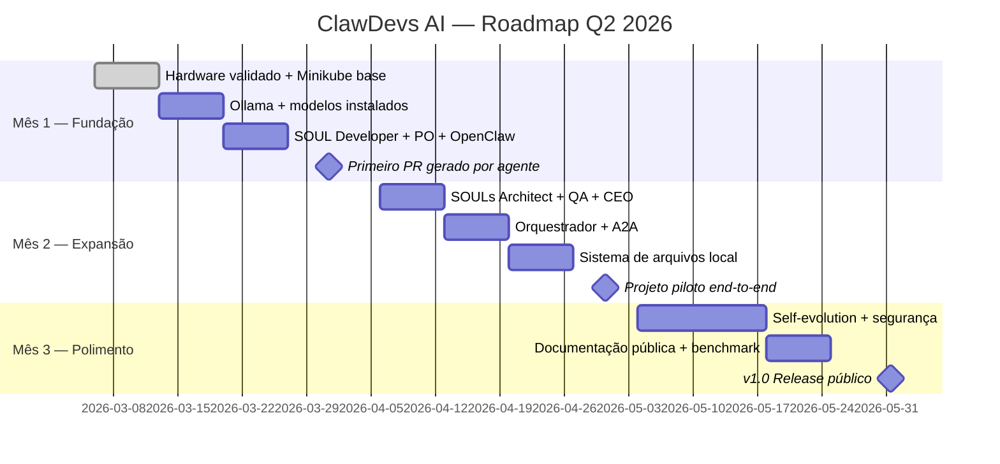
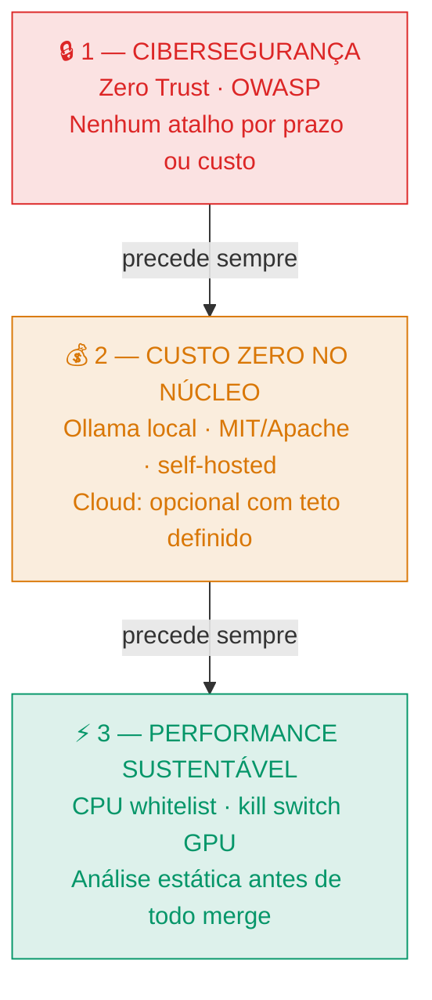
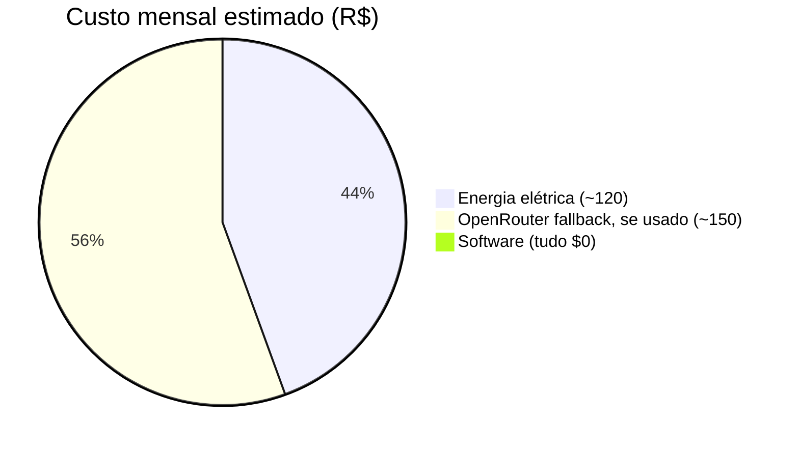
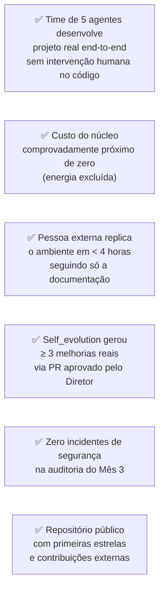

# ClawDevs AI — Documentação Técnica e Estratégica
> **Objetivo:** Funcionar como índice principal e ponto de entrada para toda a documentação do projeto.
> **Público-alvo:** Todos (PO, Scrum Master, Devs, Stakeholders)
> **Ação Esperada:** Utilize este arquivo para navegar rapidamente entre os documentos por contexto.

**v2.0 | Atualizado em:** 06 de março de 2026
**Status:** 🟢 Em execução

---

## Visão do projeto

> **"Qualquer pessoa, empresa ou desenvolvedor deve poder ter seu próprio time de agentes de IA trabalhando 24/7 — com custo próximo de zero, rodando no próprio hardware, sem depender de nuvem."**

O **ClawDevs AI** é um ecossistema de agentes autônomos de desenvolvimento de software orquestrado em Kubernetes local, com inferência via Ollama e interface conversacional pelo OpenClaw (Telegram, Slack, voz). O time é composto por agentes com papéis bem definidos — CEO, PO, Architect, Developer, QA — que colaboram como um time real: backlog, issues, PRs, revisões, merge e deploy.

---

## Índice da documentação

A documentação foi reestruturada para máxima clareza ágil, dividida em quatro contextos principais:

### 📦 Produto e Negócio (Foco: PO)
| Arquivo | Descrição |
|---|---|
| [README.md](./README.md) | **Este arquivo** ← entrada. |
| [01-produto-visao-projeto.md](./01-produto-visao-projeto.md) | Visão macro, arquitetura de alto nível e fluxos base. |
| [02-produto-backlog-mvp.md](./02-produto-backlog-mvp.md) | MVP e roadmap detalhado para priorização. |
| [03-produto-interface-diretor.md](./03-produto-interface-diretor.md) | Especificação da UI/Dashboard e métricas. |

### 🔄 Processos e Scrum (Foco: SM e Devs)
| Arquivo | Descrição |
|---|---|
| [04-processo-roadmap-entregas.md](./04-processo-roadmap-entregas.md) | Cronograma de releases e sprints. |
| [05-processo-fluxo-trabalho.md](./05-processo-fluxo-trabalho.md) | Fluxos de trabalho, DoD, e CI/CD. |
| [06-processo-politicas-engenharia.md](./06-processo-politicas-engenharia.md) | Acordos de trabalho do time e qualidade de código. |
| [07-processo-riscos-seguranca.md](./07-processo-riscos-seguranca.md) | Gestão de riscos, bloqueios e segurança. |

### ⚙️ Técnico e Arquitetura (Foco: Devs/Architect)
| Arquivo | Descrição |
|---|---|
| [08-tecnico-setup-local.md](./08-tecnico-setup-local.md) | Guia prático de setup do ambiente de desenvolvimento. |
| [09-tecnico-arquitetura-adrs.md](./09-tecnico-arquitetura-adrs.md) | Stack técnica oficial e histórico de ADRs. |
| [10-tecnico-infraestrutura-k8s.md](./10-tecnico-infraestrutura-k8s.md) | Topologia Kubernetes, ingress, pods e redes. |
| [11-tecnico-gateway-openclaw.md](./11-tecnico-gateway-openclaw.md) | Configurações, deploy e regras do OpenClaw. |
| [12-tecnico-inferencia-llm.md](./12-tecnico-inferencia-llm.md) | Integração com Ollama (local) e fallback (OpenRouter). |
| [13-tecnico-integracoes-externas.md](./13-tecnico-integracoes-externas.md) | Contratos de API e integrações com o mundo extra-cluster. |
| [14-tecnico-performance-escalabilidade.md](./14-tecnico-performance-escalabilidade.md) | Estratégias de HPA, filas, concorrência e resiliência. |

### 🤖 Agentes AI e Simulação (Foco: Todos)
| Arquivo | Descrição |
|---|---|
| [15-agentes-identidade-soul.md](./15-agentes-identidade-soul.md) | Definição de perfis, skills e restrições de cada agente. |
| [16-agentes-protocolo-a2a.md](./16-agentes-protocolo-a2a.md) | Como os agentes se comunicam (A2A) e dividem memória. |
| [17-agentes-simulacao-cenarios.md](./17-agentes-simulacao-cenarios.md) | Simulação end-to-end do time resolvendo tarefas reais. |
| [18-estrategico-visao-futuro.md](./18-estrategico-visao-futuro.md) | Visão de longo prazo, evolução e expansão do ecossistema. |

---

## Escopo do MVP v1.0

---

## Roadmap — 3 meses

### Marco 1 — Fundação (31/03)
Conseguir pedir ao time via Telegram para criar um projeto simples do zero, receber o primeiro PR e fazer merge — sem intervenção humana no código.

### Marco 2 — Time completo (30/04)
5 agentes colaborando via A2A, CEO reportando status consolidado ao Diretor diariamente, projeto real desenvolvido end-to-end.

### Marco 3 — v1.0 pública (31/05)
Pessoa externa clona o repositório, segue o guia e tem o ClawDevs funcionando na própria máquina em menos de 4 horas.

---

## Primícias — Ordem de prioridade absoluta

---

## Recursos necessários

### Hardware de referência

| Componente | Spec mínima | Por quê |
|---|---|---|
| CPU | 8 cores (i7 / Ryzen 7) | Paralelismo entre pods |
| RAM | 32 GB DDR4/DDR5 | Ollama + K8s + 5 agentes |
| GPU (opcional) | NVIDIA RTX 3060 12 GB VRAM | Aceleração de inferência |
| Disco | 500 GB NVMe SSD | Modelos (~27 GB) + dados |
| SO | Ubuntu 22.04 LTS / macOS 14+ | Compatibilidade Minikube |

### Custo estimado de operação

| Item | Custo/mês |
|---|---|
| Infraestrutura core (software) | R$ 0 |
| Energia elétrica | R$ 80 – 150 |
| OpenRouter com uso moderado | R$ 0 – 200 |
| **Total realista** | **< R$ 350/mês** |

---

## Definição de sucesso — v1.0

---

## Próximos passos imediatos

| # | Ação | Prazo |
|---|---|---|
| 1 | Validar spec de hardware da máquina de desenvolvimento | Hoje |
| 2 | Criar repositório base com estrutura de pastas e README | Hoje |
| 3 | Instalar e validar Minikube + kubectl | Até 08/03 |
| 4 | Benchmark Ollama — definir modelo base (qwen2.5-coder:14b vs. 7b) | Até 08/03 |
| 5 | Escrever SOUL v1 do Developer | Até 10/03 |

---

## Histórico de revisões

| Versão | Data | Alteração |
|---|---|---|
| v1.0 | 06/03/2026 | Documento inicial (plano-execucao-v1.md) |
| v1.1 | 06/03/2026 | Reorganizado como README da série · Mermaid · links atualizados |

---

*ClawDevs AI — Feito por builders, para builders. Open source no núcleo, soberano na infraestrutura.*
