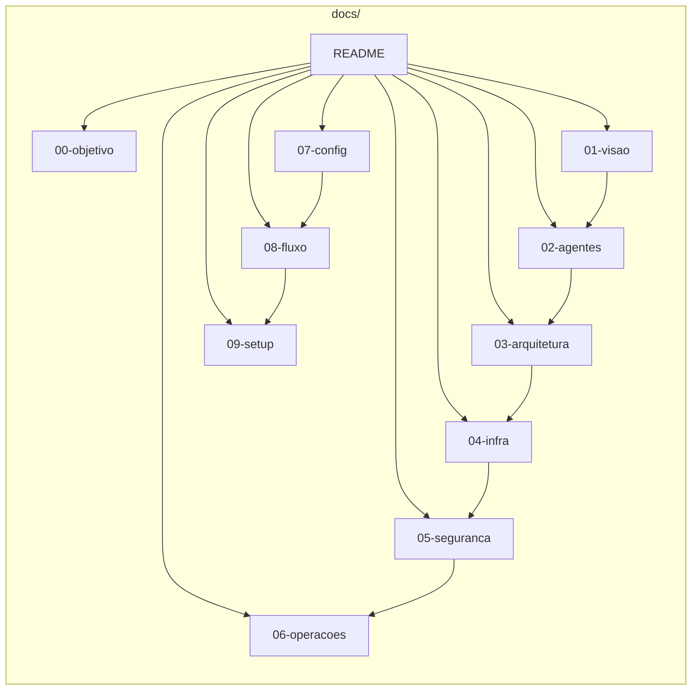

# ClawDevs — Documentação

**ClawDevs** é um ecossistema de **nove agentes de IA** de desenvolvimento de software, orquestrados em Kubernetes, com estado em Redis, inferência local (Ollama) e em nuvem, e interface OpenClaw (Telegram/voz). A ideia central: **qualquer um pode ter seu ClawDevs** — um time de desenvolvimento autônomo na própria máquina, 24 por 7. Todo o ambiente (agentes, Redis, Ollama, OpenClaw, volumes) roda **dentro do Kubernetes**, com limite de **65% do hardware**. O time pode desenvolver **qualquer projeto, em qualquer linguagem**, para o Diretor.

**Criador do projeto:** **Diego Silva Morais**.

Existe também um **projeto de auto-evolução**: o repositório ClawDevs pode ser usado para melhorar a si mesmo (#self_evolution). Início e fim da tarefa são **exclusivos do Diretor via Telegram**. Detalhes em [36-auto-evolucao-clawdevs.md](36-auto-evolucao-clawdevs.md).

---

## Comece aqui

| Se você quer… | Veja |
|---------------|------|
| **Entender o objetivo e a máquina de referência** | [00-objetivo-e-maquina-referencia.md](00-objetivo-e-maquina-referencia.md) |
| **Visão geral, agentes e autonomia** | [01-visao-e-proposta.md](01-visao-e-proposta.md) |
| **Configurar e rodar (setup)** | [09-setup-e-scripts.md](09-setup-e-scripts.md) |
| **Índice completo por tema e por arquivo** | [INDEX.md](INDEX.md) |
| **Revisões pós-crítica e termos-chave** | [revisoes-analistas-e-termos.md](revisoes-analistas-e-termos.md) |

---

## Para agentes: o que desenvolver

Objetivo para o time: **custo baixíssimo** e **performance segura e altíssima**. Stack: Kubernetes (Minikube) + OpenClaw + Ollama + provedores em nuvem (OpenRouter, OpenAI, Ollama cloud, Qwen, Moonshot AI, Hugging Face) + OpenCode no Developer. Quem tiver **máquina igual à de referência** (ou melhor) pode replicar o ClawDevs — specs em [00-objetivo-e-maquina-referencia.md](00-objetivo-e-maquina-referencia.md).

Os agentes seguem: **habilidades proativas** ([13-habilidades-proativas.md](13-habilidades-proativas.md)), **Zero Trust** ([05-seguranca-e-etica.md](05-seguranca-e-etica.md), [14-seguranca-runtime-agentes.md](14-seguranca-runtime-agentes.md)), **OWASP** ([15-seguranca-aplicacao-owasp.md](15-seguranca-aplicacao-owasp.md)), **CISO** ([16-ciso-habilidades.md](16-ciso-habilidades.md)), **escrita humanizada** ([17-escrita-humanizada.md](17-escrita-humanizada.md)), **expertise em documentação** ([18-expertise-documentacao.md](18-expertise-documentacao.md)), **descoberta de skills** ([19-descoberta-instalacao-skills.md](19-descoberta-instalacao-skills.md)), **gh CLI** ([20-ferramenta-github-gh.md](20-ferramenta-github-gh.md)), **MCP GitHub** ([34-mcp-github-publico.md](34-mcp-github-publico.md)), **auto-atualização** ([21-auto-atualizacao-ambiente.md](21-auto-atualizacao-ambiente.md)), **FreeRide** ([22-modelos-gratuitos-openrouter-freeride.md](22-modelos-gratuitos-openrouter-freeride.md)), **frontend design** ([23-frontend-design.md](23-frontend-design.md)), **busca web** ([24-busca-web-headless.md](24-busca-web-headless.md)), **Exa** ([30-exa-web-search.md](30-exa-web-search.md)), **API Gateway** ([25-api-gateway-integracao-apis.md](25-api-gateway-integracao-apis.md)), **dados/watchlist** ([26-dados-watchlist-alertas-simulacao.md](26-dados-watchlist-alertas-simulacao.md)), **markdown converter** ([27-ferramenta-markdown-converter.md](27-ferramenta-markdown-converter.md)), **memória Elite** ([28-memoria-longo-prazo-elite.md](28-memoria-longo-prazo-elite.md)), **criação de skills** ([29-criacao-de-skills.md](29-criacao-de-skills.md)), **Ollama local** ([31-ollama-local.md](31-ollama-local.md)), **UI/UX Pro Max** ([32-ui-ux-pro-max.md](32-ui-ux-pro-max.md)), **OpenCode Controller** ([33-opencode-controller.md](33-opencode-controller.md)).

**Expectativas e custos:** ambiente de prototipagem; uso em nuvem consome créditos/API. Configure **limite de gastos** no provedor e use FinOps ([07-configuracao-e-prompts.md](07-configuracao-e-prompts.md)).

---

## Navegação rápida por tema

| Tema | Documentos principais |
|------|------------------------|
| **Visão e objetivo** | [00](00-objetivo-e-maquina-referencia.md), [01](01-visao-e-proposta.md) |
| **Agentes e arquitetura** | [02](02-agentes.md), [03](03-arquitetura.md), [04](04-infraestrutura.md) |
| **Segurança** | [05](05-seguranca-e-etica.md), [14](14-seguranca-runtime-agentes.md), [15](15-seguranca-aplicacao-owasp.md), [16](16-ciso-habilidades.md), [20-zero-trust-fluxo](20-zero-trust-fluxo.md), [21-quarentena-disco-pipeline](21-quarentena-disco-pipeline.md), [27-kill-switch-redis](27-kill-switch-redis.md) |
| **Operações** | [06](06-operacoes.md), [estrategia-uso-hardware-gpu-cpu](estrategia-uso-hardware-gpu-cpu.md), [38](38-redis-streams-estado-global.md), [39](39-consumer-groups-pipeline-revisao.md), [40](40-contingencia-cluster-acefalo.md) |
| **Config e setup** | [07](07-configuracao-e-prompts.md), [09](09-setup-e-scripts.md), [openclaw-config-ref](openclaw-config-ref.md) (OpenClaw — tudo no K8s) |
| **Fluxos** | [08](08-exemplo-de-fluxo.md), [fluxo-completo-mermaid](fluxo-completo-mermaid.md), [42-fluxo-e2e-operacao-2fa](42-fluxo-e2e-operacao-2fa.md) |
| **Ferramentas e skills** | [10](10-self-improvement-agentes.md)–[19](19-descoberta-instalacao-skills.md), [28](28-memoria-longo-prazo-elite.md), [29](29-criacao-de-skills.md), [31](31-ollama-local.md)–[34](34-mcp-github-publico.md) |
| **Deploy e fases** | [37](37-deploy-fase0-telegram-ceo-ollama.md), [41](41-fase1-agentes-soul-pods.md), [42-slack-tokens-setup](42-slack-tokens-setup.md), [43](43-autonomia-nivel-4-matriz-escalonamento.md), [44](44-fase2-seguranca-automacao.md) |

**Índice completo:** [INDEX.md](INDEX.md).  
**Backlog (issues):** [issues/README.md](issues/README.md).  
**Docs operacionais (agents-devs):** [agents-devs/README.md](agents-devs/README.md).  
**Identidade dos agentes (SOUL):** [soul/README.md](soul/README.md).

---

## Diagrama de dependência

(O diagrama completo com todos os documentos está na documentação anterior; para dependências detalhadas, consulte [INDEX.md](INDEX.md) e os links internos de cada doc.)

---

## Terminologia (resumo)

- **Diretor:** humano decisor; aprovação para decisões críticas.
- **ClawDevs:** ecossistema — enxame de 9 agentes em K8s com OpenClaw.
- **OpenClaw:** orquestrador e interface (voz/chat).
- **Ollama:** inferência local; **OpenCode:** geração de código no Developer.
- **draft.2.issue:** rascunho PO→Architect para validar viabilidade.

Mais termos e revisões pós-crítica: [revisoes-analistas-e-termos.md](revisoes-analistas-e-termos.md).
