# Orquestração de Agentes de IA para Desenvolvimento Automatizado

**ClawDevs** é o nome do ecossistema: um **enxame de agentes de desenvolvimento de software autônomos** (nove agentes de IA) orquestrados em Kubernetes, com estado em Redis, inferência local (Ollama) e em nuvem, e interface OpenClaw. **A ideia central do ClawDevs: qualquer um pode ter seu ClawDevs** — um time de desenvolvimento na própria máquina, 24 por 7. Todo o **ClawDevs** — agentes, Redis, Ollama, OpenClaw, estado e volumes — roda **dentro do Kubernetes**; o limite do cluster é 65% do hardware. O time pode desenvolver **qualquer projeto para o Diretor, em qualquer linguagem de programação** — o stack (Kubernetes, OpenClaw, Ollama, etc.) é o ambiente de execução do enxame, não restrição do que é desenvolvido.

**Criador do projeto:** **Diego Silva Morais** — dono e desenvolvedor do **ClawDevs**.

Existe também um **projeto de auto-evolução**: o próprio repositório ClawDevs pode ser usado para melhorar a si mesmo. Os agentes discutem entre si e implementam melhorias **sem intervenção do Diretor** (sem validação nem aprovação durante a execução), seguindo todas as **políticas de segurança**. O início e o fim da tarefa **#self_evolution** são **exclusivos do Diretor via Telegram**. Detalhes em [36-auto-evolucao-clawdevs.md](36-auto-evolucao-clawdevs.md).

## Para agentes: o que desenvolver

Objetivo: **qualquer um pode ter seu ClawDevs** — **qualquer pessoa** (Diretor, desenvolvedor, empreendedor) pode ter seu **ClawDevs** (time de desenvolvimento 100% autônomo, nove agentes) **na sua máquina**, **prontos para trabalhar 24 por 7**, com prioridade em **custo baixíssimo** e **performance segura e altíssima**. Stack: **Kubernetes** (Minikube) + **OpenClaw** (orquestração/voz/chat) + **Ollama** (inferência local) + **provedores integrados OpenClaw em nuvem** (OpenRouter, OpenAI, Ollama cloud, Qwen, Moonshot AI, Hugging Face) + **OpenCode** (geração de código no Developer). **Todo o ecossistema ClawDevs** (agentes, Redis, Ollama, OpenClaw, estado e **volumes**) roda **dentro do Kubernetes**; o cluster é o boundary único de execução. O agente Developer usa Ollama local com OpenCode para toda a geração de código. Quem tiver **máquina igual à de referência** (ou melhor) pode replicar o **ClawDevs** — specs e comandos de verificação em [00-objetivo-e-maquina-referencia.md](00-objetivo-e-maquina-referencia.md).

---

**Esta é uma documentação de preparação** para o desenvolvimento do **ClawDevs**: visão, arquitetura, papéis, segurança e operação necessários para construir e operar o enxame.

Documentação técnica do **ClawDevs** — time de agentes de desenvolvimento de software 100% autônomos: nove agentes de IA colaborativos (CEO, Product Owner, DevOps/SRE, Architect, Developer, QA, CyberSec, UX e DBA) atuam em conjunto, orquestrados em Kubernetes (Minikube), com estado centralizado em Redis, modelos locais (Ollama) e em nuvem (provedores integrados OpenClaw: OpenRouter, OpenAI, Ollama cloud, Qwen, Moonshot AI, Hugging Face), e interface via OpenClaw (Telegram/voz). O Diretor humano intervém apenas em decisões estratégicas ou impasses. Os agentes adotam **habilidades proativas** (antecipação, persistência de contexto, autoaprimoramento seguro; ver [13-habilidades-proativas.md](13-habilidades-proativas.md)), **postura Zero Trust** em segurança (nunca confiar, sempre verificar; ver [05-seguranca-e-etica.md](05-seguranca-e-etica.md) e [14-seguranca-runtime-agentes.md](14-seguranca-runtime-agentes.md)), **auditoria e codificação segura OWASP** (ver [15-seguranca-aplicacao-owasp.md](15-seguranca-aplicacao-owasp.md)) e **habilidades CISO** — auditoria de infraestrutura, varredura local do ambiente OpenClaw, conformidade (SOC 2, GDPR, ISO, HIPAA), resposta a incidentes e avaliação de fornecedores (ver [16-ciso-habilidades.md](16-ciso-habilidades.md)) e **escrita humanizada** — remoção de padrões de texto gerado por IA e voz natural em documentação, Issues e comunicações (ver [17-escrita-humanizada.md](17-escrita-humanizada.md)) — e **expertise em documentação** — navegação por árvore de decisão, busca e descoberta, obtenção e citação da doc do projeto (ver [18-expertise-documentacao.md](18-expertise-documentacao.md)) — e **descoberta e instalação de skills** — buscar e propor skills do ecossistema aberto (Skills CLI, skills.sh) com instalação só após Zero Trust e aprovação (ver [19-descoberta-instalacao-skills.md](19-descoberta-instalacao-skills.md)) — e **ferramenta GitHub (gh CLI)** — interação com GitHub via `gh` (Issues, PRs, CI, API); ver [20-ferramenta-github-gh.md](20-ferramenta-github-gh.md) — e **MCP GitHub público** — acesso a repositórios públicos para busca e download de código de referência; quando código é baixado ou buscado, **Zero Trust crítico**: validar se é malicioso (injeção de prompt, SAST, entropia) antes de incorporar; ver [34-mcp-github-publico.md](34-mcp-github-publico.md) — e **auto-atualização do ambiente** — manter runtime e skills instaladas atualizadas via cron em sessão isolada, com resumo ao Diretor; ver [21-auto-atualizacao-ambiente.md](21-auto-atualizacao-ambiente.md) — e **modelos gratuitos OpenRouter (FreeRide)** — configurar OpenClaw para usar modelos gratuitos do OpenRouter com ranking e fallbacks; ver [22-modelos-gratuitos-openrouter-freeride.md](22-modelos-gratuitos-openrouter-freeride.md) — e **frontend design** — interfaces distintas, design thinking, estética (tipografia, cor, motion, composição, anti-genérico) e workflow e padrões SuperDesign (layout→tema→animação→implementação) para Developer e UX; ver [23-frontend-design.md](23-frontend-design.md) — e **busca web headless** — pesquisa na web e extração de conteúdo de páginas em markdown sem browser; ver [24-busca-web-headless.md](24-busca-web-headless.md) — e **Exa Web Search** — busca neural (web, código GitHub/Stack Overflow, pesquisa de empresas) via MCP Exa (mcporter), sem API key; ver [30-exa-web-search.md](30-exa-web-search.md) — e **API Gateway (integração com APIs externas)** — conectar a 100+ APIs (Google Workspace, Slack, Notion, HubSpot, Stripe, etc.) via gateway Maton com OAuth gerenciado; ver [25-api-gateway-integracao-apis.md](25-api-gateway-integracao-apis.md) — e **dados, watchlist, alertas e simulação** — consulta a APIs de dados, acompanhamento (watchlist), alertas e simulação local (paper); ver [26-dados-watchlist-alertas-simulacao.md](26-dados-watchlist-alertas-simulacao.md) — e **conversão de documentos para Markdown** — converter PDF, Word, PowerPoint, Excel, HTML, imagens, áudio, ZIP, YouTube e EPub para Markdown via `uvx markitdown` para processamento por LLM ou RAG; ver [27-ferramenta-markdown-converter.md](27-ferramenta-markdown-converter.md) — e **memória de longo prazo (Elite)** — seis camadas (Hot RAM, Warm Store, Cold Store, arquivo curado, backup em nuvem opcional, autoextração opcional), protocolo WAL e higiene de memória; **configuração prática de memória** (memorySearch na config, MEMORY.md, estrutura memory/logs|projects|groups|system, diários, recall em AGENTS.md, troubleshooting) incorporada; ver [28-memoria-longo-prazo-elite.md](28-memoria-longo-prazo-elite.md) — e **criação de skills** — criar e evoluir skills (princípios, anatomia SKILL.md + scripts/references/assets, processo em 6 passos, padrões de fluxo e saída) quando não houver skill no ecossistema e a necessidade for recorrente; ver [29-criacao-de-skills.md](29-criacao-de-skills.md) — e **Ollama Local (skill)** — gerenciar e usar modelos Ollama locais (listar/puxar/remover, chat/completions, embeddings, tool-use) e sub-agentes OpenClaw (sessions_spawn); seleção de modelos e troubleshooting; ver [31-ollama-local.md](31-ollama-local.md) — e **UI/UX Pro Max** — triagem (plataforma, stack, objetivo), entregas estruturadas (conceito UI, fluxo UX, design system, plano de implementação), heurísticas por produto/indústria e diretrizes de UX, padrão Master + overrides para design system e padrões de saída (tokens, estados, acessibilidade); Developer e UX; ver [32-ui-ux-pro-max.md](32-ui-ux-pro-max.md) — e **OpenCode Controller** — controlar e operar o OpenCode no pod do Developer: gestão de sessões (`/sessions`), seleção de modelo (`/models`), modos Plan e Build (`/agents`), fluxo planejar→implementar, tratamento de perguntas e falhas; ver [33-opencode-controller.md](33-opencode-controller.md).

**Expectativas e custos:** Este material descreve um **ambiente de prototipagem** com caminho claro para escalabilidade — não uma solução "100% grátis" vitalícia. O **limite do Kubernetes** é consumir **65% do hardware**; o cluster é configurado com esse teto e o restante fica para o host. Uso local (Ollama) exige respeitar esse limite; uso em nuvem (provedores OpenClaw) consome créditos/API com validade e limites. Recomenda-se configurar **limite rígido de gastos** no painel do provedor escolhido (OpenRouter, OpenAI, etc.) e tratar créditos iniciais como **test drive de custo zero**, com FinOps e pipeline de truncamento de contexto para uso sustentável (ver [07-configuracao-e-prompts.md](07-configuracao-e-prompts.md)).

## Índice da documentação

### Revisões pós-crítica dos analistas

A documentação foi revisada conforme críticas dos analistas para reduzir riscos estruturais:

- **Gargalo GPU:** Incorporada **validação pré-GPU em CPU** (SLM para sintaxe, lint e aderência SOLID antes de disputar o lock) e **batching de PRs** (orquestrador acumula micro-alterações; Architect revisa em lote com janela de contexto única). **Pipeline explícito e slot único de revisão** (um consumidor GPU por etapa; job "Revisão pós-Dev" adquire o lock uma vez e executa Architect, QA, CyberSec e DBA em sequência). Ver [03-arquitetura.md](03-arquitetura.md), [04-infraestrutura.md](04-infraestrutura.md), [06-operacoes.md](06-operacoes.md), [estrategia-uso-hardware-gpu-cpu.md](estrategia-uso-hardware-gpu-cpu.md) e [issues/125-pipeline-explicito-slot-unico-revisao.md](issues/125-pipeline-explicito-slot-unico-revisao.md).
- **Zero Trust / fadiga de alertas:** Incorporados **sandbox para URLs/APIs desconhecidas** (executar requisição em container efêmero isolado, registrar I/O e syscalls; Diretor revisa resultado no digest diário) e **acelerador preditivo de tokens** (prever estouro por diff/tarefa e rotear para modelo local em CPU em vez de freio bruto e Telegram). Freio de emergência ($5/dia) e auditoria mantidos. Ver [05-seguranca-e-etica.md](05-seguranca-e-etica.md), [14-seguranca-runtime-agentes.md](14-seguranca-runtime-agentes.md), [07-configuracao-e-prompts.md](07-configuracao-e-prompts.md), [22-modelos-gratuitos-openrouter-freeride.md](22-modelos-gratuitos-openrouter-freeride.md).
- **Governança do agente executivo (CEO):** **Fitness function no raciocínio** (issue 129): CEO gera **VFM_CEO_score.json** e descarta internamente eventos com threshold negativo **antes** de enviar ao Gateway; economia na raiz cognitiva. Controle de **taxa determinístico** (token bucket) para eventos de estratégia no Gateway — limite por janela (ex.: 5/hora); excedente interceptado. **Degradação por eficiência** (razão ideias CEO vs tarefas aprovadas pelo PO): abaixo do limiar → bloquear nuvem para o CEO e rotear para modelo local em CPU (refinar fila em vez de gerar volume novo). **$5/dia** mantido como **freio de emergência** (última linha de defesa). Ver [07-configuracao-e-prompts.md](07-configuracao-e-prompts.md), [05-seguranca-e-etica.md](05-seguranca-e-etica.md), [03-arquitetura.md](03-arquitetura.md), [soul/CEO.md](soul/CEO.md), [issues/129-ceo-vfm-fitness-no-raciocinio.md](issues/129-ceo-vfm-fitness-no-raciocinio.md).
- **Quarentena de código de terceiros:** Além do diff de caminhos, o pipeline de quarentena exige **matriz de confiança (assinaturas criptográficas)** (hash vs registro oficial; se ok, dispensar entropia restritiva), **SAST leve** (ex.: semgrep, regras estritas) e **analisador de entropia com consciência contextual** (whitelist de extensões .map, .wasm, .min.js com tolerância maior; em pico em arquivo tolerado, opção de análise dinâmica pelo CyberSec); evita falsos positivos em pacotes modernos. **Código de referência** (baixado ou buscado — MCP GitHub, Exa, clone, web): **Zero Trust crítico** — validar se malicioso (injeção de prompt, SAST, entropia contextual/assinaturas) antes de incorporar ao workspace/repo. Ver [05-seguranca-e-etica.md](05-seguranca-e-etica.md) (1.3, 1.4), [14-seguranca-runtime-agentes.md](14-seguranca-runtime-agentes.md) (1.6, 3.1), [34-mcp-github-publico.md](34-mcp-github-publico.md).
- **Loop PO–Architect (draft_rejected):** **Disjuntor** por épico: mesma épico com **3 draft_rejected consecutivos** → **congelar** tarefa no Redis; acionar **RAG health check determinístico** (datas de indexação vs main, estrutura de pastas); atualizar memória do orquestrador; ao descongelar, PO recebe rejeição com **contexto saneado**. Atua **antes** da cota global de degradação (10–15%). Ver [06-operacoes.md](06-operacoes.md), [03-arquitetura.md](03-arquitetura.md), [soul/PO.md](soul/PO.md), [soul/Architect.md](soul/Architect.md).
- **Five strikes:** Substituído abandono imediato por **fallback contextual**: 2º strike → prompt de compromisso (Architect gera o código que aprovaria o PR); 5º strike → empacotar contexto e **escalação para arbitragem na nuvem** (modelo superior reescreve). Abandono apenas em exceção, após falha da escalação. **Aprovação por omissão** apenas para impasses **cosméticos** (timer 6 h); impasses de código lógico/backend → 5 strikes, issue volta ao backlog do PO; **PO analisa histórico com Architect e tarefa retorna ao desenvolvimento**. Ver [06-operacoes.md](06-operacoes.md), [01-visao-e-proposta.md](01-visao-e-proposta.md), [07-configuracao-e-prompts.md](07-configuracao-e-prompts.md), [soul/Architect.md](soul/Architect.md).
- **Autoaprendizado e curadoria centralizada:** Promoção de `.learnings/` para SOUL.md/AGENTS.md/TOOLS.md **não** é orgânica por agente — evita conflitos entre 9 agentes em paralelo (learnings contraditórios, corrupção do arquivo de identidade). **Processo formal de merge request:** (1) **Protocolo de consenso (pre-flight):** QA e CyberSec avaliam novo learning (não violar OWASP/limites); (2) **Curadoria em sessão isolada (CronJob):** Architect ou CyberSec em janela dedicada lê .learnings/ não processados, resolve contradições, gera artefato consolidado e injeta nos arquivos globais. Ver [10-self-improvement-agentes.md](10-self-improvement-agentes.md), [03-arquitetura.md](03-arquitetura.md) (Merge de conhecimento).
- **Limites de evolução quantitativos (VFM e ADL):** Princípios em texto livre substituídos por **funções de aptidão** e **auditoria determinística**. **VFM:** **CEO** aplica fitness no **raciocínio** (VFM_CEO_score.json, descarte interno se negativo antes do Gateway — issue 129); demais propostas de evolução exigem artefato (ex.: vfmscore.json) com fórmula numérica; cálculo e decisão no Gateway; bloqueio na borda se pontuação < threshold. **ADL:** microADR com seção obrigatória de auditoria de desvio; **regex** contra lista negra de justificativas fracas ("parece melhor", "intuição sugere", "código mais limpo" sem métrica); rejeição em tempo de execução. Ver [13-habilidades-proativas.md](13-habilidades-proativas.md), [07-configuracao-e-prompts.md](07-configuracao-e-prompts.md), [05-seguranca-e-etica.md](05-seguranca-e-etica.md), [soul/CEO.md](soul/CEO.md).
- **Persistência acoplada a FinOps e diversidade de ferramenta:** Em vez de "5–10 tentativas" cegas ao vetor de falha: (1) **Diversidade obrigatória:** se mesma ferramenta falhar 2x consecutivas pelo mesmo motivo, orquestrador **bloqueia** essa ferramenta no escopo da tarefa; agente forçado a mudar vetor (CLI, API, outra skill). (2) **Persistência ↔ FinOps:** contador de tentativas integrado ao Gateway (custo × número da tentativa no pre-flight); ao atingir gatilho, orquestrador **interrompe** a tarefa, **devolve ao backlog do PO** e **libera travas de hardware** (GPU). Degradação graciosa; evita exaustão de recursos e orçamento. Ver [13-habilidades-proativas.md](13-habilidades-proativas.md), [06-operacoes.md](06-operacoes.md), [10-self-improvement-agentes.md](10-self-improvement-agentes.md).
- **Contingência cluster acéfalo (CEO/PO na nuvem + internet cai):** Protocolo **100% local e determinístico**: orquestrador monitora Redis; se **nenhum comando com tag de estratégia do CEO** em **time-out configurável** (ex.: 5 min), **DevOps local** é acionado: **commit do estado em branch efêmera de recuperação** (ex.: `recovery-failsafe-<timestamp>`), **persistência da fila no LanceDB**, **pausa** do consumo da fila de GPU. **Retomada automática:** health check contínuo (ping a cada 5 min, sem tokens); quando conectividade estável por **3 ciclos consecutivos**, orquestrador acorda DevOps e executa script de retomada (checkout limpo; Architect prioridade zero se conflitos; restaura fila e retoma consumo). **Nenhum comando humano** para destravar; **notificação assíncrona** ao Diretor (Telegram/Slack ou digest). Ver [06-operacoes.md](06-operacoes.md) (seção *Contingência: cluster acéfalo*), [issues/124-contingencia-cluster-acefalo.md](issues/124-contingencia-cluster-acefalo.md).
- **Segregação dos critérios de aceite (validação reversa do PO):** Os critérios de aceite originais **não** podem estar no buffer sumarizado — senão o PO perde a referência para comparar. **Tag de proteção** (ex.: `<!-- CRITERIOS_ACEITE -->`) + regex no script do DevOps para ignorar esses blocos, **ou** **payload duplo** (critérios em arquivo separado; orquestrador envia resumo + critérios intactos à nuvem). PO sempre recebe critérios intactos para rejeitar truncamento falho. Ver [07-configuracao-e-prompts.md](07-configuracao-e-prompts.md), [28-memoria-longo-prazo-elite.md](28-memoria-longo-prazo-elite.md), [issues/041-truncamento-contexto-finops.md](issues/041-truncamento-contexto-finops.md).
- **Loop de consenso (pré-freio de mão) e workflow de recuperação pós-degradação:** Ao atingir 10–15% das tarefas em rota de fuga (5º strike ou aprovação por omissão cosmética), o orquestrador primeiro aciona **loop de consenso automatizado** (QA + Architect propõem ajuste temporário, teste em uma tarefa crítica); só se falhar aciona freio de mão. **Workflow de recuperação:** (1) orquestrador **gera automaticamente relatório de degradação** (Markdown); (2) **Diretor** revisa MEMORY.md e config, ajusta limiares/critérios; (3) retomada **somente** após **comando explícito de desbloqueio** (script/CLI) — nenhum agente reativa por conta própria. Ver [06-operacoes.md](06-operacoes.md) (seções *Loop de consenso* e *Workflow de recuperação pós-degradação*), [issues/017-autonomia-nivel-4-matriz-escalonamento.md](issues/017-autonomia-nivel-4-matriz-escalonamento.md).

**Termos-chave (evitar ambiguidade):** **Evento de estratégia** = evento publicado pelo CEO no stream com tag que identifica comando/diretriz estratégica (ex.: canal `cmd:strategy`). **Token bucket** = mecanismo determinístico no Gateway/orquestrador que limita o número de eventos de estratégia por janela (ex.: 5/hora); excedente interceptado. **Degradação por eficiência** = razão (ideias CEO vs tarefas aprovadas pelo PO); abaixo do limiar → bloquear nuvem para o CEO e forçar modelo local em CPU. **Disjuntor (draft_rejected)** = mesma épico com 3 rejeições consecutivas de rascunho → congelar tarefa e acionar RAG health check. **RAG health check (determinístico)** = verificação sem LLM: datas de indexação dos docs usados pelo PO vs último commit na main; existência da estrutura de pastas; em conflito → atualizar memória do orquestrador. **SAST leve (sandbox)** = análise estática com ferramenta leve (ex.: semgrep) no sandbox, regras estritas (injeção de rede, eval oculto, shell indesejado). **Entropia (contextual)** = analisador com consciência de tipo de arquivo (whitelist .map, .wasm, .min.js com tolerância maior); matriz de confiança (assinaturas) pode dispensar entropia restritiva; pico em arquivo tolerado → opção de análise dinâmica pelo CyberSec. **Relação entre mecanismos:** Freio $5/dia = último recurso (emergência); token bucket e degradação por eficiência = controle primário sustentável. Disjuntor (3 rejeições) atua **por épico**, **antes** da cota global de degradação (10–15%). Quarentena: ordem = (1) diff de caminhos, (2) verificação de assinaturas (matriz de confiança), (3) SAST leve, (4) checagem de entropia contextual; só então aprovar transferência.

Revisões pós-análise: a documentação incorpora ajustes em **expectativas e custos** (prototipagem, test drive de custo zero, limites dos provedores OpenClaw e Ollama, FinOps e limite de gastos em nuvem), **segurança** (defesa em profundidade, **postura Zero Trust** — nunca confiar, sempre verificar; fluxo PARAR→PENSAR→VERIFICAR→PERGUNTAR→AGIR→REGISTRAR; classificação de ações externas, credenciais, URLs, red flags e regras de instalação em [05-seguranca-e-etica.md](05-seguranca-e-etica.md); aviso destacado sobre skills/Claw Hub, egress filtering, verificação externa, rotação de tokens, sandbox; **segurança em runtime** — validação pré-execução por agentes, ver [14-seguranca-runtime-agentes.md](14-seguranca-runtime-agentes.md); **segurança de aplicação e OWASP** — auditoria e codificação segura, ver [15-seguranca-aplicacao-owasp.md](15-seguranca-aplicacao-owasp.md); **habilidades CISO** — auditoria de infraestrutura, conformidade, resposta a incidentes e avaliação de fornecedores, ver [16-ciso-habilidades.md](16-ciso-habilidades.md)); **descoberta e instalação de skills** (busca e proposta ao Diretor, instalação após Zero Trust; ver [19-descoberta-instalacao-skills.md](19-descoberta-instalacao-skills.md)), **configuração automática** (rede/portas sem edição manual no container) e **escalabilidade** (fundação → K8s, filas, GPU Lock). **Ajustes pós-crítica de analistas:** (1) **Escalonamento e Diretor** — matriz de escalonamento probabilística, score de confiança e quarentena para skills validadas, **CEO como juiz de desempate** (Developer–Architect; sem autoridade sobre segurança), **digest diário** para não críticos, alerta imediato só para segurança ou $5/dia ([01-visao-e-proposta.md](01-visao-e-proposta.md), [05-seguranca-e-etica.md](05-seguranca-e-etica.md)); (2) **Memória e amnésia** — **microADR** (Architect, JSON estrito, nunca sumarizado, anexado ao Warm Store), **invariantes de negócio** (tag no estado da sessão + regex no script de limpeza) ([07-configuracao-e-prompts.md](07-configuracao-e-prompts.md), [28-memoria-longo-prazo-elite.md](28-memoria-longo-prazo-elite.md)); (3) **Pausa térmica transacional** — gatilho **80°C** (checkpoint via commit em branch efêmera de recuperação via Redis), 82°C (Q-Suite), Redis Streams **idempotente** (ACK só após conclusão em disco), **recuperação automática** (checkout limpo; Architect resolve conflitos na branch de recuperação quando aplicável; reentrega) sem manual no terminal ([06-operacoes.md](06-operacoes.md), [03-arquitetura.md](03-arquitetura.md), [04-infraestrutura.md](04-infraestrutura.md)). Ver [01-visao-e-proposta.md](01-visao-e-proposta.md), [05-seguranca-e-etica.md](05-seguranca-e-etica.md), [07-configuracao-e-prompts.md](07-configuracao-e-prompts.md) e [09-setup-e-scripts.md](09-setup-e-scripts.md).

| Documento | Conteúdo |
|-----------|----------|
| [00-objetivo-e-maquina-referencia.md](00-objetivo-e-maquina-referencia.md) | **ClawDevs** — objetivo para agentes (o que desenvolver, stack, replicabilidade) e **máquina de referência** (specs verificadas, comandos de verificação). |
| [01-visao-e-proposta.md](01-visao-e-proposta.md) | **ClawDevs** — objetivo, estrutura dos 9 agentes (resumo), ideias (War Room, Chaos Engineering, OpenClaw), autonomia nível 4 (matriz de escalonamento, Shadow Mode, aprovação por omissão). |
| [02-agentes.md](02-agentes.md) | Definição canônica dos 9 agentes do **ClawDevs**: função, responsabilidades, permissões/restrições, line-up, pontos de falha, personalidades (prompts), código de conduta e tabela de conflitos. |
| [03-arquitetura.md](03-arquitetura.md) | **ClawDevs** — Redis Streams, estado global, fluxo de eventos, GPU Lock (risco do lock estático), evolução: balanceamento dinâmico GPU/CPU (TTL dinâmico, PriorityClasses, node selectors), comparativo de eficiência. |
| [04-infraestrutura.md](04-infraestrutura.md) | **ClawDevs** — ecossistema 100% dentro do Kubernetes (incl. volumes); limite do Kubernetes de 65% do hardware. Minikube (Pop!_OS), Hub & Spoke/Ollama, alocação de recursos, YAML (ResourceQuota, LimitRange, deployment), Docker multi-stage, riscos (incl. colisão por expiração do lock). |
| [05-seguranca-e-etica.md](05-seguranca-e-etica.md) | **ClawDevs** — cibersegurança como prioridade não negociável (com custo baixíssimo e alta performance). Prioridades do projeto; ameaças cibernéticas em foco; defesa em profundidade e **verificação proativa externa**: orquestrador (RCE/zero-click), skills de terceiros, varredura na borda, rotação de tokens, sandbox do roteador; egress whitelist estática; filtro de conteúdo, CyberSec, Constitutional AI, kill switch, NetworkPolicy, alerta Telegram. Segurança com baixíssimo custo de hardware (validação determinística, análise estática, sem GPU extra). |
| [06-operacoes.md](06-operacoes.md) | **ClawDevs** — autonomia nível 4; **contingência cluster acéfalo** (heartbeat Redis, commit em branch efêmera de recuperação, LanceDB, **retomada automática** — health check 5 min, 3 ciclos estáveis, checkout limpo + Architect para conflitos, notificação assíncrona; sem comando humano); **loop de consenso automatizado (pré-freio de mão)** e **workflow de recuperação pós-degradação** (relatório auto, checklist Diretor, comando explícito de desbloqueio); manual de primeiros socorros como **último recurso** (GPU travada, diagnóstico, reset K8s/driver, recuperação) quando evict/balanceamento automático não bastarem; prevenção. |
| [estrategia-uso-hardware-gpu-cpu.md](estrategia-uso-hardware-gpu-cpu.md) | **ClawDevs** — estratégia de uso de hardware — Maximizar GPU e CPU dentro do limite de 65%; pipeline explícito e **slot único de revisão** (um consumidor/job por etapa; não múltiplos agentes disputando o mesmo evento); OLLAMA_KEEP_ALIVE, agrupamento por modelo, batching, paralelismo CPU vs GPU; referência em 03, 04, 06 e issues 007, 125. |
| [07-configuracao-e-prompts.md](07-configuracao-e-prompts.md) | Causa raiz do custo (inchaço de contexto); **controle FinOps no Gateway** (max tokens/request por perfil); **pre-flight Summarize** obrigatório para &gt;3 interações; pipeline de truncamento (janela deslizante, memória duas camadas + RAG); **TTL no Redis** para working buffer (expiração automática, sem depender de agente); manifesto de configuração (perfis por agente), OpenClaw, provedores (lista canônica OpenClaw: Ollama local/cloud, OpenRouter, Qwen, Moonshot AI, OpenAI, Hugging Face) e gateway. |
| [08-exemplo-de-fluxo.md](08-exemplo-de-fluxo.md) | **ClawDevs** — coreografia "Operação 2FA": fases do planejamento ao fechamento, papel de cada agente, pontos de risco. |
| [fluxo-completo-mermaid.md](fluxo-completo-mermaid.md) | **Fluxo completo em Mermaid** — Diagramas: visão de componentes, sequência estratégia→entrega, ciclo de rascunho, GPU Lock, truncamento na borda, governança (five strikes, aprovação por omissão cosmética), sandbox Developer, fluxo resumido. |
| [09-setup-e-scripts.md](09-setup-e-scripts.md) | Setup "um clique", script `setup.sh`, transcrição de áudio (`m4a_to_md.py`), configuração OpenClaw/Telegram, instruções de uso e teste. |
| [openclaw-sub-agents-architecture.md](openclaw-sub-agents-architecture.md) | **Arquitetura** — OpenClaw + sub-agents + K8s (pods Ollama, Redis, OpenClaw); CEO via Telegram; um modelo local para teste. |
| [37-deploy-fase0-telegram-ceo-ollama.md](37-deploy-fase0-telegram-ceo-ollama.md) | **Deploy Fase 0** — CEO via Telegram + Ollama no Kubernetes; passos de apply, secret Telegram, pairing. |
| [38-redis-streams-estado-global.md](38-redis-streams-estado-global.md) | **Redis Streams e estado global** — Streams (cmd:strategy, task:backlog, draft.2.issue, draft_rejected, code:ready), chaves (project:v1:issue:id), fluxo, semântica idempotente, checkpoint 80°C. |
| [39-consumer-groups-pipeline-revisao.md](39-consumer-groups-pipeline-revisao.md) | **Consumer groups e slot único de revisão (007+125)** — Grupos por stream, slot único para code:ready (Revisão pós-Dev), ordem de serviço GPU/CPU, Job/Deployment. |
| [40-contingencia-cluster-acefalo.md](40-contingencia-cluster-acefalo.md) | **Contingência cluster acéfalo (124)** — Heartbeat Redis, branch efêmera, snapshot fila (JSON), pausa consumo, health check, retomada automática; scripts e variáveis. |
| [20-zero-trust-fluxo.md](20-zero-trust-fluxo.md) | **Zero Trust (Fase 2 — 020)** — Fluxo em 6 passos, classificação de ações, credenciais, red flags, egress whitelist; referência para SOUL/TOOLS. |
| [21-quarentena-disco-pipeline.md](21-quarentena-disco-pipeline.md) | **Quarentena de disco (Fase 2 — 021, 128)** — Pipeline em 4 etapas (diff, assinaturas, SAST, entropia); Architect só diffs do PR; scripts. |
| [27-kill-switch-redis.md](27-kill-switch-redis.md) | **Kill switch (Fase 2 — 027)** — Chaves Redis (cluster:pause_consumption), gatilhos 80°C/82°C, recuperação, comando manual. |
| [41-fase1-agentes-soul-pods.md](41-fase1-agentes-soul-pods.md) | **Fase 1 — Agentes** — Roteiro SOUL, pods CEO/PO e técnicos, código de conduta, fluxo E2E (issues 010–017). |
| [44-fase2-seguranca-automacao.md](44-fase2-seguranca-automacao.md) | **Fase 2 — Segurança e automação** — Config central (phase2-config), contrato de automação (Gateway/orquestrador), scripts não interativos, chaves Redis; `make phase2-apply`. |
| [42-fluxo-e2e-operacao-2fa.md](42-fluxo-e2e-operacao-2fa.md) | **Fluxo E2E Operação 2FA (016)** — Cenário completo: fases, Redis (cmd:strategy, draft.2.issue, code:ready), riscos. |
| [43-autonomia-nivel-4-matriz-escalonamento.md](43-autonomia-nivel-4-matriz-escalonamento.md) | **Autonomia nível 4 (017)** — Matriz de escalonamento, CEO desempate, digest diário, five strikes, orçamento degradação, workflow recuperação. |
| [10-self-improvement-agentes.md](10-self-improvement-agentes.md) | **Self-improvement** — Captura de learnings, erros e feature requests em `.learnings/`; estrutura do workspace OpenClaw (AGENTS.md, SOUL.md, TOOLS.md, SESSION-STATE, working-buffer); WAL, recuperação pós-compactação; promoção para memória; hook opcional e comunicação entre sessões. |
| [11-ferramentas-browser.md](11-ferramentas-browser.md) | **Ferramentas de browser** — agent-browser CLI para automação (navegação, snapshot, interações, sessões); uso por QA, Developer e UX; instalação, comandos e boas práticas. |
| [12-ferramenta-summarize.md](12-ferramenta-summarize.md) | **Ferramenta summarize** — CLI para sumarizar URLs, PDFs, imagens, áudio e YouTube; uso no pipeline de truncamento e por CEO/PO; instalação, flags e config. |
| [13-habilidades-proativas.md](13-habilidades-proativas.md) | **Habilidades proativas** — Pilares proativo, persistente e autoaprimoramento; protocolos WAL, Working Buffer, recuperação pós-compactação; heartbeats; ADL/VFM; crons autônomo vs promptado; checklist de migração de ferramentas. |
| [14-seguranca-runtime-agentes.md](14-seguranca-runtime-agentes.md) | **Segurança em runtime** — Habilidades dos agentes: validação pré-execução (comandos, URLs, paths, conteúdo); proteção contra injeção de comando, SSRF, path traversal, injeção de prompt, exposição de API keys e exfiltração; protocolo no workspace; matriz por agente. |
| [15-seguranca-aplicacao-owasp.md](15-seguranca-aplicacao-owasp.md) | **Segurança de aplicação e OWASP** — Auditoria e codificação segura: processo de auditoria, OWASP Top 10 (checklist e exemplos), headers de segurança, validação de entrada, autenticação/sessão, segredos, dependências, formato de relatório e arquivos sensíveis; matriz por agente (CyberSec, Architect, Developer, DevOps, QA). |
| [16-ciso-habilidades.md](16-ciso-habilidades.md) | **Habilidades CISO** — Auditoria de infraestrutura (AWS/GCP, Docker/K8s, aplicação), **varredura local do ambiente OpenClaw** (config, rede, credenciais, hardening SO, guardrails), conformidade (SOC 2, GDPR, ISO 27001, HIPAA), resposta a incidentes (playbooks, classificação, templates), avaliação de fornecedores (tiers, questionário, DPA, desligamento); regras críticas e humano-no-loop; principal uso pelo CyberSec. |
| [17-escrita-humanizada.md](17-escrita-humanizada.md) | **Escrita humanizada** — Remoção de sinais de texto gerado por IA (24 padrões: conteúdo, linguagem, estilo, comunicação, enchimento); alma e voz na escrita; aplicável a todos os agentes ao produzir documentação, Issues, resumos e comunicações para humanos. |
| [18-expertise-documentacao.md](18-expertise-documentacao.md) | **Expertise em documentação** — Navegação por árvore de decisão, busca e descoberta em `docs/agents-devs`, obtenção do doc correto e citação da fonte; fluxo identificar → buscar → ler → citar. |
| [19-descoberta-instalacao-skills.md](19-descoberta-instalacao-skills.md) | **Descoberta e instalação de skills** — Buscar skills no ecossistema (Skills CLI, skills.sh); apresentar opções ao Diretor; instalar somente após checklist de segurança e aprovação (Zero Trust). |
| [20-ferramenta-github-gh.md](20-ferramenta-github-gh.md) | **Ferramenta GitHub (gh CLI)** — Interação com GitHub: Issues, PRs, status de CI, `gh run`, `gh api`; uso por PO, Developer, Architect, DevOps, QA e CyberSec; segurança (Zero Trust, nunca expor tokens). |
| [34-mcp-github-publico.md](34-mcp-github-publico.md) | **MCP GitHub (público)** — Acesso a repositórios públicos (busca, código de referência). Quando código é baixado ou buscado: **Zero Trust crítico** — validar se malicioso (injeção de prompt, SAST, entropia) antes de incorporar ao workspace/repo; Developer, Architect, DevOps, QA, CyberSec. |
| [35-governance-proposer.md](35-governance-proposer.md) | **Governance Proposer** — Propor ajustes a rules, soul, skills, task e configs em repo GitHub dedicado (cron + busca internet ex. ClawHub); PR para Diretor aprovar; após merge, agente aplica modificações localmente (pull + sync). Ollama CPU (qwen2.5:7b); validação humana obrigatória. |
| [36-auto-evolucao-clawdevs.md](36-auto-evolucao-clawdevs.md) | **Auto-evolução do ClawDevs** — Tarefa #self_evolution: fluxo em 6 passos; só Diretor via Telegram inicia/para; sem intervenção do Diretor durante execução; parada em cascata; issues da comunidade e PO/CEO. |
| [21-auto-atualizacao-ambiente.md](21-auto-atualizacao-ambiente.md) | **Auto-atualização do ambiente** — Atualização automática do runtime e de todas as skills instaladas (cron, sessão isolada); resumo ao Diretor; configuração e execução pelo DevOps; alinhado a Zero Trust e descoberta de skills. |
| [22-modelos-gratuitos-openrouter-freeride.md](22-modelos-gratuitos-openrouter-freeride.md) | **Modelos gratuitos OpenRouter (FreeRide)** — Configurar OpenClaw para modelos gratuitos do OpenRouter (ranking, fallbacks, rate limit); comandos freeride; uso por DevOps após aprovação; alinhado a custo e descoberta de skills. |
| [23-frontend-design.md](23-frontend-design.md) | **Frontend design** — Interfaces distintas e produção: design thinking, estética (tipografia, cor, motion, composição), anti-genérico; workflow e padrões SuperDesign (layout→tema→animação→implementação, Tailwind/Flowbite/Lucide, responsivo, acessibilidade); Developer e UX aplicam ao criar e revisar frontend. |
| [24-busca-web-headless.md](24-busca-web-headless.md) | **Busca web headless** — Pesquisa na web e extração de conteúdo de páginas em markdown sem browser; quando usar, segurança e quem pode usar; implementação via skill/MCP do ecossistema. |
| [30-exa-web-search.md](30-exa-web-search.md) | **Exa Web Search** — Busca neural web, contexto de código (GitHub/Stack Overflow) e pesquisa de empresas via MCP Exa (mcporter); setup, ferramentas principais e avançadas, segurança e quem pode usar. |
| [25-api-gateway-integracao-apis.md](25-api-gateway-integracao-apis.md) | **API Gateway (integração com APIs externas)** — Conectar a 100+ APIs (Google, Slack, Notion, HubSpot, Stripe, etc.) via gateway Maton com OAuth gerenciado; base URL, gestão de conexões, serviços suportados; uso por CEO, PO, Developer, DevOps; Zero Trust. |
| [26-dados-watchlist-alertas-simulacao.md](26-dados-watchlist-alertas-simulacao.md) | **Dados, watchlist, alertas e simulação** — Consulta a APIs de dados (leitura), watchlist, alertas (threshold/cron), calendário/prazos, momentum/digests, simulação local (paper); categorias de habilidades para skills; uso por CEO, PO, DevOps e outros conforme tarefa. |
| [27-ferramenta-markdown-converter.md](27-ferramenta-markdown-converter.md) | **Ferramenta Markdown Converter (markitdown)** — Converter PDF, Word, PowerPoint, Excel, HTML, imagens, áudio, ZIP, YouTube e EPub para Markdown via `uvx markitdown`; uso por CEO, PO, Developer, pipeline de pré-processamento e expertise em documentação. |
| [28-memoria-longo-prazo-elite.md](28-memoria-longo-prazo-elite.md) | **Memória de longo prazo (Elite)** — Seis camadas (Hot RAM, Warm Store, Cold Store, arquivo curado, cloud opcional, autoextração opcional), protocolo WAL, instruções por momento da sessão e higiene de memória; **configuração prática** (memorySearch, MEMORY.md, memory/logs|projects|groups|system, diários, recall em AGENTS.md, troubleshooting); integração com self-improvement e habilidades proativas. |
| [29-criacao-de-skills.md](29-criacao-de-skills.md) | **Criação de skills** — Criar e evoluir skills: princípios (concisão, grau de liberdade), anatomia (SKILL.md, scripts/, references/, assets/), processo em 6 passos, padrões de fluxo e saída; quando usar e quem pode criar/publicar; alinhado a descoberta de skills e FEATURE_REQUESTS. |
| [31-ollama-local.md](31-ollama-local.md) | **Ollama Local (skill)** — Gerenciar e usar modelos Ollama locais: gestão (list/pull/rm), chat/completions, embeddings, tool-use; sub-agentes OpenClaw (sessions_spawn); seleção de modelos e troubleshooting; DevOps, Developer, Architect e outros. |
| [32-ui-ux-pro-max.md](32-ui-ux-pro-max.md) | **UI/UX Pro Max** — Triagem (plataforma, stack, objetivo), entregas estruturadas (conceito UI, fluxo UX, design system, plano de implementação), heurísticas por produto/UX, design system Master + overrides, padrões de saída; Developer e UX. |
| [33-opencode-controller.md](33-opencode-controller.md) | **OpenCode Controller** — Controle e operação do OpenCode: sessões, modelo, modos Plan/Build, workflow planejar→implementar, tratamento de perguntas e falhas; Developer e CEO/PO. |
| [soul/](soul/) | **SOUL** — Identidade de cada agente (alma, tom, valores, frase de efeito, limites); base para system prompts no OpenClaw. |

## Diagrama de dependência

```mermaid
flowchart LR
  subgraph docs [docs/agents-devs]
    README[README]
    V00[00-objetivo-maquina]
    V01[01-visao]
    V02[02-agentes]
    V03[03-arquitetura]
    V04[04-infra]
    V05[05-seguranca]
    V06[06-operacoes]
    V07[07-config]
    V08[08-exemplo-fluxo]
    VFluxo[fluxo-completo-mermaid]
    V09[09-setup]
    V10[10-self-improvement]
    V11[11-ferramentas-browser]
    V12[12-ferramenta-summarize]
    V13[13-habilidades-proativas]
    V14[14-seguranca-runtime]
    V15[15-seguranca-owasp]
    V16[16-ciso-habilidades]
    V17[17-escrita-humanizada]
    V18[18-expertise-doc]
    V19[19-descoberta-skills]
    V20[20-ferramenta-github-gh]
    V21[21-auto-atualizacao]
    V22[22-modelos-freeride]
    V23[23-frontend-design]
    V24[24-busca-web-headless]
    V30[30-exa-web-search]
    V25[25-api-gateway]
    V26[26-dados-watchlist]
    V27[27-ferramenta-markdown-converter]
    V28[28-memoria-longo-prazo-elite]
    V29[29-criacao-de-skills]
    V31[31-ollama-local]
    V32[32-ui-ux-pro-max]
    V33[33-opencode-controller]
    V34[34-mcp-github-publico]
    V36[36-auto-evolucao]
  end
  README --> V00
  README --> V01
  README --> V02
  README --> V03
  README --> V04
  README --> V05
  README --> V06
  README --> V07
  README --> V08
  README --> VFluxo
  VFluxo --> V03
  VFluxo --> V06
  VFluxo --> V08
  README --> V09
  README --> V10
  README --> V11
  README --> V12
  README --> V13
  README --> V14
  README --> V15
  README --> V16
  README --> V17
  README --> V18
  README --> V20
  README --> V21
  README --> V22
  README --> V23
  README --> V24
  README --> V30
  README --> V25
  README --> V26
  README --> V27
  README --> V28
  README --> V29
  README --> V31
  README --> V32
  README --> V33
  README --> V34
  README --> V36
  V01 --> V36
  V06 --> V36
  V07 --> V31
  V05 --> V34
  V14 --> V34
  V20 --> V34
  V19 --> V31
    V07 --> V20
  V07 --> V22
  V19 --> V22
  V13 --> V21
  V19 --> V21
  V10 --> V20
  V05 --> V23
  V19 --> V23
  V23 --> V32
  V05 --> V24
  V19 --> V24
  V19 --> V30
  V24 --> V30
  V05 --> V25
  V19 --> V25
  V19 --> V26
  V19 --> V28
  V19 --> V29
  V10 --> V29
  V13 --> V26
  V01 --> V02
  V02 --> V03
  V03 --> V04
  V04 --> V05
  V05 --> V06
  V07 --> V08
  V08 --> V09
  V07 --> V10
  V09 --> V10
  V07 --> V11
  V10 --> V11
  V07 --> V12
  V10 --> V12
  V07 --> V27
  V07 --> V28
  V10 --> V27
  V10 --> V13
  V10 --> V28
  V13 --> V28
  V05 --> V13
  V05 --> V14
  V05 --> V15
  V05 --> V16
  V13 --> V14
  V14 --> V15
  V15 --> V16
  V13 --> V17
  V02 --> V17
  V10 --> V18
  V13 --> V18
  V18 --> V24
  V18 --> V27
  V05 --> V19
  V19 --> V24
  V02 --> V23
  V07 --> V23
  V23 --> V32
  V02 --> V33
  V07 --> V33
  V08 --> V33
  V10 --> V19
  V13 --> V19
```

## Terminologia

- **Criador do ClawDevs:** **Diego Silva Morais** — dono e desenvolvedor do projeto.
- **Diretor:** humano decisor; único ponto de aprovação para decisões críticas.
- **Agente CEO:** agente de IA responsável por estratégia e interface com o Diretor.
- **OpenClaw:** orquestrador e interface (voz/chat); usado nos pods CEO e PO.
- **Ollama:** runtime de inferência local (modelos no cluster); usado por Developer, Architect, QA, etc.
- **OpenRouter:** API de modelos em nuvem (ex.: FreeRide para baixo custo); configurável via OpenClaw. **Provedores de nuvem** no ClawDevs = apenas os integrados OpenClaw (Ollama cloud, OpenRouter, Qwen, Moonshot AI, OpenAI, Hugging Face).
- **OpenCode:** ferramenta de geração de código; usada no pod do Agente Developer.
- **ClawDevs:** nome do ecossistema — enxame de agentes de desenvolvimento de software autônomos (nove agentes de IA) orquestrados em Kubernetes, com interface OpenClaw no centro; identidade do projeto (Claw + Devs).
- **Enxame:** conjunto dos nove agentes de IA do ClawDevs atuando no cluster.
- **draft.2.issue:** evento de rascunho PO→Architect (também referido como **draft point-to-point-issue** em análises externas); o PO publica o rascunho da tarefa para o Architect validar viabilidade técnica antes da tarefa ir para desenvolvimento. Ver [02-agentes.md](02-agentes.md) e [03-arquitetura.md](03-arquitetura.md).
