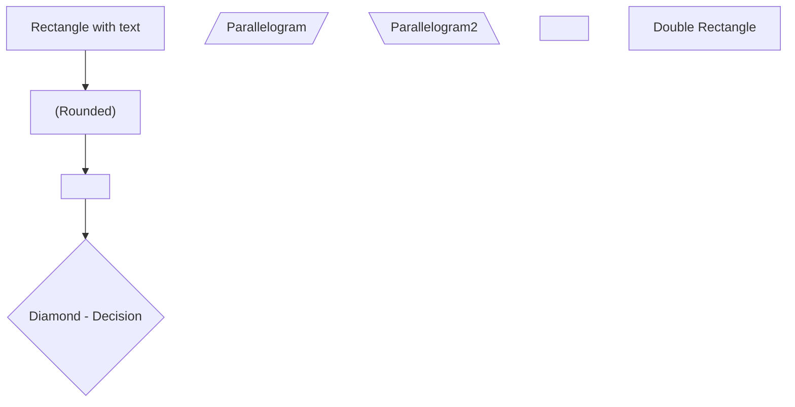
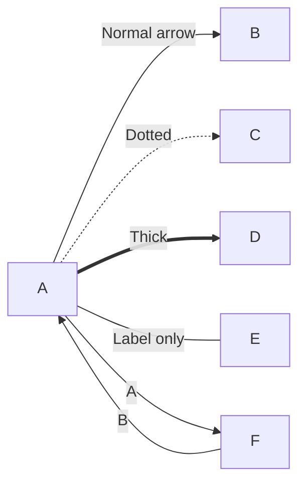
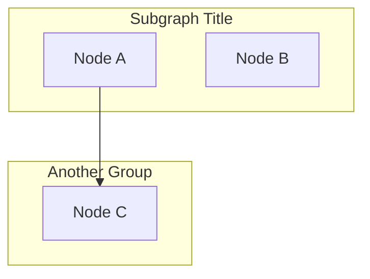
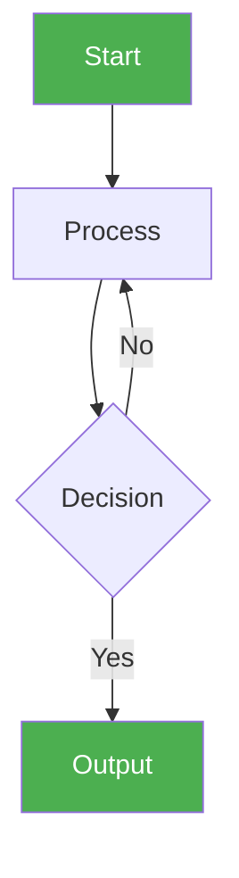

# Diagrams and Architecture Visualization Guide

**For:** All engineers (visual learners)
**Purpose:** Using Mermaid for architecture diagrams in documentation

---

## Quick Start

Use Mermaid diagram syntax in markdown:

```mermaid
layout: elk
graph TD
    User["👤 User"]
    ControlPanel["🎛️ Control Panel"]
    Gateway["🔄 OpenClaw Gateway"]
    Agent["🤖 Agent"]
    LLM["🧠 LLM"]

    User -->|WebSocket + REST| ControlPanel
    ControlPanel -->|JSON-RPC| Gateway
    Gateway -->|Route Request| Agent
    Agent -->|Inference| LLM
```

---

## Common Diagram Types

### 1. System Architecture

```mermaid
layout: elk
graph TB
    subgraph "User Interface"
        Web["🌐 Web UI<br/>Next.js"]
        Telegram["📱 Telegram Bot"]
    end

    subgraph "Orchestration"
        Gateway["🔄 OpenClaw Gateway<br/>Port 8080"]
    end

    subgraph "Agents"
        A1["Dev Backend"]
        A2["Dev Frontend"]
        A3["QA Engineer"]
    end

    subgraph "LLM & Storage"
        Ollama["🧠 Ollama<br/>Local Models"]
        Memory["💾 Memory<br/>Vector Search"]
    end

    Web -->|WS| Gateway
    Telegram -->|HTTP| Gateway
    Gateway -->|Route| A1
    Gateway -->|Route| A2
    Gateway -->|Route| A3
    A1 -->|Inference| Ollama
    A1 -->|Search| Memory

    style Gateway fill:#4CAF50,color:#fff
    style Ollama fill:#2196F3,color:#fff
    style Memory fill:#FF9800,color:#fff
```

### 2. Agent Lifecycle

```mermaid
layout: elk
graph TD
    Start["📥 Message Received"]
    Route["🔀 Route to Agent"]
    Load["📂 Load Workspace"]
    Session["💾 Load Session"]
    Prompt["📝 Assemble Prompt"]
    LLM["🧠 LLM Inference"]
    Decide{"Tool Call?"}
    Execute["⚙️ Execute Tool"]
    Stream["📤 Stream Result"]
    Persist["💾 Persist History"]
    End["✅ Complete"]

    Start --> Route
    Route --> Load
    Load --> Session
    Session --> Prompt
    Prompt --> LLM
    LLM --> Decide
    Decide -->|Yes| Execute
    Decide -->|No| Stream
    Execute --> Stream
    Stream --> Persist
    Persist --> End

    style Start fill:#4CAF50,color:#fff
    style End fill:#4CAF50,color:#fff
    style LLM fill:#2196F3,color:#fff
    style Execute fill:#FF9800,color:#fff
```

### 3. Data Flow

```mermaid
layout: elk
graph LR
    subgraph "Input"
        UI["User Input"]
        Scheduled["Cron Trigger"]
    end

    subgraph "Processing"
        Gateway["Gateway<br/>Router"]
        Agent["Agent<br/>Executor"]
    end

    subgraph "Storage"
        Session["Session<br/>History"]
        Memory["Memory<br/>System"]
    end

    subgraph "Output"
        Response["Response"]
        Log["Logs"]
    end

    UI --> Gateway
    Scheduled --> Gateway
    Gateway --> Agent
    Agent --> Session
    Agent --> Memory
    Agent --> Response
    Agent --> Log

    style Gateway fill:#4CAF50,color:#fff
    style Agent fill:#2196F3,color:#fff
    style Session fill:#FF9800,color:#fff
    style Memory fill:#FF9800,color:#fff
```

### 4. Deployment Architecture

```mermaid
layout: elk
graph TB
    subgraph "Local Machine"
        Docker["🐳 Docker Desktop"]
    end

    subgraph "Docker Stack"
        subgraph "Workloads"
            OpenClaw["Container: clawdevs-openclaw"]
            Ollama["Container: clawdevs-ollama"]
            Panel["Containers: panel-backend/-frontend/-worker"]
        end

        subgraph "Storage"
            PVC1["Volume: openclaw-data"]
            PVC2["Volume: ollama-data"]
            PVC3["Volume: panel-db"]
        end

        subgraph "Exposed Ports"
            Svc1["OpenClaw: 18789"]
            Svc2["Backend API: 8000"]
            Svc3["Frontend UI: 3000"]
        end
    end

    Docker -->|docker run| Ollama
    Ollama -->|Reads| PVC2
    OpenClaw -->|Reads/Writes| PVC1
    Panel -->|Reads/Writes| PVC3

    OpenClaw --> Svc1
    Panel --> Svc2
    Panel --> Svc3

    style Docker fill:#2196F3,color:#fff
    style Ollama fill:#FF9800,color:#fff
    style OpenClaw fill:#4CAF50,color:#fff
    style Panel fill:#9C27B0,color:#fff
```

### 5. SDD Workflow

```mermaid
layout: elk
graph LR
    A["📋 CONSTITUTION<br/>Principles"] -->
    B["📝 BRIEF<br/>Executive Summary"] -->
    C["📊 SPEC<br/>Observable Behavior"] -->
    D{"❓ Ambiguity?"}

    D -->|Yes| E["🤔 CLARIFY<br/>Resolve Issues"]
    E --> C
    D -->|No| F["🏗️ PLAN<br/>Technical Design"] -->
    G["📌 TASK<br/>Implementation Issues"] -->
    H["✨ FEATURE/STORY<br/>Product Alignment"] -->
    I["🛠️ IMPLEMENTATION<br/>Code + Tests"] -->
    J["✅ VALIDATION<br/>Demo & Review"]

    style A fill:#4CAF50,color:#fff
    style B fill:#2196F3,color:#fff
    style C fill:#2196F3,color:#fff
    style E fill:#FF9800,color:#fff
    style F fill:#2196F3,color:#fff
    style G fill:#2196F3,color:#fff
    style I fill:#4CAF50,color:#fff
    style J fill:#4CAF50,color:#fff
```

### 6. Multi-Agent Routing

```mermaid
layout: elk
graph TD
    Msg["📨 Incoming Message"]
    Route{"🔀 Route Decision"}

    Route -->|Channel=Discord| Discord["Discord Agent"]
    Route -->|Channel=Telegram| TG["Telegram Agent"]
    Route -->|Channel=Slack| Slack["Slack Agent"]
    Route -->|Peer=dev_team| Dev["Dev Backend"]
    Route -->|Peer=qa_team| QA["QA Engineer"]

    Discord --> Execute["⚙️ Execute"]
    TG --> Execute
    Slack --> Execute
    Dev --> Execute
    QA --> Execute

    Execute --> Response["📤 Send Response"]

    style Route fill:#FF9800,color:#fff
    style Execute fill:#4CAF50,color:#fff
```

---

## Mermaid Features Used

### Layouts

| Layout | Use Case | Syntax |
|--------|----------|--------|
| `elk` | Large complex diagrams | `layout: elk` |
| `tb` | Top-to-bottom flow | `graph TB` |
| `lr` | Left-to-right flow | `graph LR` |
| `td` | Top-down (same as TB) | `graph TD` |

### Styling

```markdown
style NodeId fill:#color,color:#textColor,stroke:#strokeColor
```

**Colors:**
- Green (`#4CAF50`) — Success, input, output
- Blue (`#2196F3`) — Process, data, core
- Orange (`#FF9800`) — Tools, decisions
- Purple (`#9C27B0`) — Features, UI
- Red (`#F44336`) — Errors, warnings

### Node Types



### Connections



### Subgraphs



---

## Where to Use Diagrams

### In Architecture Docs
```markdown
# System Design

See the diagram below for component relationships:

​```mermaid
graph TD
    ... diagram code ...
​```

Each component:
- X does Y
- Z does W
```

### In Setup Guides
```markdown
# Deployment Flow

The system deploys in this order:

​```mermaid
graph TD
    ... deployment sequence ...
​```

1. Step 1: X
2. Step 2: Y
```

### In Troubleshooting
```markdown
## Debugging Flow

Follow this flowchart:

​```mermaid
graph TD
    Start["Check logs"] --> Decide{Error found?}
    Decide -->|Yes| Fix["Apply fix"]
    Decide -->|No| Else["Check next"]
​```
```

---

## Best Practices

1. **Keep diagrams simple** — Too many nodes = hard to read
2. **Use colors consistently** — Green = success, Red = error, Blue = process
3. **Label connections** — "Sends", "Receives", "Calls", etc.
4. **Add subgraphs** — Group related components
5. **Center important nodes** — Use styling to highlight key elements
6. **Test rendering** — Preview before publishing

---

## Common Mistakes to Avoid

❌ **Too much detail** — Simplify, focus on key relationships
❌ **No color styling** — Use colors to improve readability
❌ **Unclear labels** — Be specific (not just "→")
❌ **Inconsistent layout** — Pick one layout (elk for complex, tb for flow)
❌ **Overlapping nodes** — Organize hierarchically

---

## Tools

- **Online Editor:** [mermaid.live](https://mermaid.live) — Preview before using
- **VSCode Plugin:** Mermaid Preview — See diagrams in editor
- **GitHub:** Native support — Renders automatically in markdown

---

## Quick Reference

**Syntax template:**


---

**More info:** [Mermaid Documentation](https://mermaid.js.org)

Use diagrams to make documentation clearer and more visual! ✨
