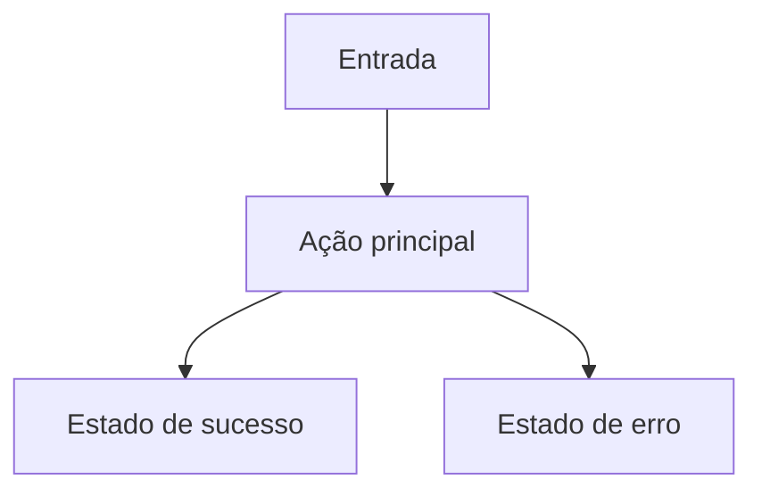

# Skills do UX_Designer

Use este documento como skill única para orientar criação de artefatos UX.

---

## Criar Artefato UX Completo

Use esta skill quando receber uma User Story com componente de UI do PO.

Workflow:
1. Ler US-XXX.md e SPEC-XXX.md para entender o objetivo e critérios de aceite.
2. Pesquisar referências de UX para o domínio do produto (mínimo 3 referências).
3. Mapear user flow com Mermaid: happy path, estados de erro, edge cases.
4. Criar wireframe em Markdown por tela: layout, componentes, estados (empty/loading/error/success).
5. Definir design tokens relevantes: cores, tipografia, espaçamentos, breakpoints.
6. Especificar componentes principais: props, variantes, comportamento responsivo, acessibilidade WCAG AA.
7. Persistir UX-XXX-<slug>.md em `/data/openclaw/backlog/ux/`.
8. Reportar ao PO com link do artefato e resumo de decisões de design.

---

## Estrutura do Artefato UX-XXX.md

```markdown
# UX-XXX — <título da feature>

## Objetivo
<objetivo da experiência do usuário>

## Persona Primária
<persona, contexto de uso, dispositivo>

## User Flow


## Wireframes

### Tela: <nome>
[Layout ASCII/Markdown com anotações]
**Estados:** empty | loading | success | error
**Acessibilidade:** aria-label, role, contraste mínimo 4.5:1

## Design Tokens
| Token | Valor | Uso |
|-------|-------|-----|
| color-primary | #... | CTA principal |

## Componentes
### <NomeComponente>
- Props: ...
- Variantes: ...
- Responsivo: mobile-first, breakpoints sm/md/lg
- WCAG: role, aria-*, contraste

## Referências
- [Fonte 1](url) — <o que foi adaptado>

## Critérios de Aceite UX
- [ ] User flow implementado conforme diagrama
- [ ] Todos os estados de tela cobertos
- [ ] WCAG AA validado
- [ ] Design tokens aplicados corretamente
```
